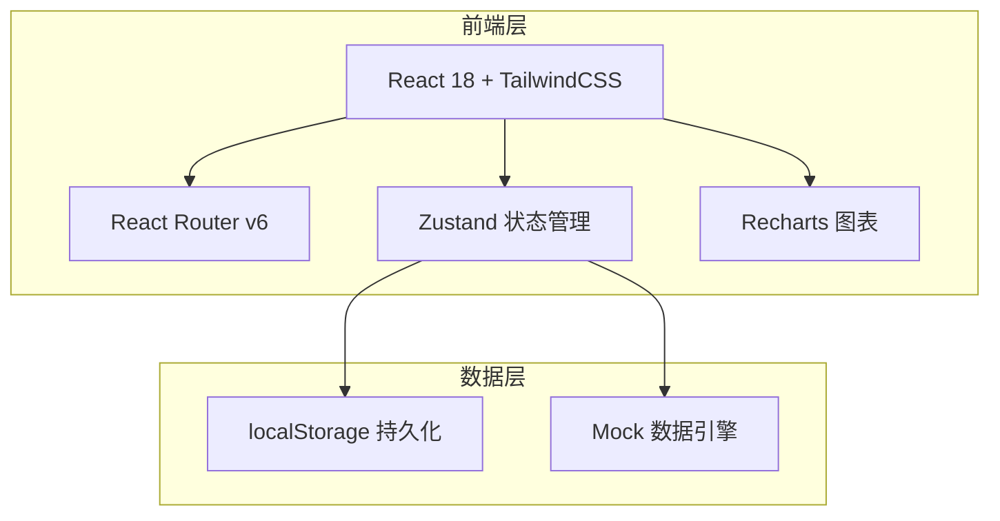
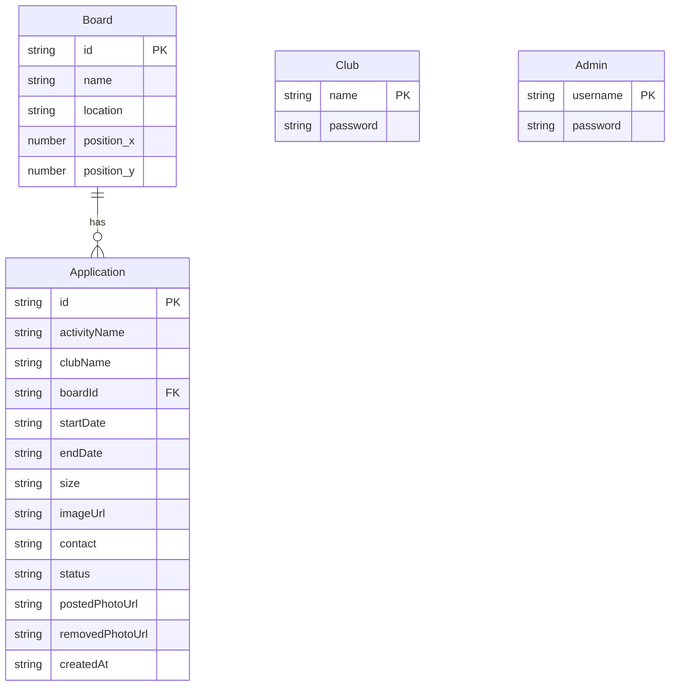

## 1. 架构设计



纯前端架构，使用 localStorage 做数据持久化，所有业务逻辑在浏览器端完成。

## 2. 技术说明

- **前端框架**：React@18 + TailwindCSS@3 + Vite
- **初始化工具**：Vite (react-ts 模板)
- **路由**：React Router v6
- **状态管理**：Zustand（轻量、无 boilerplate）
- **图表库**：Recharts
- **日期处理**：date-fns
- **图标**：Lucide React
- **后端**：无（纯前端，localStorage 模拟）
- **数据库**：无（localStorage + 初始化 Mock 数据）

## 3. 路由定义

| 路由 | 用途 |
|------|------|
| `/` | 登录页（选择角色） |
| `/apply` | 社团申请页（表单+我的申请列表） |
| `/review` | 管理员审批页（待处理+冲突+过期） |
| `/boards` | 展板总览页（地图+日历+照片） |
| `/boards/:id` | 单块展板详情（日历视图+排期+照片） |
| `/dashboard` | 汇总统计页（热度/活跃度/冲突热力图） |

## 4. API 定义

无后端 API，使用 Zustand store 直接操作 localStorage。核心数据操作通过以下 store 方法暴露：

```typescript
interface Application {
  id: string
  activityName: string
  clubName: string
  boardId: string
  startDate: string
  endDate: string
  size: string
  imageUrl: string
  contact: string
  status: 'pending' | 'approved' | 'rejected' | 'expired'
  postedPhotoUrl?: string
  removedPhotoUrl?: string
  postedAt?: string
  removedAt?: string
  createdAt: string
}

interface Board {
  id: string
  name: string
  location: string
  position: { x: number; y: number }
}

interface Conflict {
  applicationA: Application
  applicationB: Application
  boardId: string
  overlapStart: string
  overlapEnd: string
}
```

## 5. 服务端架构图

不适用（纯前端项目）

## 6. 数据模型

### 6.1 数据模型定义



### 6.2 数据定义语言

```sql
CREATE TABLE board (
  id TEXT PRIMARY KEY,
  name TEXT NOT NULL,
  location TEXT NOT NULL,
  position_x REAL NOT NULL,
  position_y REAL NOT NULL
);

CREATE TABLE application (
  id TEXT PRIMARY KEY,
  activityName TEXT NOT NULL,
  clubName TEXT NOT NULL,
  boardId TEXT NOT NULL REFERENCES board(id),
  startDate TEXT NOT NULL,
  endDate TEXT NOT NULL,
  size TEXT NOT NULL,
  imageUrl TEXT NOT NULL,
  contact TEXT NOT NULL,
  status TEXT NOT NULL DEFAULT 'pending',
  postedPhotoUrl TEXT,
  removedPhotoUrl TEXT,
  postedAt TEXT,
  removedAt TEXT,
  createdAt TEXT NOT NULL DEFAULT (datetime('now'))
);

CREATE TABLE club (
  name TEXT PRIMARY KEY,
  password TEXT NOT NULL
);

CREATE TABLE admin (
  username TEXT PRIMARY KEY,
  password TEXT NOT NULL
);
```
