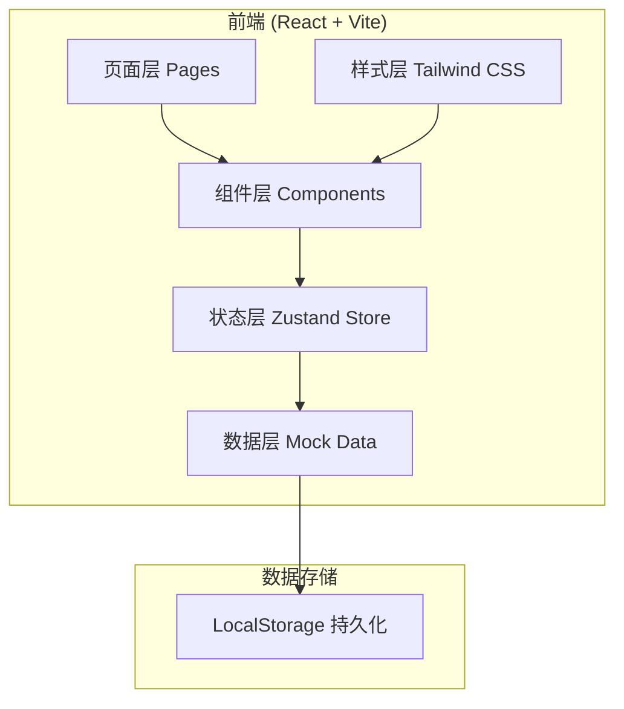
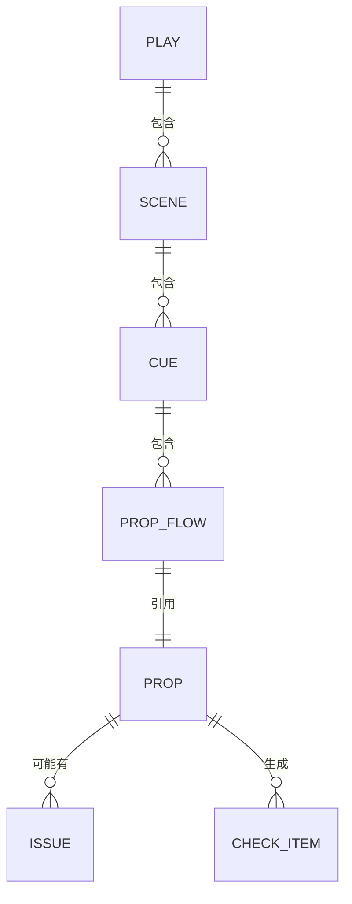

## 1. 架构设计



## 2. 技术描述

- **前端框架**: React@18 + TypeScript@5
- **构建工具**: Vite@5
- **状态管理**: zustand@4
- **样式方案**: Tailwind CSS@3
- **路由**: react-router-dom@6
- **图标库**: lucide-react
- **数据持久化**: LocalStorage
- **后端**: 无（纯前端应用，数据本地存储）

## 3. 路由定义

| 路由 | 页面 | 用途 |
|------|------|------|
| `/` | 主控制台 | 剧目选择、场次概览 |
| `/play/:playId/scene/:sceneId` | 道具流向页 | 当前场次 Cue 点及道具流向 |
| `/issues` | 问题报告页 | 问题道具列表及标记 |
| `/checklist` | 排练清单页 | 待确认道具清单 |

## 4. 数据模型

### 4.1 数据实体定义



### 4.2 数据类型定义

```typescript
// 剧目
interface Play {
  id: string;
  name: string;
  description: string;
  totalScenes: number;
  createdAt: string;
}

// 场次
interface Scene {
  id: string;
  playId: string;
  name: string;
  order: number;
  description: string;
}

// Cue 点
interface Cue {
  id: string;
  sceneId: string;
  number: number;
  name: string;
  description: string;
}

// 道具
interface Prop {
  id: string;
  name: string;
  category: string;
  description: string;
}

// 道具流向
interface PropFlow {
  id: string;
  cueId: string;
  propId: string;
  from: string;        // 来源：左侧台口/道具桌等
  to: string;          // 放置位置
  handler: string;     // 经手人
  receiver: string;    // 下一场接收人
  status: 'pending' | 'confirmed' | 'issue';
  confirmedAt?: string;
}

// 问题记录
interface Issue {
  id: string;
  propId: string;
  propFlowId: string;
  type: 'lost' | 'damaged' | 'wrong_position';
  description: string;
  reportedAt: string;
  resolved: boolean;
  resolvedAt?: string;
  resolution?: string;
}

// 排练清单项
interface CheckItem {
  id: string;
  propId: string;
  issueId?: string;
  priority: 'high' | 'medium' | 'low';
  checked: boolean;
  checkedAt?: string;
  note?: string;
}
```

## 5. 状态管理

使用 Zustand 管理全局状态，分为以下几个 store：

| Store 名称 | 用途 | 主要方法 |
|------------|------|----------|
| usePlayStore | 剧目数据管理 | loadPlays, selectPlay, getScenes |
| usePropStore | 道具流向管理 | getPropFlows, confirmProp, reportIssue |
| useIssueStore | 问题管理 | getIssues, resolveIssue, getUnresolvedCount |
| useChecklistStore | 排练清单管理 | generateChecklist, toggleCheck, getPriorityItems |
| useUiStore | 界面状态管理 | toggleDarkMode, setMute, getCurrentView |

## 6. 组件结构

```
src/
├── components/
│   ├── layout/
│   │   └── PageLayout.tsx       # 页面布局
│   ├── play/
│   │   ├── PlayCard.tsx         # 剧目卡片
│   │   └── SceneTimeline.tsx    # 场次时间线
│   ├── prop/
│   │   ├── CueSection.tsx       # Cue 点区块
│   │   ├── PropFlowCard.tsx     # 道具流向卡片
│   │   └── ConfirmButton.tsx    # 确认按钮
│   ├── issue/
│   │   ├── IssueCard.tsx        # 问题卡片
│   │   └── IssueTag.tsx         # 问题类型标签
│   └── checklist/
│       └── CheckItem.tsx        # 清单条目
├── pages/
│   ├── Dashboard.tsx            # 主控制台
│   ├── PropFlowPage.tsx         # 道具流向页
│   ├── IssuesPage.tsx           # 问题报告页
│   └── ChecklistPage.tsx        # 排练清单页
├── store/
│   ├── playStore.ts
│   ├── propStore.ts
│   ├── issueStore.ts
│   └── checklistStore.ts
├── data/
│   └── mockData.ts              # Mock 数据
├── types/
│   └── index.ts                 # 类型定义
└── utils/
    └── storage.ts               # 本地存储工具
```

## 7. 核心交互逻辑

### 7.1 道具确认流程
1. 用户进入场次道具流向页
2. 展示当前 Cue 的所有道具
3. 点击道具卡片展开详情
4. 点击"确认放置"按钮
5. 状态变为 confirmed，显示绿色对勾
6. 自动滚动到下一个待确认道具

### 7.2 问题标记流程
1. 在道具卡片上点击"报告问题"
2. 弹出问题类型选择（遗失/损坏/位置错误）
3. 输入问题描述（可选）
4. 提交后道具状态变为 issue
5. 自动添加到排练确认清单

### 7.3 排练清单生成
1. 扫描所有未解决的问题记录
2. 按问题类型分配优先级：遗失 > 损坏 > 位置错误
3. 生成 Checklist 列表
4. 支持逐项勾选确认
5. 全部确认后自动标记为已解决
