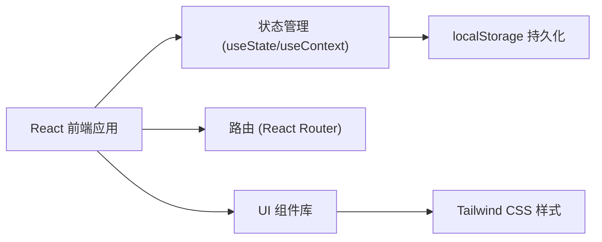

## 1. 架构设计



## 2. 技术描述

- **前端框架**：React@18 + TypeScript
- **构建工具**：Vite
- **样式方案**：Tailwind CSS 3
- **路由管理**：React Router v6
- **数据持久化**：localStorage（纯前端，无后端）
- **图标方案**：Lucide React
- **初始化方式**：使用 vite 创建 React + TypeScript 项目

## 3. 路由定义

| 路由 | 页面 | 说明 |
|-------|------|------|
| `/` | 首页/列表页 | 展示所有香水记录卡片，支持场景筛选 |
| `/perfume/:id` | 详情页 | 展示单支香水的完整留香记录 |
| `/new` | 新增记录页 | 创建新的留香实验记录 |
| `/edit/:id` | 编辑记录页 | 修改已有记录 |

## 4. 数据模型

### 4.1 数据结构定义

```typescript
// 香气记录节点
interface ScentNote {
  top: string;      // 前调描述
  middle: string;   // 中调描述
  base: string;     // 尾调描述
  diffusion: number; // 扩散范围 1-5
}

// 时间节点
type TimePoint = '0min' | '30min' | '2h' | '6h';

// 场景类型
type SceneType = 'commute' | 'date' | 'rainy' | 'bedtime';

// 香水记录
interface PerfumeRecord {
  id: string;
  brand: string;           // 品牌
  name: string;            // 香水名称
  scentFamily: string;     // 香调
  sprayLocation: string;   // 喷洒位置
  weather: string;         // 天气
  humidity: number;        // 湿度 0-100
  createdAt: string;       // 创建时间
  
  // 留香时间线记录
  timeline: Record<TimePoint, ScentNote>;
  
  // 评分
  skinScore: number;       // 皮肤表现 1-5
  clothScore: number;      // 衣服表现 1-5
  
  // 场景标签
  scenes: SceneType[];
}
```

### 4.2 Mock 数据

应用启动时预置 3-5 条示例香水记录，方便用户快速了解功能。

## 5. 组件结构

```
src/
├── components/
│   ├── Header.tsx           # 顶部导航
│   ├── PerfumeCard.tsx      # 香水卡片
│   ├── Timeline.tsx         # 留香时间线
│   ├── ScoreDisplay.tsx     # 评分展示
│   ├── SceneTags.tsx        # 场景标签
│   ├── PerfumeForm.tsx      # 香水表单
│   └── TimelineForm.tsx     # 时间线记录表单
├── pages/
│   ├── HomePage.tsx         # 首页列表
│   ├── DetailPage.tsx       # 详情页
│   └── FormPage.tsx         # 新增/编辑页
├── hooks/
│   └── usePerfumeStore.ts   # 数据管理 hook
├── types/
│   └── index.ts             # 类型定义
├── utils/
│   └── storage.ts           # localStorage 工具
├── data/
│   └── mockData.ts          # 示例数据
├── App.tsx
├── main.tsx
└── index.css
```

## 6. 核心功能实现

### 6.1 数据管理
- 使用自定义 Hook `usePerfumeStore` 统一管理香水数据
- 数据变更自动同步到 localStorage
- 支持增删改查操作

### 6.2 场景分类逻辑
- 用户手动选择场景标签
- 也可基于评分和香调进行智能推荐
- 通勤：清新/柑橘/木质调，扩散适中
- 约会：花香/果香/东方调，评分较高
- 雨天：温润/木质/东方调，留香持久
- 睡前：柔和/花香/草本调，扩散较低

### 6.3 时间线可视化
- 垂直时间轴展示四个时间节点
- 扩散范围用圆形进度条可视化
- 香气描述分层展示（前/中/后调）
