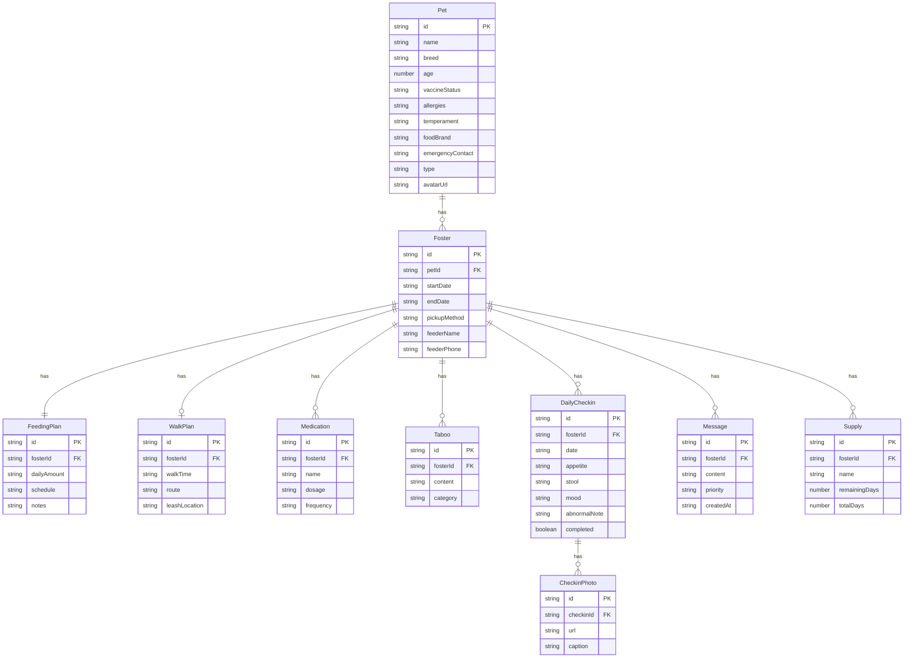

## 1. 架构设计

```mermaid
graph TB
    subgraph "前端层"
        "React + TypeScript"
        "Zustand 状态管理"
        "Tailwind CSS"
        "React Router"
    end
    subgraph "数据层"
        "LocalStorage 持久化"
        "Zustand Persist"
    end
    "React + TypeScript" --> "Zustand 状态管理"
    "Zustand 状态管理" --> "LocalStorage 持久化"
```

纯前端应用，使用 LocalStorage 进行数据持久化，无需后端服务。

## 2. 技术说明

- **前端**：React@18 + TypeScript + Tailwind CSS@3 + Vite
- **初始化工具**：vite-init
- **后端**：无（纯前端应用，数据存储在 LocalStorage）
- **状态管理**：Zustand + persist 中间件
- **路由**：react-router-dom@6
- **图标**：lucide-react
- **日期处理**：date-fns
- **数据存储**：LocalStorage（通过 Zustand persist 中间件自动同步）

## 3. 路由定义

| 路由 | 用途 |
|------|------|
| / | 首页，展示宠物档案列表 |
| /pet/:id | 宠物档案详情页 |
| /pet/new | 新建宠物档案 |
| /foster/:id | 寄养交接单详情页 |
| /foster/new | 新建寄养交接单 |
| /foster/:id/checkin | 每日打卡页面 |
| /foster/:id/messages | 留言板页面 |
| /foster/:id/stats | 统计页面 |

## 4. 数据模型

### 4.1 数据模型定义



### 4.2 数据定义（TypeScript 接口）

```typescript
interface Pet {
  id: string;
  name: string;
  breed: string;
  age: number;
  vaccineStatus: string;
  allergies: string;
  temperament: string;
  foodBrand: string;
  emergencyContact: string;
  type: 'cat' | 'dog';
  avatarUrl: string;
}

interface Foster {
  id: string;
  petId: string;
  startDate: string;
  endDate: string;
  pickupMethod: string;
  feederName: string;
  feederPhone: string;
  feedingPlan: FeedingPlan;
  walkPlan: WalkPlan | null;
  cleanPlan: CleanPlan;
  medications: Medication[];
  taboos: Taboo[];
  supplies: Supply[];
}

interface FeedingPlan {
  dailyAmount: string;
  schedule: string;
  notes: string;
}

interface WalkPlan {
  walkTime: string;
  route: string;
  leashLocation: string;
}

interface CleanPlan {
  bathFrequency: string;
  litterFrequency: string;
  supplyLocations: string;
}

interface Medication {
  id: string;
  name: string;
  dosage: string;
  frequency: string;
}

interface Taboo {
  id: string;
  content: string;
  category: 'feeding' | 'cleaning' | 'walking' | 'health';
}

interface DailyCheckin {
  id: string;
  fosterId: string;
  date: string;
  appetite: 'good' | 'normal' | 'poor';
  stool: 'normal' | 'soft' | 'abnormal';
  mood: 'energetic' | 'calm' | 'lethargic';
  abnormalNote: string;
  photos: string[];
  completed: boolean;
}

interface Message {
  id: string;
  fosterId: string;
  content: string;
  priority: 'normal' | 'important';
  createdAt: string;
}

interface Supply {
  id: string;
  fosterId: string;
  name: string;
  remainingDays: number;
  totalDays: number;
}
```

## 5. 项目结构

```
src/
├── components/
│   ├── layout/          # 布局组件
│   │   ├── AppLayout.tsx
│   │   └── Sidebar.tsx
│   ├── pet/             # 宠物相关组件
│   │   ├── PetCard.tsx
│   │   └── PetForm.tsx
│   ├── foster/          # 寄养交接单组件
│   │   ├── FosterCard.tsx
│   │   ├── FosterForm.tsx
│   │   ├── FeedingSection.tsx
│   │   ├── CleanSection.tsx
│   │   ├── WalkSection.tsx
│   │   └── HealthSection.tsx
│   ├── checkin/         # 打卡组件
│   │   ├── CheckinCalendar.tsx
│   │   ├── CheckinForm.tsx
│   │   └── PhotoUpload.tsx
│   ├── message/         # 留言组件
│   │   ├── MessageList.tsx
│   │   └── MessageForm.tsx
│   └── stats/           # 统计组件
│       ├── CheckinProgress.tsx
│       ├── AbnormalTimeline.tsx
│       └── SupplyBar.tsx
├── pages/
│   ├── Home.tsx         # 宠物档案列表
│   ├── PetDetail.tsx    # 宠物详情
│   ├── PetNew.tsx       # 新建宠物
│   ├── FosterDetail.tsx # 交接单详情
│   ├── FosterNew.tsx    # 新建交接单
│   ├── Checkin.tsx      # 每日打卡
│   ├── Messages.tsx     # 留言板
│   └── Stats.tsx        # 统计页
├── store/
│   └── index.ts         # Zustand store
├── types/
│   └── index.ts         # TypeScript 类型定义
├── utils/
│   └── helpers.ts       # 工具函数
├── App.tsx
└── main.tsx
```
