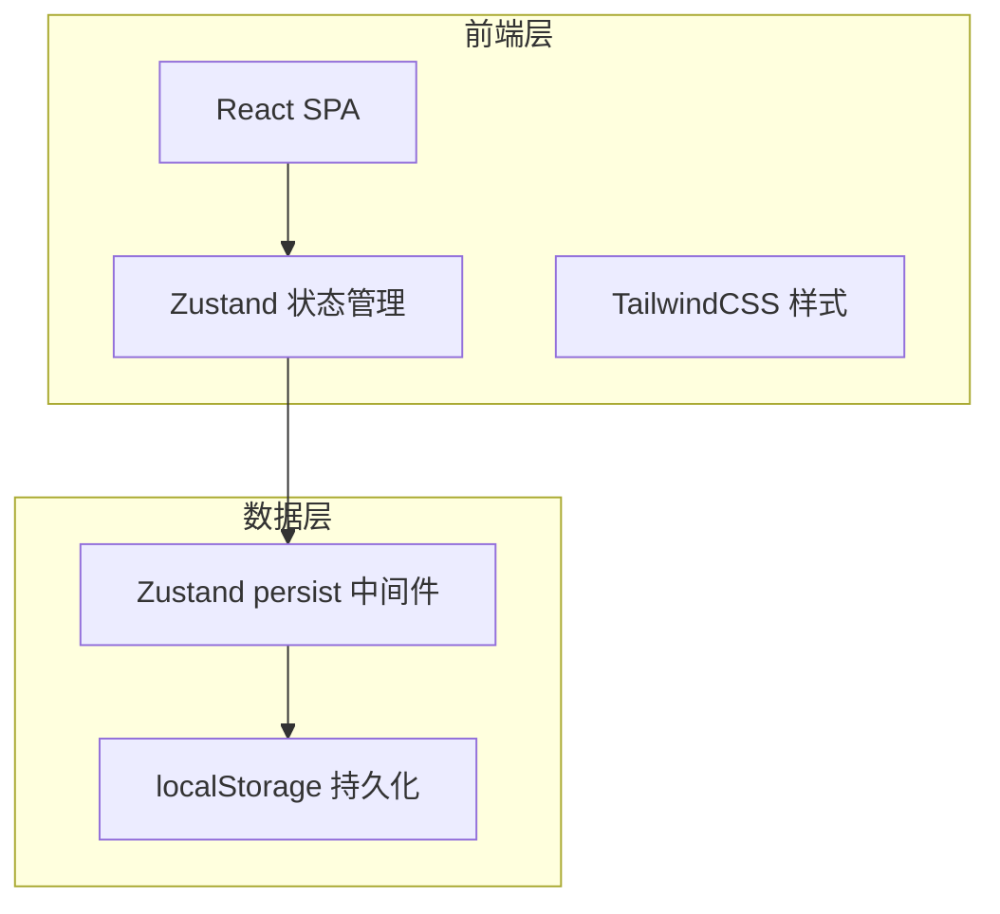
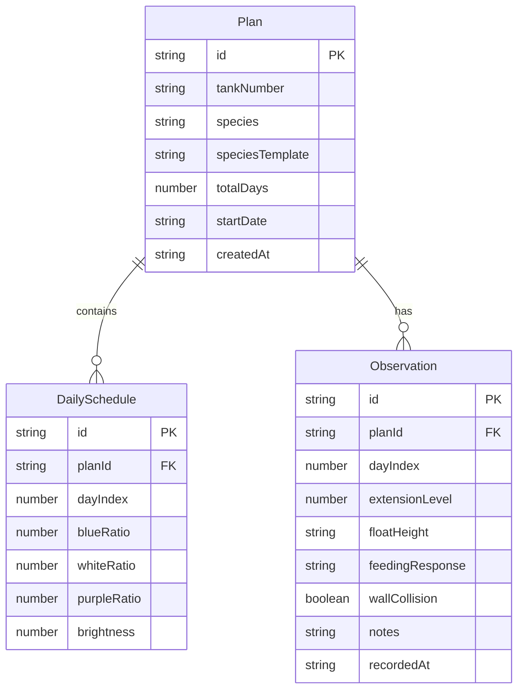

## 1. 架构设计



纯前端架构，无需后端服务。数据通过 Zustand persist 中间件自动同步到 localStorage。

## 2. 技术说明

- **前端框架**：React@18 + TypeScript + Vite
- **状态管理**：Zustand（含 persist 中间件）
- **样式方案**：TailwindCSS@3
- **图表库**：Recharts（折线图、面积图）
- **路由**：react-router-dom@6
- **图标**：lucide-react
- **数据持久化**：localStorage（通过 Zustand persist）
- **后端**：无（纯前端应用）

## 3. 路由定义

| 路由 | 用途 |
|------|------|
| `/` | 驯化计划页 - 时间线编辑与灯谱预览 |
| `/record` | 观察记录页 - 行为指标录入与历史曲线 |
| `/alert` | 异常预警页 - 异常检测与调光建议 |
| `/handover` | 交接卡页 - 生成与打印灯谱交接卡 |

## 4. 数据模型

### 4.1 数据模型定义



### 4.2 数据结构定义

```typescript
interface Plan {
  id: string
  tankNumber: string
  species: string
  speciesTemplate: string
  totalDays: number
  startDate: string
  createdAt: string
}

interface DailySchedule {
  id: string
  planId: string
  dayIndex: number
  blueRatio: number    // 0-100
  whiteRatio: number   // 0-100
  purpleRatio: number  // 0-100
  brightness: number   // 0-100
}

interface Observation {
  id: string
  planId: string
  dayIndex: number
  extensionLevel: 1 | 2 | 3 | 4 | 5
  floatHeight: 'top' | 'middle' | 'bottom'
  feedingResponse: 'active' | 'moderate' | 'refuse'
  wallCollision: boolean
  notes: string
  recordedAt: string
}

interface SpeciesTemplate {
  id: string
  name: string
  description: string
  defaultDays: number
  startBlue: number
  startWhite: number
  startPurple: number
  startBrightness: number
  endBlue: number
  endWhite: number
  endPurple: number
  endBrightness: number
}
```

## 5. 异常检测逻辑

- **连续异常判定**：同一种类指标连续 2 天及以上偏离正常范围
  - 舒展度 ≤ 2 视为异常
  - 漂浮高度为 bottom 视为异常
  - 摄食反应为 refuse 视为异常
  - 撞壁为 true 视为异常
- **调光建议生成**：异常天数占驯化周期 ≥ 20% 时，建议将每日光比例变化幅度降低 50%，亮度日增幅降低 50%
- **预警展示**：异常项红色脉动边框，建议卡片含参数对比与一键应用
