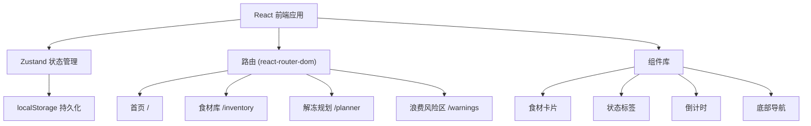
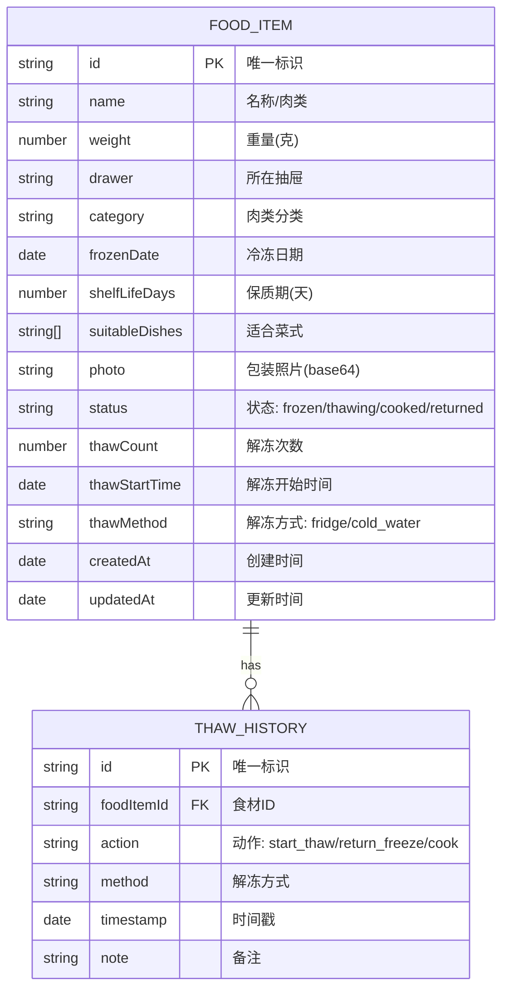

## 1. 架构设计



纯前端应用，无后端服务，数据存储在浏览器 localStorage 中。

## 2. 技术描述

- **前端框架**：React 18 + TypeScript
- **构建工具**：Vite 5
- **样式方案**：Tailwind CSS 3
- **状态管理**：Zustand
- **路由**：React Router DOM 6
- **图标**：Lucide React
- **数据持久化**：localStorage
- **图片处理**：FileReader + Base64 存储

## 3. 路由定义

| 路由 | 页面 | 用途 |
|------|------|------|
| / | 首页 | 今晚解冻提醒、正在解冻中、快速操作入口 |
| /inventory | 食材库 | 冷冻食材列表、按抽屉筛选、添加/编辑食材 |
| /planner | 解冻规划 | 选菜式、选时间、获取解冻方案 |
| /warnings | 浪费风险区 | 久冻、解冻过夜、临期食材预警 |
| /inventory/:id | 食材详情 | 食材详细信息、状态操作、解冻历史 |

## 4. 数据模型

### 4.1 数据模型定义



### 4.2 核心类型定义

```typescript
type FoodStatus = 'frozen' | 'thawing' | 'cooked' | 'returned';
type ThawMethod = 'fridge' | 'cold_water';

interface FoodItem {
  id: string;
  name: string;
  weight: number;
  drawer: string;
  category: string;
  frozenDate: string;
  shelfLifeDays: number;
  suitableDishes: string[];
  photo?: string;
  status: FoodStatus;
  thawCount: number;
  thawStartTime?: string;
  thawMethod?: ThawMethod;
  createdAt: string;
  updatedAt: string;
}

interface ThawHistory {
  id: string;
  foodItemId: string;
  action: 'start_thaw' | 'return_freeze' | 'cook' | 'discard';
  method?: ThawMethod;
  timestamp: string;
  note?: string;
}

interface Dish {
  id: string;
  name: string;
  category: string;
  requiredWeight: number;
  suitableMeats: string[];
  photo: string;
}

interface Drawer {
  id: string;
  name: string;
  icon: string;
}
```

## 5. 解冻时间计算规则

根据肉类重量和解冻方式计算所需时间：

| 重量范围 | 冷藏解冻 | 冷水解冻 |
|----------|----------|----------|
| < 200g | 3-4 小时 | 30-45 分钟 |
| 200-500g | 5-7 小时 | 1-1.5 小时 |
| 500-1000g | 8-12 小时 | 2-3 小时 |
| > 1000g | 12-24 小时 | 3-5 小时 |

倒推公式：`取出时间 = 用餐时间 - 解冻时间 - 准备时间(30分钟)`

## 6. 浪费风险判定规则

| 风险等级 | 判定条件 | 建议 |
|----------|----------|------|
| 高风险 (红色) | 冷冻 > 180 天 / 解冻 > 24 小时 / 已过保质期 | 建议立即丢弃 |
| 中风险 (橙色) | 冷冻 > 90 天 / 解冻 > 12 小时 / 3天内过期 | 建议尽快食用 |
| 低风险 (黄色) | 冷冻 > 60 天 / 解冻 > 6 小时 / 7天内过期 | 提醒关注 |

## 7. 项目结构

```
src/
├── components/          # 可复用组件
│   ├── FoodCard.tsx     # 食材卡片
│   ├── StatusBadge.tsx  # 状态标签
│   ├── Countdown.tsx    # 倒计时组件
│   ├── BottomNav.tsx    # 底部导航
│   ├── AddFoodModal.tsx # 添加食材弹窗
│   └── RiskCard.tsx     # 风险卡片
├── pages/               # 页面组件
│   ├── Home.tsx         # 首页
│   ├── Inventory.tsx    # 食材库
│   ├── Planner.tsx      # 解冻规划
│   ├── Warnings.tsx     # 浪费风险区
│   └── FoodDetail.tsx   # 食材详情
├── store/               # 状态管理
│   └── useFoodStore.ts  # 食材状态 store
├── utils/               # 工具函数
│   ├── thawTime.ts      # 解冻时间计算
│   ├── dateUtils.ts     # 日期工具
│   └── riskAssessment.ts # 风险评估
├── data/                # 静态数据
│   ├── dishes.ts        # 预设菜式
│   └── drawers.ts       # 抽屉配置
├── types/               # 类型定义
│   └── index.ts
├── App.tsx
├── main.tsx
└── index.css
```
