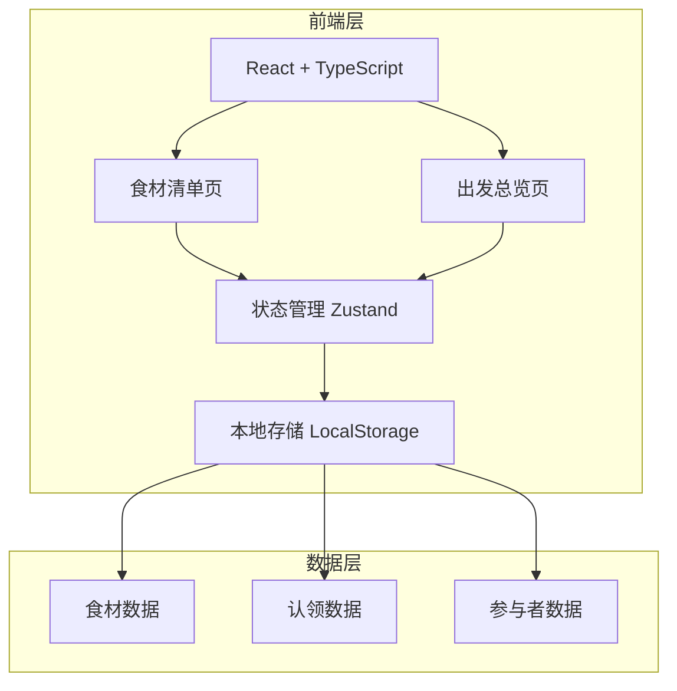
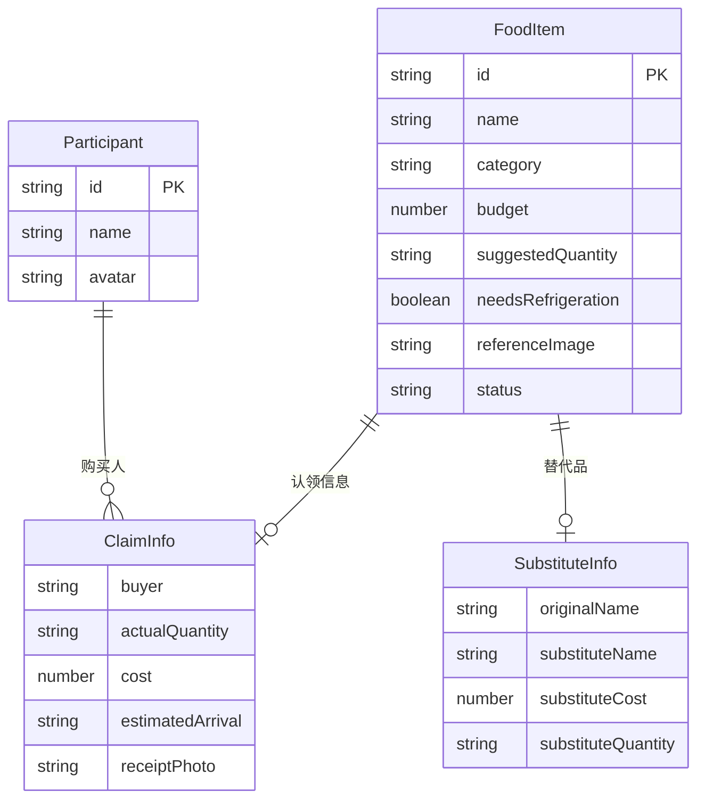

## 1. 架构设计



纯前端应用，无需后端服务。数据持久化使用 LocalStorage，状态管理使用 Zustand。

## 2. 技术说明

- **前端**：React@18 + TypeScript + TailwindCSS@3 + Vite
- **初始化工具**：Vite (react-ts 模板)
- **状态管理**：Zustand（轻量级，适合中小型应用）
- **后端**：无（纯前端，数据存储在 LocalStorage）
- **数据库**：无（LocalStorage 模拟持久化）
- **图表**：recharts（费用汇总环形图）
- **图片处理**：FileReader API（小票照片本地预览）
- **参考图**：使用占位图服务

## 3. 路由定义

| 路由 | 用途 |
|------|------|
| `/` | 食材清单页，展示所有食材、认领操作、状态分组 |
| `/overview` | 出发总览页，缺项提醒、小票核查、冷藏追踪、费用汇总 |

## 4. API定义

无后端API，所有数据通过 Zustand store 管理。

### 数据类型定义

```typescript
type ItemCategory = "肉类" | "海鲜" | "蔬菜" | "主食" | "饮品" | "调料" | "耗材";
type ItemStatus = "未认领" | "已认领" | "已买到" | "临时缺货";

interface FoodItem {
  id: string;
  name: string;
  category: ItemCategory;
  budget: number;
  suggestedQuantity: string;
  needsRefrigeration: boolean;
  referenceImage: string;
  status: ItemStatus;
  claim?: ClaimInfo;
  substitute?: SubstituteInfo;
}

interface ClaimInfo {
  buyer: string;
  actualQuantity: string;
  cost: number;
  estimatedArrival: string;
  receiptPhoto?: string;
}

interface SubstituteInfo {
  originalName: string;
  substituteName: string;
  substituteCost: number;
  substituteQuantity: string;
}

interface Participant {
  id: string;
  name: string;
  avatar: string;
}

interface BBQStore {
  items: FoodItem[];
  participants: Participant[];
  addItem: (item: FoodItem) => void;
  claimItem: (id: string, claim: ClaimInfo) => void;
  markPurchased: (id: string, receiptPhoto: string) => void;
  markOutOfStock: (id: string) => void;
  addSubstitute: (id: string, substitute: SubstituteInfo) => void;
  getTotalCost: () => number;
  getPerPersonCost: () => number;
  getUnclaimedItems: () => FoodItem[];
  getMissingReceipts: () => { buyer: string; item: string }[];
  getUnclaimedRefrigerated: () => FoodItem[];
}
```

## 5. 服务端架构图

不适用（纯前端应用）

## 6. 数据模型

### 6.1 数据模型定义



### 6.2 初始数据

预设7个分类的烧烤食材数据，包含约20种常见烧烤食材，模拟5位参与者数据，覆盖所有状态类型。
