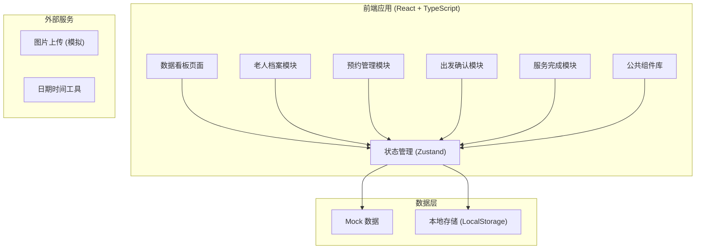
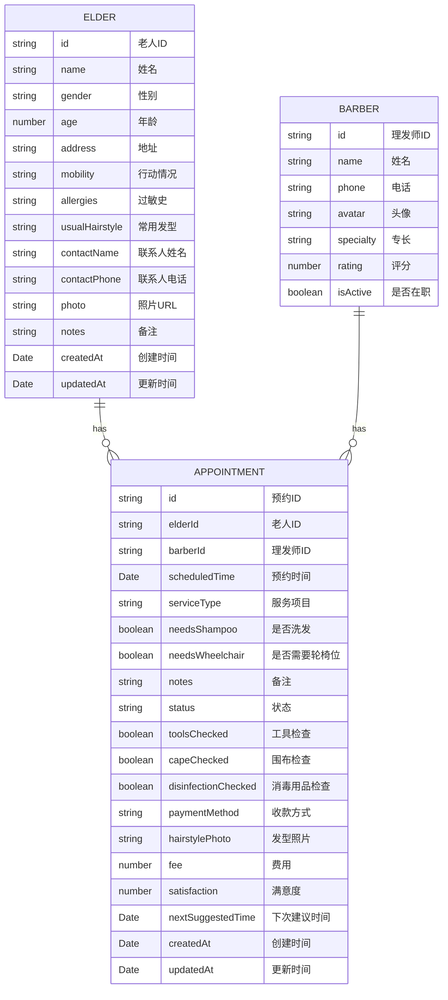

## 1. 架构设计



## 2. 技术描述

- **前端框架**：React 18 + TypeScript
- **构建工具**：Vite
- **样式方案**：Tailwind CSS 3
- **状态管理**：Zustand
- **路由管理**：React Router DOM
- **图标库**：Lucide React
- **后端**：无（纯前端应用，使用 Mock 数据 + LocalStorage 持久化）
- **数据库**：无（LocalStorage 本地存储）
- **初始化方式**：vite-init react-ts 模板

## 3. 路由定义

| 路由 | 页面 | 说明 |
|------|------|------|
| `/` | 数据看板 | 首页，展示今日上门、待确认、特殊需求、超时未到和复约提醒 |
| `/elders` | 老人档案列表 | 展示所有老人档案，支持搜索和筛选 |
| `/elders/new` | 新建老人档案 | 表单页面，录入老人信息 |
| `/elders/:id` | 老人档案详情 | 展示老人完整信息和历史预约 |
| `/elders/:id/edit` | 编辑老人档案 | 修改老人信息 |
| `/appointments` | 预约列表 | 所有预约记录，支持筛选 |
| `/appointments/new` | 新建预约 | 分步表单创建预约 |
| `/appointments/:id` | 预约详情 | 查看预约详情，支持状态操作 |
| `/appointments/:id/confirm-departure` | 出发确认 | 理发师出发前工具检查清单 |
| `/appointments/:id/complete` | 服务完成 | 服务完成记录表单 |

## 4. 数据模型

### 4.1 数据模型定义



### 4.2 预约状态枚举

- `pending` - 待确认
- `confirmed` - 已确认
- `departed` - 已出发
- `in_progress` - 服务中
- `completed` - 已完成
- `cancelled` - 已取消
- `overdue` - 超时未到

### 4.3 行动情况枚举

- `normal` - 行动正常
- `slow` - 行动缓慢
- `wheelchair` - 需轮椅
- `bedridden` - 卧床不起

## 5. 项目结构

```
src/
├── components/          # 公共组件
│   ├── Layout/         # 布局组件
│   ├── Card/           # 卡片组件
│   ├── Button/         # 按钮组件
│   ├── Modal/          # 模态框
│   ├── Form/           # 表单组件
│   ├── StatusBadge/    # 状态标签
│   └── StarRating/     # 星级评分
├── pages/              # 页面组件
│   ├── Dashboard/      # 数据看板
│   ├── ElderList/      # 老人档案列表
│   ├── ElderDetail/    # 老人档案详情
│   ├── ElderForm/      # 老人档案表单
│   ├── AppointmentList/ # 预约列表
│   ├── AppointmentForm/ # 新建预约
│   ├── AppointmentDetail/ # 预约详情
│   ├── DepartureConfirm/ # 出发确认
│   └── ServiceComplete/  # 服务完成
├── store/              # Zustand 状态管理
│   ├── useElderStore.ts
│   ├── useBarberStore.ts
│   └── useAppointmentStore.ts
├── types/              # TypeScript 类型定义
│   ├── elder.ts
│   ├── barber.ts
│   └── appointment.ts
├── utils/              # 工具函数
│   ├── date.ts
│   ├── storage.ts
│   └── mock.ts
├── data/               # Mock 数据
│   ├── elders.ts
│   ├── barbers.ts
│   └── appointments.ts
├── App.tsx
├── main.tsx
└── index.css
```

## 6. 核心功能实现要点

### 6.1 数据看板
- 统计卡片：今日上门、待确认、特殊需求、超时未到
- 看板列：按状态分组展示预约卡片
- 复约提醒：根据上次服务时间和建议下次时间计算
- 支持点击卡片跳转预约详情

### 6.2 老人档案
- CRUD 完整操作
- 照片上传（使用 FileReader 转 Base64）
- 搜索功能（按姓名、地址）
- 历史预约记录展示

### 6.3 预约管理
- 分步表单：选择老人 → 选择服务 → 确认预约
- 时间选择器：日期 + 时间段
- 服务项目：剪发、染发、烫发、护理等
- 特殊需求：洗发、轮椅位

### 6.4 出发确认
- 工具清单逐项勾选确认
- 包含：理发工具、围布、消毒用品、收款方式
- 全部确认后才能标记出发

### 6.5 服务完成
- 发型照片上传
- 费用记录
- 星级满意度评分（1-5星）
- 下次建议时间选择

### 6.6 状态流转
```
待确认 → 已确认 → 已出发 → 服务中 → 已完成
   ↓         ↓         ↓         ↓
  取消      取消      取消      取消
   ↓
 超时未到（自动判断）
```
