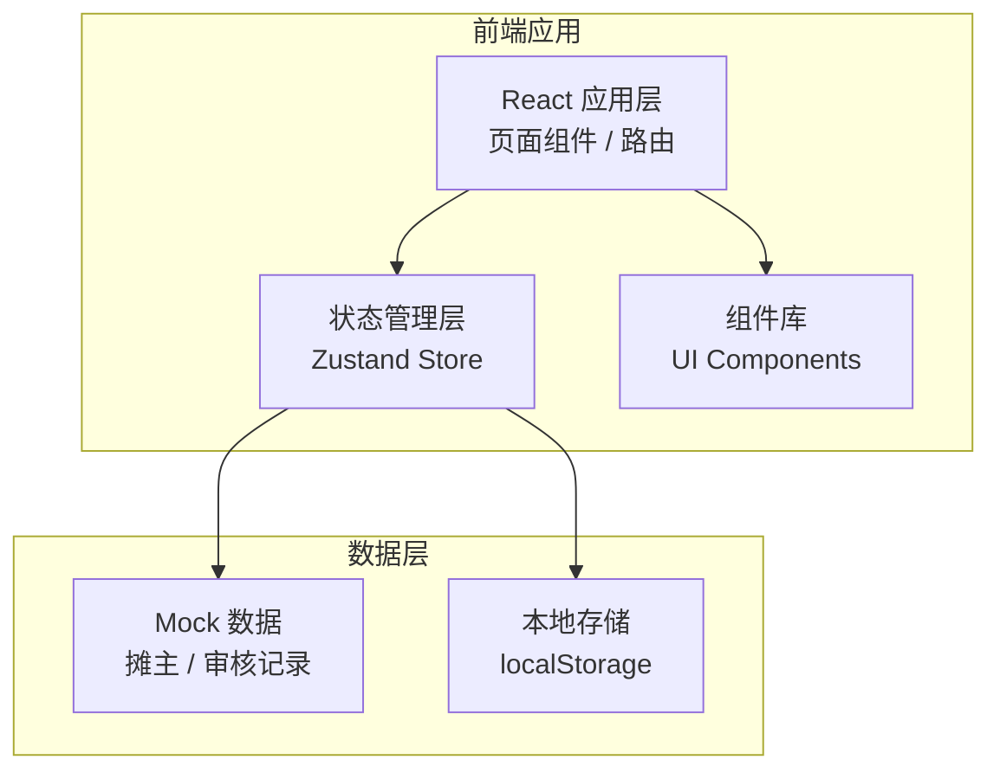
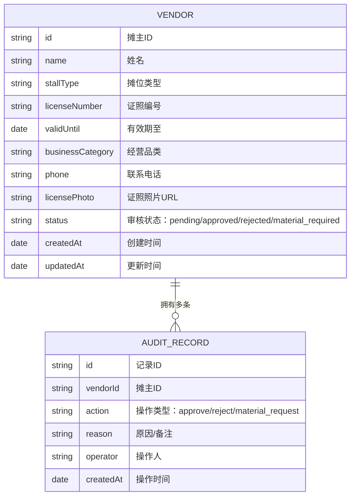

# 周末广场临时摊位管理台 - 技术架构文档

## 1. 架构设计



## 2. 技术说明

- **前端框架**: React 18 + TypeScript
- **构建工具**: Vite
- **样式方案**: TailwindCSS 3
- **状态管理**: Zustand
- **路由**: React Router v6
- **图标**: Lucide React
- **数据存储**: 本地 Mock 数据 + localStorage 持久化
- **日期处理**: date-fns

## 3. 路由定义

| 路由 | 页面 | 说明 |
|------|------|------|
| /dashboard | 首页仪表板 | 数据概览卡片、快捷入口 |
| /vendors | 摊主列表 | 分类筛选、搜索、摊主卡片列表 |
| /vendors/:id | 摊主详情 | 档案信息、证照照片、审核记录、审核操作 |
| /vendors/new | 新增摊主 | 表单录入、照片上传 |
| /vendors/:id/edit | 编辑摊主 | 表单编辑、照片更新 |

## 4. 数据模型

### 4.1 数据模型定义



### 4.2 TypeScript 类型定义

```typescript
// 摊主状态
type LicenseStatus = 'normal' | 'expiring' | 'expired';
type AuditStatus = 'pending' | 'approved' | 'rejected' | 'material_required';
type StallType = 'food' | 'handcraft' | 'clothing' | 'accessory' | 'other';

interface Vendor {
  id: string;
  name: string;
  stallType: StallType;
  licenseNumber: string;
  validUntil: string;
  businessCategory: string;
  phone: string;
  licensePhoto: string;
  auditStatus: AuditStatus;
  createdAt: string;
  updatedAt: string;
}

interface AuditRecord {
  id: string;
  vendorId: string;
  action: 'approve' | 'reject' | 'material_request';
  reason: string;
  operator: string;
  createdAt: string;
}
```

### 4.3 Mock 初始数据

- 预置 8-10 条摊主数据，覆盖不同状态（正常/临期/已过期）
- 预置若干审核记录示例
- 证照照片使用占位图片

## 5. 核心功能实现思路

### 5.1 证照状态判断
- 根据当前日期与 `validUntil` 比较
- 有效期 > 30 天：正常（normal）
- 有效期 ≤ 30 天且 > 0 天：临期（expiring）
- 有效期 ≤ 0 天：已过期（expired）

### 5.2 首页统计数据
- 本周到期：筛选有效期在本周内的摊主
- 食品类摊主：`stallType === 'food'` 的数量
- 待补材料：`auditStatus === 'material_required'` 的数量

### 5.3 审核流程
- 每次审核操作创建一条 AuditRecord
- 审核操作类型：通过(approve)、驳回(reject)、补材料(material_request)
- 必须填写原因/备注才能提交
- 更新 vendor 的 auditStatus 字段

## 6. 项目目录结构

```
src/
├── components/       # 通用组件
│   ├── Layout/       # 布局组件（侧边栏、顶栏）
│   ├── Card/         # 卡片组件
│   ├── StatusBadge/  # 状态标签
│   └── Modal/        # 弹窗组件
├── pages/            # 页面组件
│   ├── Dashboard/    # 首页仪表板
│   ├── VendorList/   # 摊主列表
│   ├── VendorDetail/ # 摊主详情
│   └── VendorForm/   # 新增/编辑表单
├── store/            # Zustand 状态管理
│   └── useVendorStore.ts
├── types/            # TypeScript 类型定义
│   └── index.ts
├── data/             # Mock 数据
│   └── vendors.ts
├── utils/            # 工具函数
│   ├── date.ts       # 日期处理
│   └── status.ts     # 状态判断
├── App.tsx
├── main.tsx
└── index.css
```
