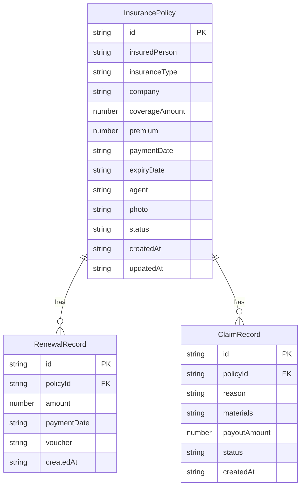

## 1. 架构设计

```mermaid
graph TB
    subgraph "前端层"
        "React 18 + TypeScript"
        "React Router DOM"
        "Tailwind CSS"
        "Zustand 状态管理"
    end
    subgraph "数据层"
        "localStorage 持久化"
        "File Base64 图片存储"
    end
    "React 18 + TypeScript" --> "Zustand 状态管理"
    "Zustand 状态管理" --> "localStorage 持久化"
    "Zustand 状态管理" --> "File Base64 图片存储"
```

纯前端架构，无后端服务。数据通过 Zustand 管理并自动持久化到 localStorage。

## 2. 技术说明
- 前端：React@18 + TypeScript + Tailwind CSS@3 + Vite
- 初始化工具：vite-init
- 后端：无
- 数据库：localStorage（浏览器本地存储）
- 状态管理：Zustand（含 persist 中间件自动持久化）
- 图表：recharts
- 日期处理：date-fns
- 图标：lucide-react

## 3. 路由定义
| 路由 | 用途 |
|------|------|
| / | 首页 - 保单分组展示和提醒 |
| /policy/new | 添加新保单 |
| /policy/:id | 编辑保单 |
| /policy/:id/renew | 续费记录 |
| /policy/:id/claim | 理赔记录 |
| /members | 个人保障视图 - 按被保人查看 |
| /members/:name | 特定被保人的保障详情 |
| /statistics | 统计页面 - 年保费/保障概况 |

## 4. API定义
无后端API，所有数据操作通过 Zustand store 完成。

## 5. 服务器架构图
不适用 - 纯前端应用

## 6. 数据模型

### 6.1 数据模型定义



### 6.2 数据定义语言

```typescript
type InsuranceType = '车险' | '重疾险' | '医疗险' | '意外险' | '其他'
type PolicyStatus = '快缴费' | '快到期' | '保障中' | '已失效'
type ClaimStatus = '处理中' | '已赔付' | '已拒赔'

interface InsurancePolicy {
  id: string
  insuredPerson: string
  insuranceType: InsuranceType
  company: string
  coverageAmount: number
  premium: number
  paymentDate: string
  expiryDate: string
  agent: string
  photo: string
  status: PolicyStatus
  createdAt: string
  updatedAt: string
}

interface RenewalRecord {
  id: string
  policyId: string
  amount: number
  paymentDate: string
  voucher: string
  createdAt: string
}

interface ClaimRecord {
  id: string
  policyId: string
  reason: string
  materials: string
  payoutAmount: number
  status: ClaimStatus
  createdAt: string
}
```

保单状态自动计算规则：
- 已失效：到期日 < 今天
- 快缴费：缴费日期距今 ≤ 30天 且 尚未失效
- 快到期：到期日距今 ≤ 30天 且 尚未失效 且 非快缴费
- 保障中：以上条件均不满足
