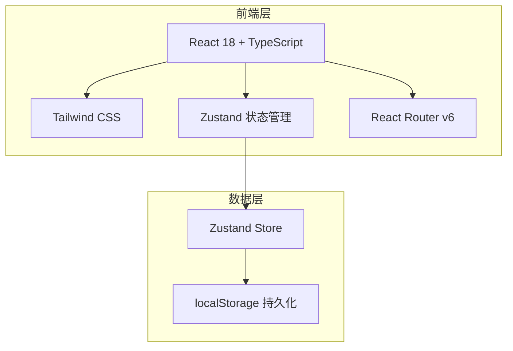
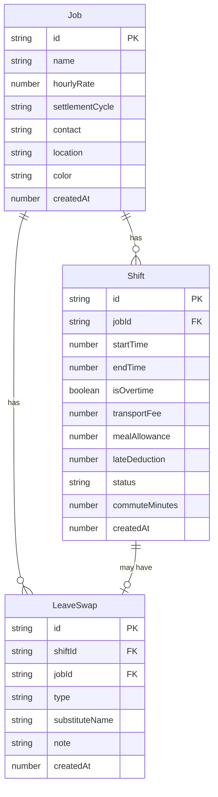

## 1. 架构设计

纯前端架构，数据通过 localStorage 持久化存储，无需后端服务。

## 2. 技术说明

- **前端**：React@18 + TypeScript + Tailwind CSS@3 + Vite
- **初始化工具**：vite-init (react-ts 模板)
- **状态管理**：Zustand（带 persist 中间件实现 localStorage 持久化）
- **路由**：react-router-dom@6
- **图标**：lucide-react
- **后端**：无
- **数据库**：无，使用 localStorage 模拟数据持久化

## 3. 路由定义

| 路由 | 用途 |
|------|------|
| / | 首页 - 本周班次、待结算/已结算分组、提醒、收入摘要 |
| /jobs | 兼职管理 - 添加/编辑兼职岗位 |
| /shifts | 排班记录 - 添加/管理排班班次 |
| /income | 收入明细 - 按兼职分类收入、月度汇总 |
| /leave | 请假换班 - 请假和换班记录管理 |
| /stats | 统计 - 兼职排名、时薪、通勤、缺勤分析 |

## 4. API 定义

无后端 API，所有数据操作通过 Zustand Store 在前端完成。

## 5. 服务器架构图

无后端服务器。

## 6. 数据模型

### 6.1 数据模型定义

### 6.2 数据定义

**Job（兼职岗位）**
- `id`: string - 唯一标识，UUID
- `name`: string - 岗位名称（如"星巴克咖啡师"）
- `hourlyRate`: number - 时薪（元/小时）
- `settlementCycle`: "daily" | "weekly" | "monthly" - 结算周期
- `contact`: string - 联系人
- `location`: string - 工作地点
- `color`: string - 标识颜色（hex值，用于区分不同兼职）
- `createdAt`: number - 创建时间戳

**Shift（排班记录）**
- `id`: string - 唯一标识，UUID
- `jobId`: string - 关联兼职ID
- `startTime`: number - 开始时间戳
- `endTime`: number - 结束时间戳
- `isOvertime`: boolean - 是否加班
- `transportFee`: number - 交通费（元）
- `mealAllowance`: number - 餐补（元）
- `lateDeduction`: number - 迟到扣款（元）
- `status`: "pending" | "settled" - 结算状态
- `commuteMinutes`: number - 通勤时间（分钟）
- `createdAt`: number - 创建时间戳

**LeaveSwap（请假换班）**
- `id`: string - 唯一标识，UUID
- `shiftId`: string - 关联班次ID
- `jobId`: string - 关联兼职ID
- `type`: "leave" | "swap" - 类型：请假/换班
- `substituteName`: string - 顶班人姓名
- `note`: string - 备注
- `createdAt`: number - 创建时间戳
