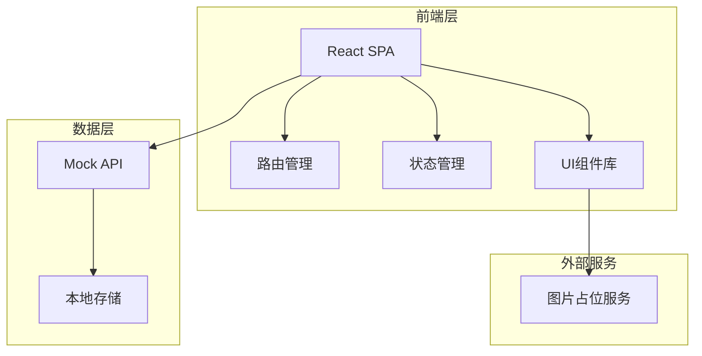
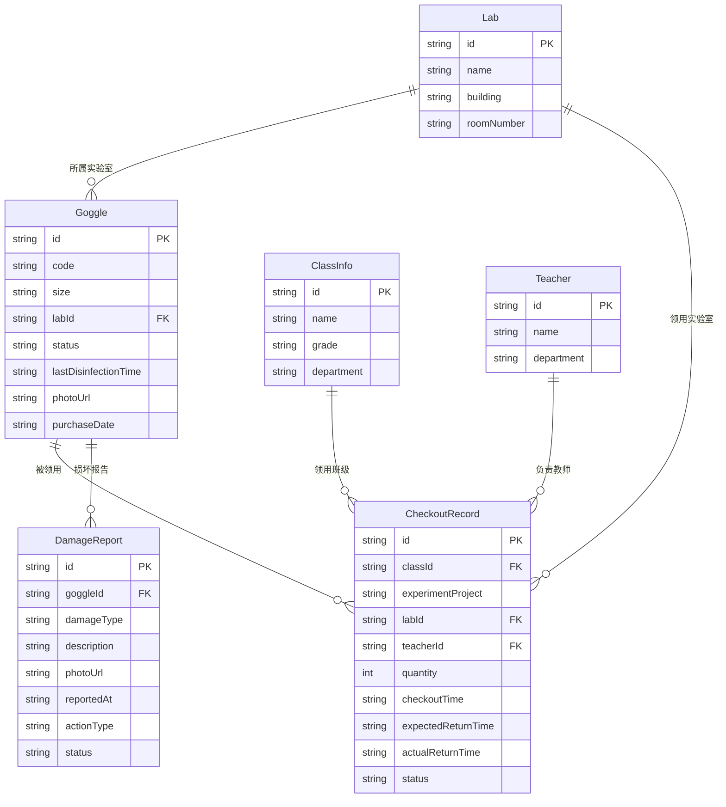

## 1. 架构设计



## 2. 技术说明

- **前端**：React@18 + TypeScript + Tailwind CSS@3 + Vite
- **初始化工具**：Vite (react-ts 模板)
- **路由**：React Router@6
- **状态管理**：Zustand（轻量级，适合中小型应用）
- **图表**：Recharts（用于管理看板的统计图表）
- **后端**：无后端，使用 Mock 数据 + localStorage 持久化
- **数据库**：前端 localStorage，数据结构通过 TypeScript 类型约束

## 3. 路由定义

| 路由 | 用途 |
|------|------|
| `/` | 重定向至管理看板 |
| `/dashboard` | 管理看板：库存概览、归还效率、消毒预警、状态统计 |
| `/checkout` | 领用管理：领用登记、领用记录 |
| `/return` | 归还管理：扫码归还、损坏标记 |
| `/inventory` | 护目镜台账：列表、详情、新增 |
| `/maintenance` | 维修补购清单：待处理列表、处理操作 |

## 4. API 定义

本项目无后端，使用 Zustand store + localStorage 模拟数据层。核心数据操作通过 store 方法暴露：

```typescript
interface Goggle {
  id: string
  code: string
  size: 'S' | 'M' | 'L' | 'XL'
  labId: string
  status: 'available' | 'checked_out' | 'pending_clean' | 'disinfected' | 'drying' | 'stored' | 'under_repair' | 'retired'
  lastDisinfectionTime: string | null
  photoUrl: string | null
  purchaseDate: string
  createdAt: string
  updatedAt: string
}

interface CheckoutRecord {
  id: string
  classId: string
  experimentProject: string
  labId: string
  teacherId: string
  quantity: number
  goggleIds: string[]
  checkoutTime: string
  expectedReturnTime: string
  actualReturnTime: string | null
  status: 'active' | 'partial_returned' | 'returned' | 'overdue'
}

interface DamageReport {
  id: string
  goggleId: string
  damageType: 'lens_scratched' | 'strap_broken' | 'nose_pad_missing' | 'other'
  description: string
  photoUrl: string | null
  reportedAt: string
  actionType: 'repair' | 'replace'
  status: 'pending' | 'in_progress' | 'completed'
  completedAt: string | null
  notes: string | null
}

interface Lab {
  id: string
  name: string
  building: string
  roomNumber: string
}

interface ClassInfo {
  id: string
  name: string
  grade: string
  department: string
}

interface Teacher {
  id: string
  name: string
  department: string
}
```

## 5. 服务器架构图

不适用，本项目为纯前端应用，无后端服务器。

## 6. 数据模型

### 6.1 数据模型定义



### 6.2 数据定义

使用 TypeScript 接口定义数据结构，数据持久化至 localStorage，键名为 `goggle_mgr_<entity>`。初始 Mock 数据在首次加载时生成，包含：

- 3 间实验室（化学实验室A、物理实验室B、生物实验室C）
- 6 个班级
- 4 名教师
- 60 副护目镜（各状态分布）
- 15 条领用记录
- 8 条损坏报告
