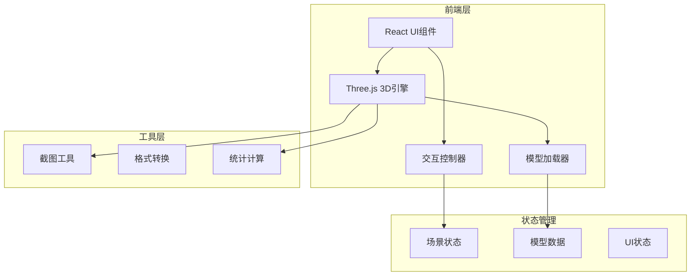

# 3D模型查看器 技术架构

## 1. 架构设计



## 2. 技术描述

- **前端框架**: React@18 + TypeScript
- **构建工具**: Vite@5
- **样式方案**: TailwindCSS@3
- **3D引擎**: Three.js@0.160 + @types/three
- **控制组件**: OrbitControls (Three.js内置)
- **加载器**: 
  - STLLoader (STL格式)
  - OBJLoader (OBJ格式)
  - GLTFLoader (GLB/GLTF格式)

## 3. 目录结构

```
src/
├── components/
│   ├── ControlPanel/      # 左侧控制面板
│   │   ├── BackgroundControl.tsx
│   │   ├── LightControl.tsx
│   │   ├── RenderModeControl.tsx
│   │   ├── MaterialControl.tsx
│   │   └── HelperSwitch.tsx
│   ├── InfoPanel/         # 右侧信息面板
│   │   └── ModelInfo.tsx
│   ├── Toolbar/           # 顶部工具栏
│   │   ├── UploadButton.tsx
│   │   └── ScreenshotButton.tsx
│   └── Viewer/            # 3D查看器核心
│       ├── ThreeCanvas.tsx
│       ├── useScene.ts
│       └── useModelLoader.ts
├── hooks/
│   └── useRaycaster.ts    # 射线检测hook
├── utils/
│   ├── modelUtils.ts      # 模型处理工具
│   └── screenshot.ts      # 截图工具
├── types/
│   └── index.ts           # 类型定义
├── App.tsx
├── main.tsx
└── index.css
```

## 4. 核心组件说明

### 4.1 ThreeCanvas 组件
- 负责初始化Three.js场景、相机、渲染器
- 管理OrbitControls交互
- 处理窗口大小自适应
- 渲染循环管理

### 4.2 useModelLoader Hook
- 封装STL/OBJ/GLB加载器
- 处理文件上传和解析
- 模型自动居中缩放逻辑
- 错误处理和加载状态

### 4.3 ControlPanel 组件
- 背景色选择器
- 灯光强度滑块（环境光/方向光）
- 渲染模式切换（实体/线框/半透明）
- 材质颜色选择
- 辅助元素开关（坐标轴/网格/自动旋转）

### 4.4 ModelInfo 组件
- 顶点数统计
- 面数/三角形数统计
- 文件大小显示
- 包围盒尺寸计算（X/Y/Z轴）
- 实时更新机制

### 4.5 useRaycaster Hook
- 射线检测实现
- 面级别的精确碰撞
- 点击高亮效果
- 三维坐标计算和显示

## 5. 关键技术点

### 5.1 模型自适应缩放
```typescript
// 计算包围盒并自动缩放
const box = new THREE.Box3().setFromObject(model);
const center = box.getCenter(new THREE.Vector3());
const size = box.getSize(new THREE.Vector3());
const maxDim = Math.max(size.x, size.y, size.z);
const scale = 5 / maxDim;
model.scale.setScalar(scale);
model.position.sub(center.multiplyScalar(scale));
```

### 5.2 射线检测
```typescript
// 点击面检测
const raycaster = new THREE.Raycaster();
const mouse = new THREE.Vector2();
raycaster.setFromCamera(mouse, camera);
const intersects = raycaster.intersectObjects(scene.children, true);
```

### 5.3 截图导出
```typescript
// 渲染后获取画布数据
renderer.render(scene, camera);
const dataURL = renderer.domElement.toDataURL('image/png');
const link = document.createElement('a');
link.download = `model-viewer-${timestamp}.png`;
link.href = dataURL;
link.click();
```
