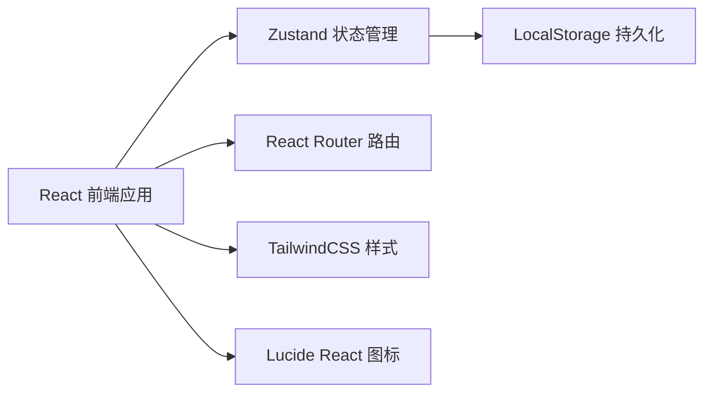
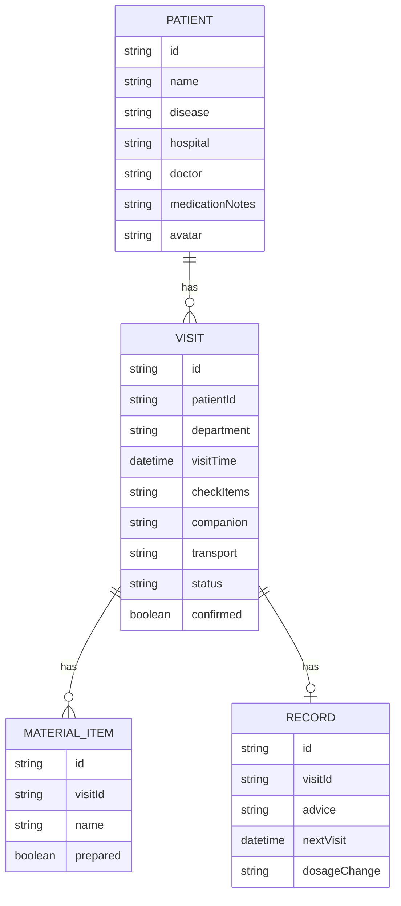

## 1. 架构设计



## 2. 技术描述
- 前端：React@18 + TypeScript + Vite
- 状态管理：Zustand
- 路由：react-router-dom
- 样式：TailwindCSS@3
- 图标：lucide-react
- 数据持久化：LocalStorage（前端模拟）
- 初始化工具：vite-init

## 3. 路由定义
| 路由 | 页面 | 用途 |
|-------|------|------|
| / | Dashboard | 首页统计概览 |
| /patients | PatientList | 就诊人档案列表 |
| /patients/:id | PatientDetail | 就诊人详情 |
| /visits | VisitList | 复诊排班列表 |
| /visits/:id | VisitDetail | 复诊详情/材料准备 |
| /records | RecordList | 复诊历史记录 |
| /stats | Statistics | 统计面板 |

## 4. 数据模型

### 4.1 数据模型定义



### 4.2 TypeScript 类型定义

```typescript
interface Patient {
  id: string;
  name: string;
  disease: string;
  hospital: string;
  doctor: string;
  medicationNotes: string;
  avatar: string;
}

interface Visit {
  id: string;
  patientId: string;
  department: string;
  visitTime: string;
  checkItems: string;
  materials: MaterialItem[];
  companion: string;
  transport: string;
  status: 'upcoming' | 'confirmed' | 'completed' | 'cancelled';
  confirmed: boolean;
}

interface MaterialItem {
  id: string;
  name: string;
  prepared: boolean;
}

interface VisitRecord {
  id: string;
  visitId: string;
  advice: string;
  nextVisit: string;
  dosageChange: string;
}

interface CompanionStats {
  name: string;
  count: number;
}
```
