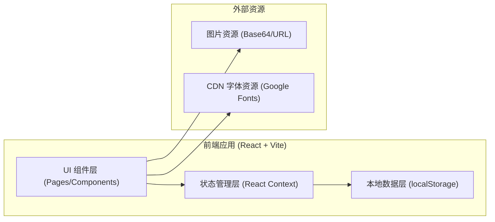
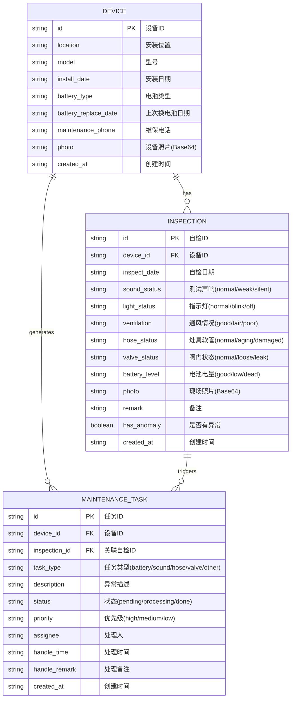

## 1. 架构设计



## 2. 技术说明

- **前端框架**：React@18 + React Router@6
- **构建工具**：Vite@5
- **样式方案**：TailwindCSS@3 + 自定义 CSS 变量
- **图标方案**：Lucide React（线性图标库）
- **状态管理**：React Context + useReducer
- **数据持久化**：localStorage（设备、自检记录、维修任务数据）
- **图片处理**：FileReader + Base64 存储
- **字体**：Google Fonts - Noto Sans SC
- **后端**：无（纯前端本地应用）
- **数据库**：localStorage 模拟

## 3. 路由定义

| 路由路径 | 页面组件 | 用途 |
|----------|----------|------|
| `/` | DashboardPage | 首页仪表盘：待自检、异常、换电池提醒、报警记录 |
| `/devices` | DeviceListPage | 设备档案列表 |
| `/devices/new` | DeviceFormPage | 新增设备档案 |
| `/devices/:id` | DeviceDetailPage | 设备详情（含档案信息+自检历史） |
| `/devices/:id/edit` | DeviceFormPage | 编辑设备档案 |
| `/devices/:id/inspection` | InspectionFormPage | 录入月度自检记录 |
| `/alerts` | AlertsPage | 异常提醒与维修任务看板 |

## 4. 数据模型

### 4.1 数据模型 ER 图



### 4.2 电池寿命参考

| 电池类型 | 建议更换周期 |
|----------|--------------|
| 5号碱性电池 (AA) | 12 个月 |
| 7号碱性电池 (AAA) | 12 个月 |
| 9V 叠层电池 | 12 个月 |
| CR123A 锂电池 | 36 个月 |
| CR2 锂电池 | 36 个月 |
| 内置锂电 (可充电) | 按充电次数/24个月 |

## 5. 目录结构

```
src/
├── main.jsx                 # 入口文件
├── App.jsx                  # 路由配置
├── index.css                # 全局样式 + Tailwind
├── context/
│   └── AppContext.jsx       # 全局状态管理 (设备/自检/任务)
├── pages/
│   ├── DashboardPage.jsx    # 首页仪表盘
│   ├── DeviceListPage.jsx   # 设备列表页
│   ├── DeviceFormPage.jsx   # 设备表单(新增/编辑)
│   ├── DeviceDetailPage.jsx # 设备详情页
│   ├── InspectionFormPage.jsx # 自检表单页
│   └── AlertsPage.jsx       # 异常与维修页
├── components/
│   ├── Layout/
│   │   ├── Header.jsx       # 顶部导航
│   │   ├── Sidebar.jsx      # 侧边栏(桌面)
│   │   └── BottomNav.jsx    # 底部导航(移动)
│   ├── Dashboard/
│   │   ├── StatCard.jsx     # 统计卡片
│   │   ├── PendingList.jsx  # 待自检列表
│   │   ├── AnomalyList.jsx  # 异常设备列表
│   │   ├── BatteryReminder.jsx # 电池提醒
│   │   └── RecentTimeline.jsx  # 最近记录时间线
│   ├── Device/
│   │   ├── DeviceCard.jsx   # 设备卡片
│   │   └── DeviceForm.jsx   # 设备表单
│   ├── Inspection/
│   │   ├── InspectionForm.jsx   # 自检表单
│   │   ├── InspectionItem.jsx   # 单项检查
│   │   └── InspectionHistory.jsx # 历史记录
│   └── Alerts/
│       ├── AnomalyCard.jsx      # 异常警示卡
│       └── TaskBoard.jsx        # 任务看板
├── utils/
│   ├── storage.js           # localStorage 封装
│   ├── dateUtils.js         # 日期计算工具
│   ├── anomalyDetector.js   # 异常检测与任务生成
│   └── mockData.js          # 初始模拟数据
└── constants/
    └── index.js             # 常量定义(枚举/选项)
```

## 6. 核心业务逻辑

### 6.1 异常检测规则 (anomalyDetector.js)

| 自检项 | 异常条件 | 维修任务类型 | 优先级 |
|--------|----------|--------------|--------|
| 电池电量 | `battery_level === 'low' 或 'dead'` | battery | high |
| 测试声响 | `sound_status === 'silent'` | sound | high |
| 测试声响 | `sound_status === 'weak'` | sound | medium |
| 灶具软管 | `hose_status === 'aging' 或 'damaged'` | hose | high |
| 阀门状态 | `valve_status === 'leak'` | valve | high |
| 阀门状态 | `valve_status === 'loose'` | valve | medium |
| 指示灯 | `light_status === 'off'` | sound | medium |

### 6.2 自检完成判断

- 本月已自检：`inspect_date` 在当前自然月内
- 本月待自检：设备存在且本月尚无自检记录

### 6.3 电池更换计算

```
下次换电池日期 = 上次换电池日期 + 电池寿命周期（月）
剩余天数 = 下次换电池日期 - 今天
剩余天数 ≤ 30 天：黄色提醒
剩余天数 ≤ 7 天：红色提醒 + 自动生成维修任务
```
