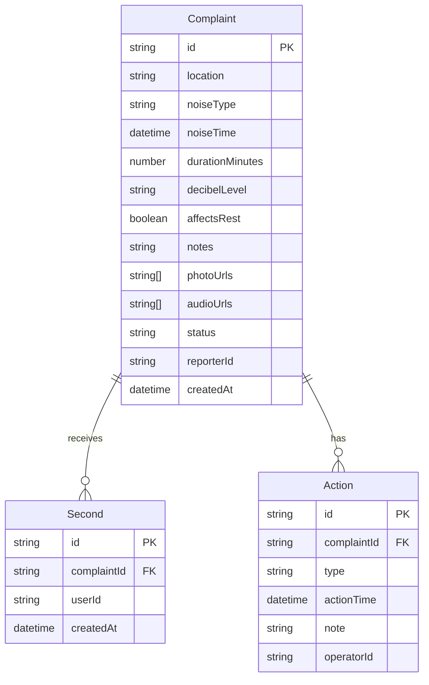

## 1. 架构设计

```mermaid
graph TB
    "前端 React+Vite" --> "Zustand 状态管理"
    "Zustand 状态管理" --> "LocalStorage 持久化"
    "前端 React+Vite" --> "页面路由 React-Router"
```

纯前端项目，使用 LocalStorage 模拟数据持久化，无需后端服务。

## 2. 技术说明

- 前端：React@18 + TypeScript + Tailwind CSS@3 + Vite
- 初始化工具：vite-init
- 后端：无（使用 LocalStorage + Mock 数据）
- 数据库：LocalStorage（浏览器本地存储）

## 3. 路由定义

| 路由 | 用途 |
|------|------|
| / | 首页，按状态分组的投诉列表 |
| /complaint/new | 新增投诉表单 |
| /complaint/:id | 投诉详情页（附议+处理记录） |
| /scripts | 沟通话术页 |
| /stats | 统计分析页 |

## 4. API定义

无后端API，所有数据操作通过 Zustand Store + LocalStorage 完成。

### 数据操作接口

- `addComplaint(complaint)` — 新增投诉
- `secondComplaint(id, userId)` — 附议投诉
- `addAction(complaintId, action)` — 添加处理动作
- `updateStatus(complaintId, status)` — 更新投诉状态
- `getComplaintsByStatus(status)` — 按状态筛选
- `getStatistics()` — 获取统计数据

## 5. 服务器架构图

不适用（纯前端项目）

## 6. 数据模型

### 6.1 数据模型定义



### 6.2 数据定义

```typescript
type NoiseType = 'renovation' | 'singing' | 'speaker' | 'pet' | 'other';
type DecibelLevel = 'quiet' | 'moderate' | 'loud' | 'extreme';
type ComplaintStatus = 'ongoing' | 'pending' | 'resolved' | 'recurring';
type ActionType = 'visited' | 'contacted' | 'police' | 'rectification';

interface Complaint {
  id: string;
  location: string;
  noiseType: NoiseType;
  noiseTime: string;
  durationMinutes: number;
  decibelLevel: DecibelLevel;
  affectsRest: boolean;
  notes: string;
  photoUrls: string[];
  audioUrls: string[];
  status: ComplaintStatus;
  reporterId: string;
  createdAt: string;
  seconds: Second[];
  actions: Action[];
}

interface Second {
  id: string;
  complaintId: string;
  userId: string;
  createdAt: string;
}

interface Action {
  id: string;
  complaintId: string;
  type: ActionType;
  actionTime: string;
  note: string;
  operatorId: string;
}
```

初始 Mock 数据将包含 8-10 条覆盖各状态和类型的投诉记录，附议和处理动作各若干条。
