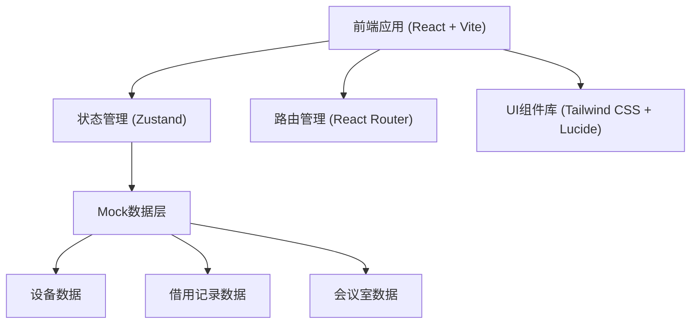
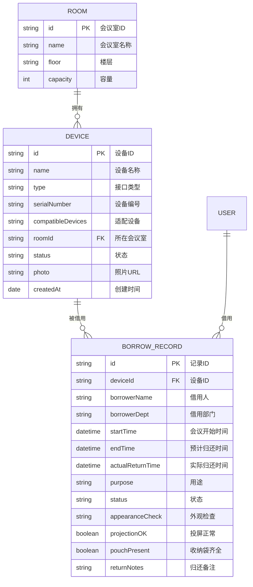

## 1. 架构设计



## 2. 技术描述

- **前端框架**：React@18 + TypeScript
- **构建工具**：Vite@5
- **样式方案**：Tailwind CSS@3
- **状态管理**：Zustand
- **路由管理**：React Router DOM@6
- **图标库**：Lucide React
- **后端**：无（纯前端Mock数据演示）
- **数据持久化**：LocalStorage（可选）

## 3. 路由定义

| 路由路径 | 页面名称 | 说明 |
|---------|----------|------|
| / | 首页仪表盘 | 统计概览和最近借用记录 |
| /devices | 设备档案 | 设备列表和管理 |
| /devices/:id | 设备详情 | 单个设备的详细信息 |
| /borrow | 借用登记 | 发起新的借用申请 |
| /return | 归还确认 | 归还设备并填写检查信息 |
| /records | 借用记录 | 查看所有借用历史 |

## 4. 数据模型

### 4.1 数据模型ER图



### 4.2 类型定义

```typescript
// 设备接口类型
type ConnectorType = 'HDMI' | 'Type-C' | 'Mac' | 'VGA' | 'DP';

// 设备状态
type DeviceStatus = 'available' | 'borrowed' | 'faulty' | 'maintenance';

// 借用状态
type BorrowStatus = 'pending' | 'borrowed' | 'returned' | 'overdue' | 'cancelled';

interface Room {
  id: string;
  name: string;
  floor: string;
  capacity: number;
}

interface Device {
  id: string;
  name: string;
  type: ConnectorType;
  serialNumber: string;
  compatibleDevices: string[];
  roomId: string;
  status: DeviceStatus;
  photo: string;
  createdAt: string;
}

interface BorrowRecord {
  id: string;
  deviceId: string;
  borrowerName: string;
  borrowerDept: string;
  startTime: string;
  endTime: string;
  actualReturnTime?: string;
  purpose: string;
  status: BorrowStatus;
  appearanceCheck?: 'good' | 'minor-damage' | 'damaged';
  projectionOK?: boolean;
  pouchPresent?: boolean;
  returnNotes?: string;
}

interface DashboardStats {
  totalBorrowed: number;
  overdueCount: number;
  faultyCount: number;
  highDemandTypes: { type: ConnectorType; count: number; deficit: number }[];
}
```

## 5. 目录结构

```
src/
├── components/          # 可复用组件
│   ├── Layout.tsx       # 页面布局
│   ├── StatCard.tsx     # 统计卡片
│   ├── DeviceCard.tsx   # 设备卡片
│   ├── StatusBadge.tsx  # 状态标签
│   └── Modal.tsx        # 弹窗组件
├── pages/               # 页面组件
│   ├── Dashboard.tsx    # 首页仪表盘
│   ├── DeviceList.tsx   # 设备档案列表
│   ├── DeviceDetail.tsx # 设备详情
│   ├── BorrowForm.tsx   # 借用登记
│   ├── ReturnForm.tsx   # 归还确认
│   └── Records.tsx      # 借用记录
├── store/               # 状态管理
│   └── useStore.ts      # Zustand store
├── data/                # Mock数据
│   ├── devices.ts       # 设备数据
│   ├── rooms.ts         # 会议室数据
│   └── records.ts       # 借用记录数据
├── types/               # TypeScript类型
│   └── index.ts         # 类型定义
├── utils/               # 工具函数
│   ├── date.ts          # 日期工具
│   └── conflict.ts      # 冲突检测
├── App.tsx              # 根组件
├── main.tsx             # 入口文件
└── index.css            # 全局样式
```

## 6. 核心功能实现思路

### 6.1 冲突检测算法

1. 输入：设备ID、开始时间、结束时间
2. 查询：该设备所有"借出中"的借用记录
3. 判断：新借用时间段与已有记录是否有时间重叠
4. 重叠判定：start1 < end2 && start2 < end1
5. 若冲突，查询同一楼层其他会议室的同类设备
6. 返回可用设备列表和建议时间

### 6.2 统计数据计算

- 当前借出：状态为"借出中"的记录数
- 逾期未还：结束时间 < 当前时间 且 状态为"借出中"
- 故障线材：设备状态为"故障"或"维修中"
- 高频缺口：按设备类型统计借出数量与总数量的比值，排序取前3

### 6.3 状态流转

```
可用 → 借出中 → 已归还
  ↓        ↓
故障/维修  逾期
  ↑        ↓
维修完成  已归还（逾期后归还）
```
