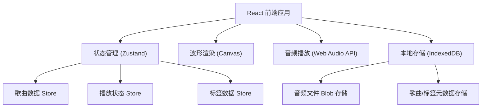
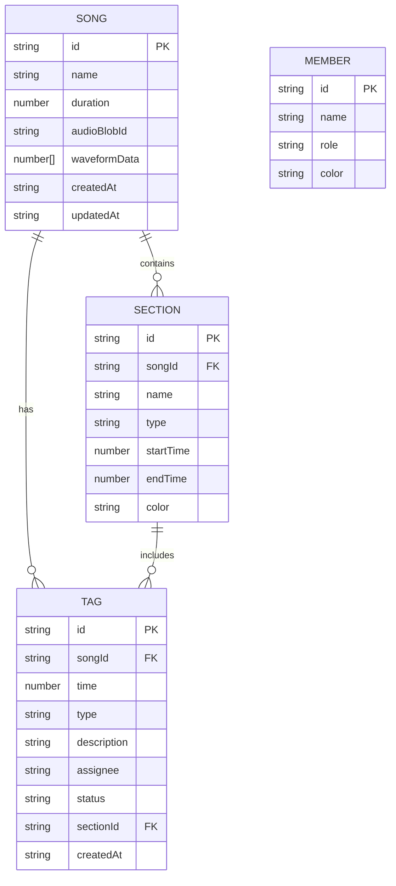

## 1. 架构设计



## 2. 技术描述

- **前端**：React@18 + TypeScript + Vite
- **样式**：TailwindCSS@3
- **状态管理**：Zustand
- **路由**：react-router-dom
- **图标**：lucide-react
- **音频处理**：Web Audio API + Canvas 波形绘制
- **本地存储**：IndexedDB（存储音频文件） + localStorage（元数据）
- **后端**：无（纯前端本地应用）

## 3. 路由定义

| 路由 | 页面 | 用途 |
|------|------|------|
| `/` | 歌曲列表页 | 展示所有歌曲，新建/上传入口 |
| `/song/:id` | 标注工作台 | 波形显示、标签标注、段落划分 |

## 4. 数据模型

### 4.1 数据结构定义



### 4.2 TypeScript 类型定义

```typescript
// 标签类型
type TagType = 'pitch' | 'rhythm' | 'harmony' | 'solo';

// 标签状态
type TagStatus = 'pending' | 'resolved' | 'reviewing';

// 段落类型
type SectionType = 'intro' | 'verse' | 'chorus' | 'bridge' | 'outro' | 'other';

// 成员角色
type MemberRole = 'vocal' | 'guitar' | 'bass' | 'drums' | 'keys' | 'other';

interface Song {
  id: string;
  name: string;
  duration: number;
  audioBlobId?: string;
  waveformData: number[];
  createdAt: string;
  updatedAt: string;
}

interface Section {
  id: string;
  songId: string;
  name: string;
  type: SectionType;
  startTime: number;
  endTime: number;
  color: string;
}

interface Tag {
  id: string;
  songId: string;
  time: number;
  type: TagType;
  description: string;
  assignee: string;
  status: TagStatus;
  sectionId?: string;
  createdAt: string;
}

interface Member {
  id: string;
  name: string;
  role: MemberRole;
  color: string;
}
```

## 5. 核心模块

### 5.1 波形渲染模块
- 使用 Web Audio API 的 `AudioContext` 和 `AnalyserNode` 提取波形数据
- 使用 Canvas 绘制波形图
- 支持缩放和平移
- 段落背景色块叠加
- 标签点标记叠加

### 5.2 音频播放模块
- 封装 HTML5 Audio 元素
- 播放/暂停/跳转控制
- 播放进度回调
- 倍速播放支持

### 5.3 状态管理模块
- `useSongStore`：歌曲列表管理
- `usePlayerStore`：播放状态控制
- `useTagStore`：标签增删改查
- `useSectionStore`：段落管理

### 5.4 本地存储模块
- IndexedDB 存储音频文件 Blob
- localStorage 存储歌曲、标签、段落元数据
- 自动持久化状态变更
