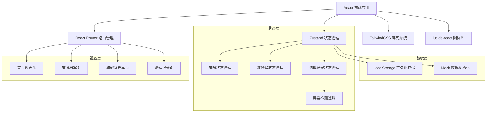
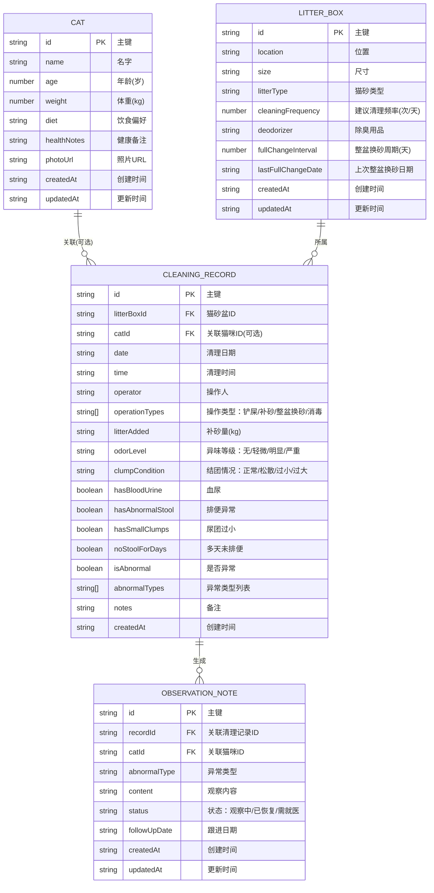

## 1. 架构设计



## 2. 技术描述

- **前端框架**：React@18 + TypeScript
- **构建工具**：Vite@5
- **路由管理**：react-router-dom@6
- **状态管理**：zustand@4
- **样式系统**：tailwindcss@3
- **图标库**：lucide-react
- **数据持久化**：localStorage + zustand persist 中间件
- **后端**：无（纯前端应用，数据本地存储）
- **数据库**：localStorage 浏览器存储

## 3. 路由定义

| 路由路径 | 页面名称 | 说明 |
|----------|----------|------|
| `/` | 首页仪表盘 | 展示今日待清理、异常提醒、库存和换砂提醒 |
| `/cats` | 猫咪档案 | 猫咪列表管理，新增/编辑/删除 |
| `/litter-boxes` | 猫砂盆档案 | 猫砂盆列表管理，新增/编辑/删除 |
| `/cleaning-records` | 清理记录 | 记录列表、新增记录、异常标记 |

## 4. 数据模型

### 4.1 ER 图



### 4.2 类型定义

```typescript
// 猫咪档案
interface Cat {
  id: string;
  name: string;
  age: number;
  weight: number;
  diet: string;
  healthNotes: string;
  photoUrl: string;
  createdAt: string;
  updatedAt: string;
}

// 猫砂盆档案
interface LitterBox {
  id: string;
  location: string;
  size: string;
  litterType: string;
  cleaningFrequency: number;
  deodorizer: string;
  fullChangeInterval: number;
  lastFullChangeDate: string;
  createdAt: string;
  updatedAt: string;
}

// 操作类型枚举
type OperationType = 'scoop' | 'add_litter' | 'full_change' | 'disinfect';

// 异味等级
type OdorLevel = 'none' | 'mild' | 'moderate' | 'severe';

// 结团情况
type ClumpCondition = 'normal' | 'loose' | 'small' | 'large';

// 异常类型
type AbnormalType = 'blood_urine' | 'abnormal_stool' | 'small_clumps' | 'no_stool_days';

// 观察记录状态
type ObservationStatus = 'watching' | 'recovered' | 'need_vet';

// 清理记录
interface CleaningRecord {
  id: string;
  litterBoxId: string;
  catId?: string;
  date: string;
  time: string;
  operator: string;
  operationTypes: OperationType[];
  litterAdded: number;
  odorLevel: OdorLevel;
  clumpCondition: ClumpCondition;
  hasBloodUrine: boolean;
  hasAbnormalStool: boolean;
  hasSmallClumps: boolean;
  noStoolForDays: boolean;
  isAbnormal: boolean;
  abnormalTypes: AbnormalType[];
  notes: string;
  createdAt: string;
}

// 观察记录
interface ObservationNote {
  id: string;
  recordId: string;
  catId?: string;
  abnormalType: AbnormalType;
  content: string;
  status: ObservationStatus;
  followUpDate: string;
  createdAt: string;
  updatedAt: string;
}

// 首页统计数据
interface DashboardStats {
  todayPending: number;
  abnormalCount: number;
  litterStock: number;
  nextFullChangeDays: number;
  nextFullChangeBoxName: string;
}
```

## 5. 核心功能模块设计

### 5.1 异常检测模块

```typescript
// 异常检测逻辑
function detectAbnormalities(record: Partial<CleaningRecord>): {
  isAbnormal: boolean;
  abnormalTypes: AbnormalType[];
} {
  const abnormalTypes: AbnormalType[] = [];
  
  if (record.hasBloodUrine) abnormalTypes.push('blood_urine');
  if (record.hasAbnormalStool) abnormalTypes.push('abnormal_stool');
  if (record.hasSmallClumps || record.clumpCondition === 'small') {
    abnormalTypes.push('small_clumps');
  }
  if (record.noStoolForDays) abnormalTypes.push('no_stool_days');
  
  return {
    isAbnormal: abnormalTypes.length > 0,
    abnormalTypes,
  };
}

// 自动生成观察记录
function generateObservationNote(
  record: CleaningRecord,
  abnormalType: AbnormalType
): Omit<ObservationNote, 'id' | 'createdAt' | 'updatedAt'> {
  const typeLabels: Record<AbnormalType, string> = {
    blood_urine: '血尿',
    abnormal_stool: '排便异常',
    small_clumps: '尿团过小',
    no_stool_days: '多天未排便',
  };
  
  return {
    recordId: record.id,
    catId: record.catId,
    abnormalType,
    content: `检测到${typeLabels[abnormalType]}异常，请密切观察猫咪状态。建议：增加饮水量，监测后续排泄情况，如持续异常请及时就医。`,
    status: 'watching',
    followUpDate: addDays(new Date(), 3).toISOString().split('T')[0],
  };
}
```

### 5.2 提醒计算模块

```typescript
// 计算今日待清理数量
function calculateTodayPending(litterBoxes: LitterBox[], records: CleaningRecord[]): number {
  const today = new Date().toISOString().split('T')[0];
  let pending = 0;
  
  litterBoxes.forEach(box => {
    const todayRecords = records.filter(
      r => r.litterBoxId === box.id && r.date === today && r.operationTypes.includes('scoop')
    );
    if (todayRecords.length < box.cleaningFrequency) {
      pending += box.cleaningFrequency - todayRecords.length;
    }
  });
  
  return pending;
}

// 计算下次整盆换砂
function calculateNextFullChange(litterBoxes: LitterBox[]): {
  days: number;
  boxName: string;
} {
  let minDays = Infinity;
  let nearestBox = '';
  
  litterBoxes.forEach(box => {
    if (box.lastFullChangeDate) {
      const lastChange = new Date(box.lastFullChangeDate);
      const nextChange = addDays(lastChange, box.fullChangeInterval);
      const days = differenceInDays(nextChange, new Date());
      
      if (days < minDays) {
        minDays = days;
        nearestBox = box.location;
      }
    }
  });
  
  return {
    days: minDays === Infinity ? 7 : Math.max(0, minDays),
    boxName: nearestBox || '未设置',
  };
}
```

## 6. 项目目录结构

```
trae0601-5/
├── src/
│   ├── components/          # 通用组件
│   │   ├── Layout.tsx       # 布局组件（导航）
│   │   ├── StatCard.tsx     # 统计卡片
│   │   ├── CatCard.tsx      # 猫咪卡片
│   │   ├── LitterBoxCard.tsx # 猫砂盆卡片
│   │   ├── RecordItem.tsx   # 清理记录项
│   │   ├── ObservationPanel.tsx # 观察记录面板
│   │   ├── CatForm.tsx      # 猫咪表单
│   │   ├── LitterBoxForm.tsx # 猫砂盆表单
│   │   └── RecordForm.tsx   # 清理记录表单
│   ├── pages/               # 页面组件
│   │   ├── Dashboard.tsx    # 首页
│   │   ├── Cats.tsx         # 猫咪档案页
│   │   ├── LitterBoxes.tsx  # 猫砂盆档案页
│   │   └── CleaningRecords.tsx # 清理记录页
│   ├── store/               # 状态管理
│   │   └── useAppStore.ts   # Zustand store
│   ├── types/               # 类型定义
│   │   └── index.ts
│   ├── utils/               # 工具函数
│   │   ├── detection.ts     # 异常检测
│   │   ├── calculation.ts   # 统计计算
│   │   └── mockData.ts      # Mock 数据
│   ├── App.tsx              # 根组件
│   ├── main.tsx             # 入口文件
│   └── index.css            # 全局样式
├── .trae/
│   └── documents/
│       ├── prd.md
│       └── tech-architecture.md
├── package.json
├── tsconfig.json
├── vite.config.ts
├── tailwind.config.js
└── postcss.config.js
```
