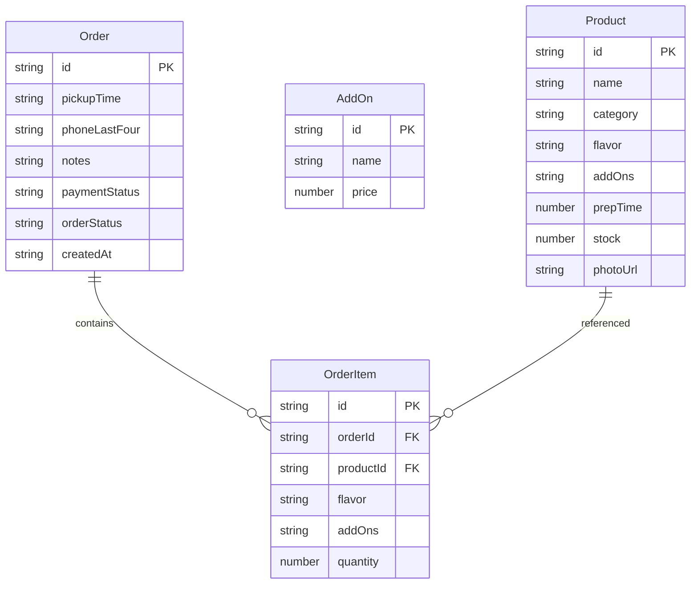

## 1. 架构设计

```mermaid
flowchart TB
    "前端 React 应用" --> "Zustand 状态管理"
    "Zustand 状态管理" --> "LocalStorage 持久化"
    "前端 React 应用" --> "页面路由"
    "页面路由" --> "商品管理页"
    "页面路由" --> "下单页"
    "页面路由" --> "厨房看板页"
    "页面路由" --> "统计页"
```

纯前端应用，使用 Zustand 进行状态管理，数据通过 LocalStorage 持久化，无需后端服务。

## 2. 技术说明

- **前端**：React@18 + TypeScript + Tailwind CSS@3 + Vite
- **初始化工具**：vite-init
- **后端**：无（纯前端，数据存 LocalStorage）
- **状态管理**：Zustand（含 persist 中间件）
- **图表库**：recharts
- **日期处理**：date-fns
- **图标**：lucide-react

## 3. 路由定义

| 路由 | 用途 |
|------|------|
| / | 重定向到 /products |
| /products | 商品管理页，商品列表与增删改 |
| /order | 下单页，顾客选择商品提交预订单 |
| /kitchen | 厨房看板页，按取餐时间排队的订单管理 |
| /stats | 统计页，时段分布、加料排行、销量排行 |

## 4. 数据模型

### 4.1 数据模型定义



### 4.2 类型定义

```typescript
interface Product {
  id: string;
  name: string;
  category: string;
  flavor: string[];
  addOns: string[];
  prepTime: number;
  stock: number;
  photoUrl: string;
}

interface AddOn {
  id: string;
  name: string;
  price: number;
}

interface Order {
  id: string;
  items: OrderItem[];
  pickupTime: string;
  phoneLastFour: string;
  notes: string;
  paymentStatus: 'paid' | 'unpaid';
  orderStatus: 'pending' | 'ready' | 'picked_up' | 'overdue';
  createdAt: string;
}

interface OrderItem {
  id: string;
  productId: string;
  productName: string;
  flavor: string;
  selectedAddOns: string[];
  quantity: number;
}
```

### 4.3 初始数据

预设早餐店常见商品：豆浆（甜/无糖）、饭团（加蛋/加油条/加肉松）、包子（肉包/菜包/豆沙包）、油条、煎饼果子（加蛋/加火腿/加生菜）等，配以合理库存和备餐时长。
