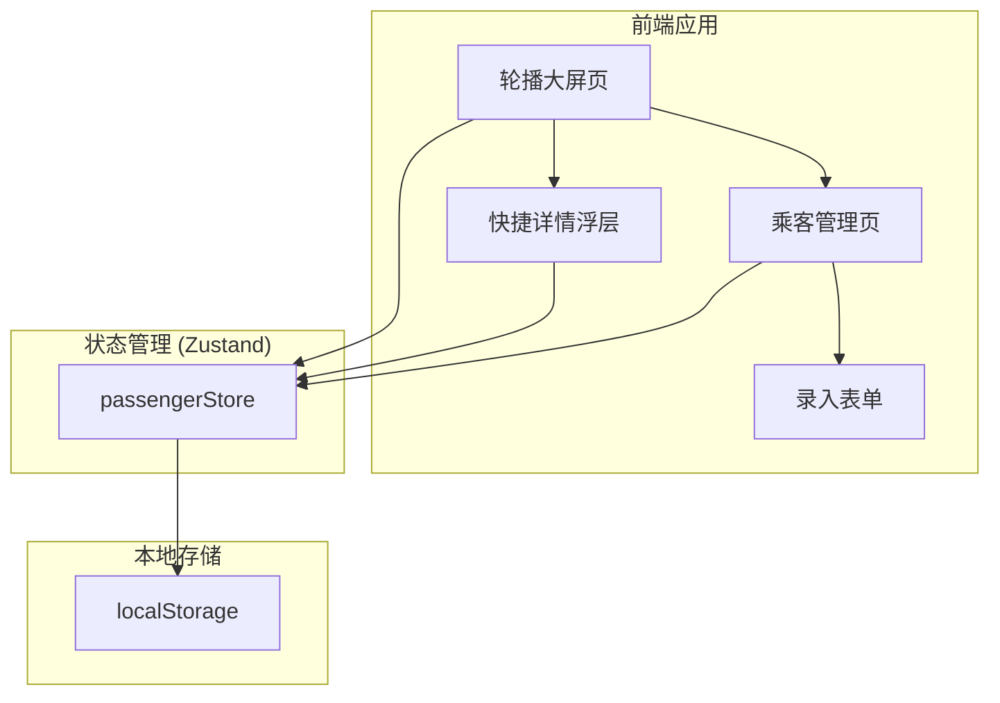
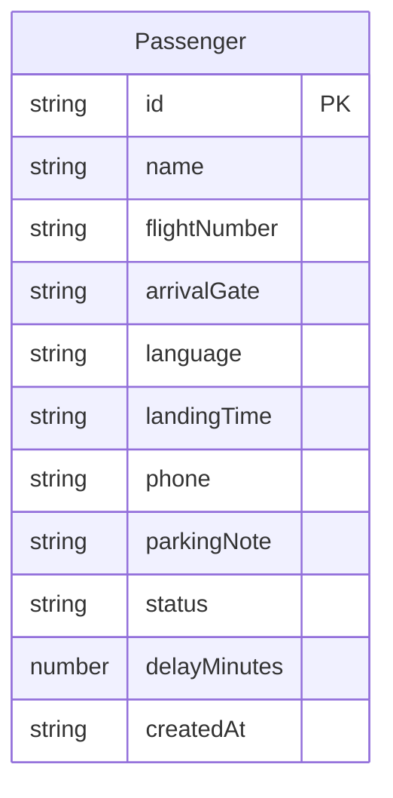

## 1. 架构设计



## 2. 技术说明

- **前端**：React@18 + TypeScript + Tailwind CSS@3 + Vite
- **初始化工具**：vite-init
- **后端**：无（纯前端应用）
- **数据持久化**：localStorage（通过 Zustand persist 中间件）
- **状态管理**：Zustand

## 3. 路由定义

| 路由 | 用途 |
|------|------|
| `/` | 轮播大屏页，默认主页 |
| `/manage` | 乘客管理页，录入和编辑乘客信息 |

## 4. API 定义

无后端 API，所有数据存储在 localStorage。

## 5. 数据模型

### 5.1 数据模型定义



### 5.2 数据定义

```typescript
type Language = "zh" | "en" | "ja" | "ko" | "other"

type PassengerStatus = "waiting" | "delayed" | "picked_up"

interface Passenger {
  id: string
  name: string
  flightNumber: string
  arrivalGate: string
  language: Language
  landingTime: string
  phone: string
  parkingNote: string
  status: PassengerStatus
  delayMinutes: number
  createdAt: string
}

interface AppState {
  passengers: Passenger[]
  currentIndex: number
  isPlaying: boolean
  isNightMode: boolean
  isLocked: boolean
  carouselInterval: number
}
```

## 6. 核心逻辑

### 6.1 轮播排序算法

- 默认按 `landingTime` 升序排列
- `status === "delayed"` 的航班排到同时间段之后
- `status === "picked_up"` 的航班从轮播中排除
- 轮播间隔可配置（默认 10 秒）

### 6.2 语言欢迎语映射

| 语言 | 欢迎语 |
|------|--------|
| zh | 欢迎 |
| en | Welcome |
| ja | ようこそ |
| ko | 환영합니다 |
| other | Welcome |

### 6.3 防误触锁定

- 锁定状态下，触控操作被拦截
- 长按 3 秒解锁
- 锁定图标显示锁定/解锁状态
