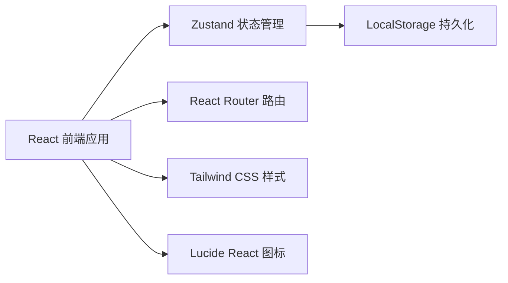
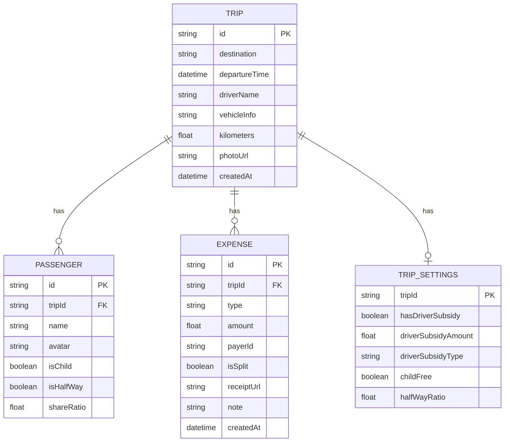

## 1. 架构设计

本项目为纯前端应用，使用 React + TypeScript + Vite 构建，数据通过 LocalStorage 持久化存储，无需后端服务。



## 2. 技术描述

- **前端框架**：React 18 + TypeScript
- **构建工具**：Vite 5
- **路由管理**：React Router DOM v6
- **状态管理**：Zustand
- **样式方案**：Tailwind CSS 3
- **图标库**：Lucide React
- **数据存储**：LocalStorage（本地持久化）
- **初始化工具**：vite-init

## 3. 路由定义

| 路由 | 页面 | 说明 |
|------|------|------|
| / | 行程列表页 | 展示所有行程，新建入口 |
| /trip/new | 新建行程 | 创建新行程档案 |
| /trip/:id | 行程详情 | 行程信息、费用列表、乘客管理 |
| /trip/:id/edit | 编辑行程 | 编辑行程档案信息 |
| /trip/:id/expense/new | 新增费用 | 添加新的费用记录 |
| /trip/:id/expense/:expenseId | 编辑费用 | 编辑已有费用记录 |
| /trip/:id/settlement | 结算页 | 费用分摊计算结果 |

## 4. 数据模型

### 4.1 数据模型定义



### 4.2 数据类型定义

```typescript
// 费用类型
type ExpenseType = 'fuel' | 'toll' | 'parking' | 'carwash' | 'supplies';

// 乘客
interface Passenger {
  id: string;
  name: string;
  avatar?: string;
  isChild: boolean;
  isHalfWay: boolean;
  shareRatio: number; // 分摊比例，默认1.0，半程0.5，儿童0
}

// 费用记录
interface Expense {
  id: string;
  tripId: string;
  type: ExpenseType;
  amount: number;
  payerId: string; // 付款人ID
  isSplit: boolean; // 是否均摊
  receiptUrl?: string;
  note?: string;
  createdAt: string;
}

// 司机补贴类型
type DriverSubsidyType = 'fixed' | 'percentage';

// 行程设置
interface TripSettings {
  tripId: string;
  hasDriverSubsidy: boolean;
  driverSubsidyAmount: number;
  driverSubsidyType: DriverSubsidyType;
  childFree: boolean;
  halfWayRatio: number;
}

// 行程
interface Trip {
  id: string;
  destination: string;
  departureTime: string;
  driverName: string;
  vehicleInfo: string;
  kilometers: number;
  photoUrl?: string;
  passengers: Passenger[];
  expenses: Expense[];
  settings: TripSettings;
  createdAt: string;
}

// 结算明细
interface SettlementItem {
  passengerId: string;
  passengerName: string;
  shouldPay: number; // 应付
  alreadyPaid: number; // 已付
  balance: number; // 差额（正=需补，负=多付）
}

// 结算汇总
interface SettlementSummary {
  totalCost: number;
  averageCost: number;
  maxPayer: { name: string; amount: number };
  items: SettlementItem[];
}
```

## 5. 项目结构

```
src/
├── components/        # 通用组件
│   ├── Layout/        # 布局组件
│   ├── Card/          # 卡片组件
│   ├── Button/        # 按钮组件
│   ├── Avatar/        # 头像组件
│   └── Form/          # 表单组件
├── pages/             # 页面组件
│   ├── TripList/      # 行程列表
│   ├── TripEdit/      # 行程编辑
│   ├── ExpenseList/   # 费用列表（行程详情）
│   ├── ExpenseEdit/   # 费用编辑
│   └── Settlement/    # 结算页
├── store/             # 状态管理
│   └── useTripStore.ts
├── utils/             # 工具函数
│   ├── calculation.ts # 费用计算
│   └── storage.ts     # 本地存储
├── types/             # 类型定义
│   └── index.ts
├── data/              # Mock数据
│   └── mockData.ts
├── App.tsx
├── main.tsx
└── index.css
```

## 6. 核心计算逻辑

### 6.1 费用分摊算法

1. 计算所有均摊费用的总和
2. 计算参与分摊的总份数（成人1份，儿童0份或0.5份，半程按比例）
3. 计算每份应承担的金额
4. 根据每人份数计算应付金额
5. 加上司机补贴（从乘客分摊）
6. 计算每人已付金额（自己付款的总和）
7. 计算差额 = 应付 - 已付

### 6.2 司机补贴处理

- 固定金额：直接从总费用中扣除，平均分摊给其他乘客
- 百分比：按油费的百分比计算，作为司机补贴
