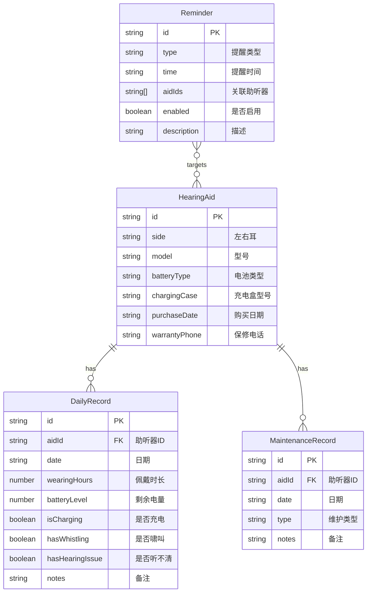

## 1. 架构设计

```mermaid
flowchart TB
    subgraph "前端层"
        "React 18 + TypeScript"
        "Tailwind CSS"
        "Zustand 状态管理"
        "React Router DOM"
    end
    subgraph "数据层"
        "LocalStorage 持久化"
        "Zustand Store"
    end
    "前端层" --> "数据层"
```

纯前端应用，数据存储在浏览器 LocalStorage 中，通过 Zustand 的 persist 中间件实现数据持久化。无需后端服务。

## 2. 技术说明

- 前端：React@18 + Tailwind CSS@3 + Vite
- 初始化工具：vite-init
- 后端：无
- 数据库：LocalStorage（浏览器本地存储）
- 状态管理：Zustand（带 persist 中间件）
- 图表：recharts
- 日期处理：date-fns
- 图标：lucide-react

## 3. 路由定义

| 路由 | 用途 |
|------|------|
| / | 首页，展示分组提醒（充电/换电池/异常） |
| /devices | 助听器管理页，添加/编辑助听器设备 |
| /devices/add | 添加新助听器 |
| /devices/:id/edit | 编辑助听器信息 |
| /daily | 每日记录页，记录佩戴状态和电量 |
| /reminders | 提醒设置页，家人设置提醒规则 |
| /maintenance | 维护记录页，清洁/换耳塞/维修记录 |
| /statistics | 统计页，续航分析/问题统计/充电习惯 |

## 4. API定义

无后端 API，所有数据通过 Zustand Store + LocalStorage 管理。

## 5. 服务端架构

不适用

## 6. 数据模型

### 6.1 数据模型定义



### 6.2 数据定义

```typescript
interface HearingAid {
  id: string
  side: 'left' | 'right'
  model: string
  batteryType: 'rechargeable' | 'disposable_13' | 'disposable_312' | 'disposable_10' | 'disposable_675'
  chargingCase: string
  purchaseDate: string
  warrantyPhone: string
}

interface DailyRecord {
  id: string
  aidId: string
  date: string
  wearingHours: number
  batteryLevel: number
  isCharging: boolean
  hasWhistling: boolean
  hasHearingIssue: boolean
  notes: string
}

interface Reminder {
  id: string
  type: 'before_sleep_charge' | 'before_out_check' | 'regular_maintenance' | 'custom'
  time: string
  aidIds: string[]
  enabled: boolean
  description: string
}

interface MaintenanceRecord {
  id: string
  aidId: string
  date: string
  type: 'clean_filter' | 'replace_ear_tip' | 'repair' | 'other'
  notes: string
}
```
