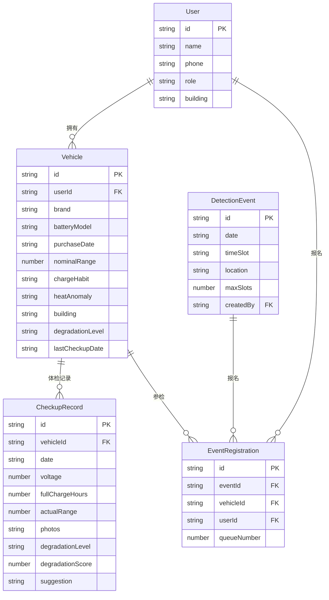

## 1. 架构设计

```mermaid
graph TB
    "前端 React+Vite" --> "状态管理 Zustand"
    "状态管理 Zustand" --> "本地存储 localStorage"
    "前端 React+Vite" --> "页面路由 React Router"
```

纯前端架构，使用 localStorage 持久化数据，无需后端服务。

## 2. 技术说明

- **前端框架**：React@18 + TypeScript + Vite
- **样式方案**：Tailwind CSS@3
- **状态管理**：Zustand（含 persist 中间件，数据持久化到 localStorage）
- **路由方案**：React Router DOM@6
- **图表库**：Recharts（轻量级，适合统计页的饼图、折线图、条形图）
- **图标**：lucide-react
- **初始化工具**：vite-init（react-ts 模板）
- **后端**：无（纯前端，数据存 localStorage）
- **数据库**：localStorage（模拟持久化）

## 3. 路由定义

| 路由 | 用途 |
|------|------|
| `/` | 首页——电池状态分区看板 |
| `/vehicles` | 车辆管理——车辆列表与录入 |
| `/checkup/:vehicleId` | 电池体检——填写检测数据与查看结果 |
| `/checkup/:vehicleId/history` | 体检历史记录 |
| `/events` | 集中检测——场次列表与报名 |
| `/stats` | 统计中心——风险概览与楼栋排行 |

## 4. 数据模型

### 4.1 数据模型定义



### 4.2 数据定义

**衰减等级计算逻辑**：

根据体检数据综合评分：
- 实际续航/标称续航比（权重40%）：比值越高越好
- 电压状态（权重30%）：额定电压48V为基准，偏差越大扣分越多
- 充满耗时变化（权重20%）：比正常时间增加越多扣分越多
- 发热记录（权重10%）：有异常发热扣分

等级划分：
- A 健康（≥85分）
- B 轻微衰减（70-84分）
- C 明显衰减（50-69分）
- D 严重衰减（30-49分）
- E 危险（<30分）

## 5. 项目目录结构

```
src/
├── components/          # 通用组件
│   ├── Layout.tsx       # 布局框架（侧边栏+内容区）
│   ├── StatusCard.tsx   # 状态分区卡片
│   ├── VehicleCard.tsx  # 车辆信息卡片
│   └── QueueBadge.tsx   # 排队号码徽章
├── pages/
│   ├── Home.tsx         # 首页
│   ├── Vehicles.tsx     # 车辆管理
│   ├── Checkup.tsx      # 电池体检
│   ├── CheckupHistory.tsx # 体检历史
│   ├── Events.tsx       # 集中检测
│   └── Stats.tsx        # 统计中心
├── store/
│   └── useStore.ts      # Zustand 全局状态
├── utils/
│   └── degradation.ts   # 衰减等级计算
├── App.tsx
└── main.tsx
```
