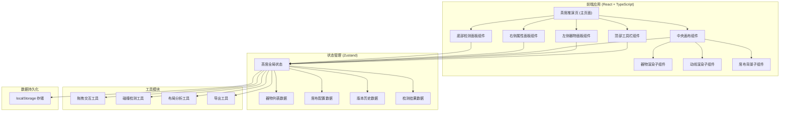
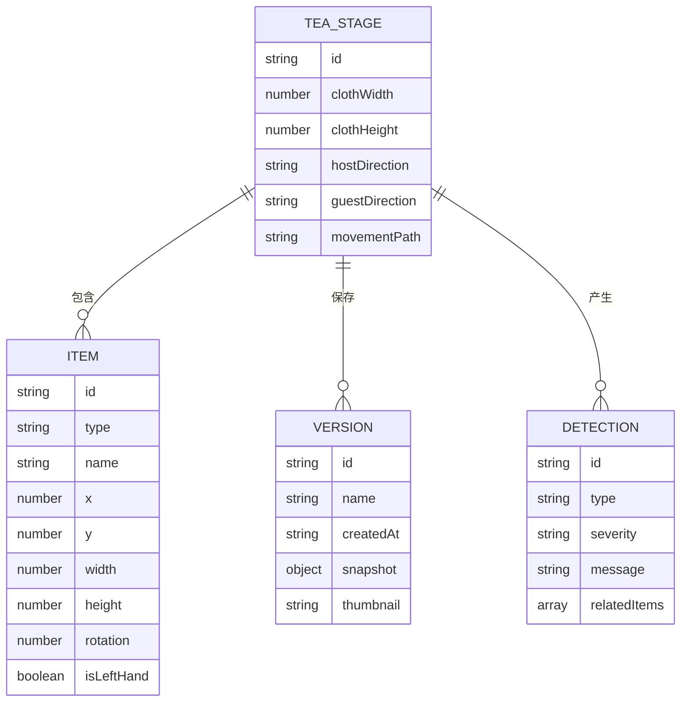

## 1. 架构设计



## 2. 技术描述

- **前端框架**：React@18 + TypeScript + Vite@5
- **样式方案**：TailwindCSS@3 + CSS Variables
- **状态管理**：Zustand@4
- **图标库**：Lucide React
- **初始化工具**：vite-init
- **后端**：无后端，纯前端应用
- **数据持久化**：localStorage 本地存储
- **拖拽实现**：原生 HTML5 拖拽 API + 自定义指针事件

## 3. 目录结构

```
src/
├── components/
│   ├── Toolbar/          # 顶部工具栏
│   ├── ItemPanel/        # 左侧器物面板
│   ├── Canvas/           # 中央画布
│   ├── PropertyPanel/    # 右侧属性面板
│   └── DetectionPanel/   # 底部检测面板
├── store/
│   └── useTeaStore.ts    # Zustand 全局状态
├── utils/
│   ├── drag.ts           # 拖拽工具函数
│   ├── collision.ts      # 碰撞检测
│   ├── layout.ts         # 布局分析
│   └── export.ts         # 导出工具
├── types/
│   └── index.ts          # 类型定义
├── data/
│   └── items.ts          # 器物预设数据
├── pages/
│   └── TeaStage.tsx      # 茶席推演主页
├── App.tsx
└── main.tsx
```

## 4. 路由定义

| 路由 | 用途 |
|------|------|
| / | 茶席推演主页（单页应用，无多路由） |

## 5. 数据模型

### 5.1 数据模型定义



### 5.2 TypeScript 类型定义

```typescript
// 器物类型
type ItemType = 'pot' | 'gongdao' | 'cup' | 'incense' | 'teaLeaf' | 'flower';

interface TeaItem {
  id: string;
  type: ItemType;
  name: string;
  x: number;
  y: number;
  width: number;
  height: number;
  rotation: number;
  isLeftHand?: boolean;
}

// 席布配置
interface ClothConfig {
  width: number;
  height: number;
  hostDirection: 'top' | 'bottom' | 'left' | 'right';
  guestDirection: 'top' | 'bottom' | 'left' | 'right';
}

// 版本记录
interface StageVersion {
  id: string;
  name: string;
  createdAt: number;
  items: TeaItem[];
  clothConfig: ClothConfig;
  thumbnail?: string;
}

// 检测结果
type DetectionType = 'occlusion' | 'distance' | 'handConflict' | 'balance';
type Severity = 'error' | 'warning' | 'info';

interface DetectionResult {
  id: string;
  type: DetectionType;
  severity: Severity;
  message: string;
  relatedItemIds: string[];
}

// 全局状态
interface TeaStore {
  items: TeaItem[];
  clothConfig: ClothConfig;
  versions: StageVersion[];
  currentVersionId: string | null;
  detections: DetectionResult[];
  movementPath: string;
  
  // Actions
  addItem: (item: Omit<TeaItem, 'id'>) => void;
  updateItem: (id: string, updates: Partial<TeaItem>) => void;
  removeItem: (id: string) => void;
  updateClothConfig: (config: Partial<ClothConfig>) => void;
  saveVersion: (name: string) => void;
  loadVersion: (id: string) => void;
  deleteVersion: (id: string) => void;
  runDetection: () => void;
  setMovementPath: (path: string) => void;
  clearAll: () => void;
}
```

## 6. 核心算法

### 6.1 遮挡检测
- 使用矩形碰撞检测算法（AABB）
- 计算两个器物矩形的重叠面积
- 重叠面积超过阈值判定为遮挡

### 6.2 距离检测
- 计算器物中心点之间的欧氏距离
- 与预设的合理距离范围比较
- 过近或过远均给出提醒

### 6.3 左右手冲突检测
- 根据主客方向确定左右方位
- 标记常用器物的惯用手属性
- 检测是否存在跨手取用不便的布局

### 6.4 空位均衡检测
- 将画布划分为网格区域
- 统计每个区域的器物数量和占用面积
- 计算分布方差，评估均衡程度
