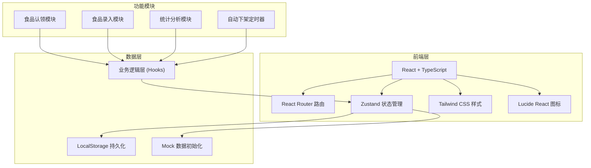
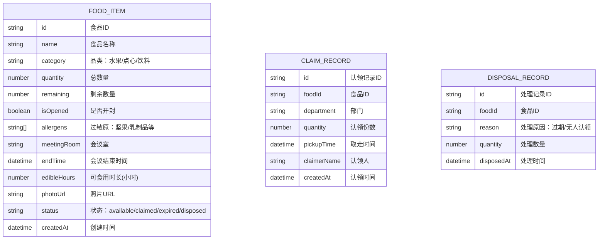

## 1. 架构设计



## 2. 技术描述

- **前端框架**：React 18 + TypeScript
- **构建工具**：Vite 5
- **路由管理**：react-router-dom 6
- **状态管理**：Zustand
- **样式方案**：Tailwind CSS 3
- **图标库**：lucide-react
- **数据持久化**：LocalStorage（前端模拟）
- **模板选择**：react-ts（纯前端项目，使用 mock 数据）

## 3. 路由定义

| 路由路径 | 页面名称 | 用途 |
|---------|----------|------|
| / | 认领大厅 | 展示所有可认领食品列表 |
| /food/:id | 食品详情 | 查看食品详情和进行认领 |
| /admin/publish | 食品录入 | 行政人员录入剩余食品 |
| /admin/stats | 统计后台 | 数据统计和报表展示 |
| /admin/records | 处理记录 | 查看过期/处理食品记录 |
| /my/claims | 我的认领 | 查看个人认领历史 |

## 4. 数据模型

### 4.1 数据模型定义



### 4.2 核心类型定义

```typescript
// 食品品类
type FoodCategory = 'fruit' | 'snack' | 'beverage';

// 过敏原类型
type AllergenType = 'nuts' | 'dairy' | 'gluten' | 'seafood' | 'soy';

// 食品状态
type FoodStatus = 'available' | 'partially_claimed' | 'fully_claimed' | 'expired' | 'disposed';

interface FoodItem {
  id: string;
  name: string;
  category: FoodCategory;
  quantity: number;
  remaining: number;
  isOpened: boolean;
  allergens: AllergenType[];
  meetingRoom: string;
  endTime: string;
  edibleHours: number;
  photoUrl: string;
  status: FoodStatus;
  createdAt: string;
}

interface ClaimRecord {
  id: string;
  foodId: string;
  department: string;
  quantity: number;
  pickupTime: string;
  claimerName: string;
  createdAt: string;
}

interface DisposalRecord {
  id: string;
  foodId: string;
  foodName: string;
  reason: 'expired' | 'unclaimed';
  quantity: number;
  disposedAt: string;
}

interface StatsData {
  totalAvailable: number;
  safeToTakeToday: number;
  topWasteDepartments: { department: string; count: number }[];
  commonlyUnclaimed: { name: string; count: number }[];
  todayClaimed: number;
}
```

## 5. 项目结构

```
src/
├── components/          # 公共组件
│   ├── FoodCard.tsx     # 食品卡片
│   ├── AllergenBadge.tsx # 过敏原标签
│   ├── CountdownTimer.tsx # 倒计时组件
│   ├── Navbar.tsx       # 导航栏
│   └── Modal.tsx        # 弹窗组件
├── pages/               # 页面组件
│   ├── Home.tsx         # 认领大厅
│   ├── FoodDetail.tsx   # 食品详情
│   ├── PublishFood.tsx  # 食品录入
│   ├── Stats.tsx        # 统计后台
│   ├── Records.tsx      # 处理记录
│   └── MyClaims.tsx     # 我的认领
├── store/               # 状态管理
│   └── useFoodStore.ts  # 食品状态 store
├── hooks/               # 自定义 hooks
│   ├── useFoodList.ts   # 食品列表逻辑
│   ├── useAutoExpire.ts # 自动下架逻辑
│   └── useStats.ts      # 统计逻辑
├── utils/               # 工具函数
│   ├── time.ts          # 时间处理
│   ├── storage.ts       # 本地存储
│   └── mock.ts          # Mock 数据
├── types/               # 类型定义
│   └── index.ts         # 类型导出
├── App.tsx              # 根组件
├── main.tsx             # 入口文件
└── index.css            # 全局样式
```

## 6. 核心功能实现思路

### 6.1 自动下架机制
- 使用 `useAutoExpire` hook，通过 `setInterval` 定时检查
- 每分钟检查一次所有 available 状态的食品
- 开封食品：结束时间 + 可食用时长 < 当前时间 → 自动过期
- 未开封食品：可适当延长可食用时间（默认 24 小时）
- 过期后状态更新为 expired，并创建处理记录

### 6.2 过敏原标注
- 含坚果或乳制品的食品卡片显示醒目的红色警示标签
- 详情页顶部显示过敏原警示横幅
- 筛选栏支持按过敏原排除/包含筛选

### 6.3 认领扣减
- 认领时校验剩余数量是否充足
- 使用乐观更新，立即更新 UI
- 扣减后库存为 0 时自动下架

### 6.4 统计功能
- 部门剩余排行：按食品来源会议室关联部门统计
- 常没人领食品：统计进入处理记录的食品品类
- 今日安全可取：统计今天内不会过期的可认领食品数量
