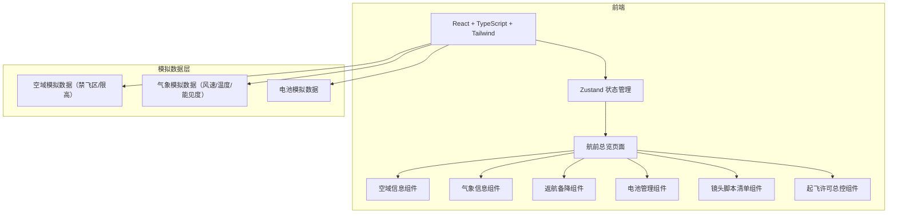

## 1. 架构设计



纯前端项目，所有空域/气象数据使用本地模拟数据，无需后端服务。

## 2. 技术说明

- **前端**：React@18 + TypeScript + Tailwind CSS@3 + Vite
- **初始化工具**：vite-init
- **后端**：无（纯前端项目，使用模拟数据）
- **状态管理**：Zustand
- **路由**：react-router-dom（单页应用，预留路由扩展）
- **图标**：lucide-react

## 3. 路由定义

| 路由 | 用途 |
|------|------|
| `/` | 航前总览页面（主入口，包含所有功能模块） |

## 4. 数据模型

### 4.1 核心类型定义

```typescript
interface Location {
  name: string;
  lat: number;
  lng: number;
}

interface AirspaceInfo {
  noFlyZones: NoFlyZone[];
  altitudeLimit: number;
  distanceToNearestZone: number;
  status: 'safe' | 'caution' | 'danger';
}

interface NoFlyZone {
  name: string;
  type: 'airport' | 'military' | 'government' | 'population';
  radius: number;
  lat: number;
  lng: number;
}

interface WeatherInfo {
  windSpeed: number;
  windDirection: number;
  temperature: number;
  visibility: number;
  windStatus: 'safe' | 'caution' | 'danger';
}

interface RthInfo {
  homePoint: Location;
  alternatives: AlternateLanding[];
}

interface AlternateLanding {
  name: string;
  location: Location;
  distance: number;
  direction: string;
}

interface Battery {
  id: string;
  name: string;
  cycleCount: number;
  health: number;
  estimatedFlightTime: number;
  status: 'good' | 'warning' | 'critical';
}

interface ShotItem {
  id: string;
  order: number;
  name: string;
  description: string;
  requiredAltitude: number;
  maxWindSpeed: number;
  batteryId: string;
  status: 'safe' | 'caution' | 'danger';
  issues: string[];
  alternatives: AlternativePosition[];
}

interface AlternativePosition {
  name: string;
  description: string;
  altitude: number;
  reason: string;
}
```

### 4.2 模拟数据策略

- 空域数据：预设 5-6 个中国典型航拍场景（如：北京故宫周边、上海外滩、深圳湾、成都天府广场、杭州西湖），根据输入地点匹配
- 气象数据：为每个地点生成随机但合理的模拟气象数据
- 电池数据：用户可交互添加/编辑，初始提供 3 块预设电池
- 镜头脚本：用户可交互添加/编辑，初始提供示例脚本
