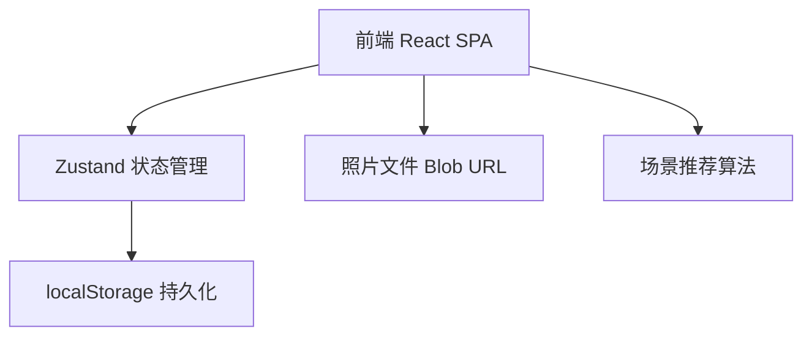
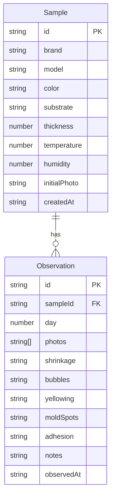

## 1. 架构设计



纯前端应用，无需后端服务。数据通过 Zustand 管理，持久化到 localStorage。照片以 Base64 格式存储在 localStorage 中。场景推荐算法基于五项指标的加权评分模型，在前端计算。

## 2. 技术说明

- 前端：React@18 + TypeScript + Tailwind CSS@3 + Vite
- 初始化工具：vite-init
- 后端：无
- 数据库：无，使用 localStorage 持久化

## 3. 路由定义

| 路由 | 用途 |
|------|------|
| / | 观察板主页，展示所有胶样卡片 |
| /sample/new | 新增样品录入页 |
| /sample/:id | 样品详情与观察记录页 |
| /recommendations | 场景推荐页 |

## 4. API定义

无后端API，纯前端应用。

## 5. 服务器架构图

不适用

## 6. 数据模型

### 6.1 数据模型定义



### 6.2 数据定义

```typescript
type IndicatorLevel = "none" | "mild" | "severe"

type AdhesionLevel = "excellent" | "good" | "poor"

interface Sample {
  id: string
  brand: string
  model: string
  color: string
  substrate: string
  thickness: number
  temperature: number
  humidity: number
  initialPhoto: string
  createdAt: string
}

interface Observation {
  id: string
  sampleId: string
  day: 1 | 3 | 7
  photos: string[]
  shrinkage: IndicatorLevel
  bubbles: IndicatorLevel
  yellowing: IndicatorLevel
  moldSpots: IndicatorLevel
  adhesion: AdhesionLevel
  notes: string
  observedAt: string
}

interface Recommendation {
  scenario: "kitchen" | "bathroom" | "window" | "balcony" | "general"
  sampleId: string
  score: number
  reasons: string[]
}
```

场景推荐评分算法：
- 厨房：发黄权重×2，附着力权重×1.5
- 卫生间：霉点权重×2，收缩权重×1.5
- 窗边：收缩权重×2，附着力权重×1.5
- 阳台：发黄权重×1.5，收缩权重×1.5
- 通用：五项等权
