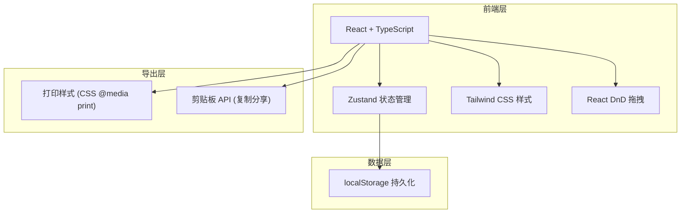
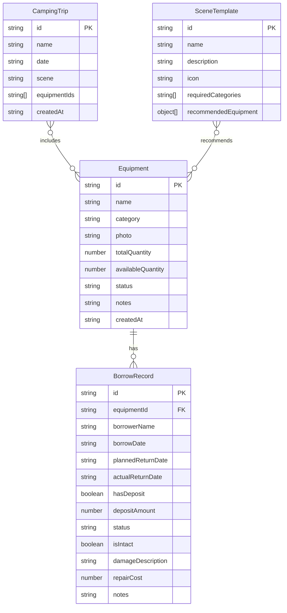

## 1. 架构设计



> 本项目为纯前端应用，数据存储在 localStorage，无需后端服务。

## 2. 技术说明

- **前端框架**：React@18 + TypeScript
- **构建工具**：Vite
- **样式方案**：Tailwind CSS@3
- **状态管理**：Zustand（含 persist 中间件自动持久化到 localStorage）
- **拖拽功能**：@dnd-kit/core + @dnd-kit/sortable（轻量现代拖拽库）
- **图标**：lucide-react
- **字体**：Google Fonts - Playfair Display + DM Sans
- **后端**：无（纯前端，数据存 localStorage）
- **数据库**：无（使用 localStorage + Zustand persist）

## 3. 路由定义

| 路由 | 用途 |
|------|------|
| `/` | 主页面 - 左右双栏布局（装备库 + 露营清单） |
| `/scenes` | 场景清单生成页面 |
| `/export` | 导出出发前检查表页面 |

## 4. 数据模型

### 4.1 数据模型定义



### 4.2 数据定义

**Equipment（装备）类型定义**：

```typescript
interface Equipment {
  id: string
  name: string
  category: 'shelter' | 'cooking' | 'lighting' | 'furniture' | 'sleeping' | 'safety' | 'other'
  photo: string
  totalQuantity: number
  availableQuantity: number
  status: 'available' | 'borrowed' | 'overdue' | 'maintenance'
  notes: string
  createdAt: string
}
```

**BorrowRecord（借用记录）类型定义**：

```typescript
interface BorrowRecord {
  id: string
  equipmentId: string
  borrowerName: string
  borrowDate: string
  plannedReturnDate: string
  actualReturnDate: string | null
  hasDeposit: boolean
  depositAmount: number
  status: 'borrowed' | 'returned' | 'overdue'
  isIntact: boolean | null
  damageDescription: string
  repairCost: number
  notes: string
}
```

**CampingTrip（露营行程）类型定义**：

```typescript
interface CampingTrip {
  id: string
  name: string
  date: string
  scene: 'mountain_overnight' | 'beach_bbq' | 'family_camping' | 'custom'
  selectedEquipment: { equipmentId: string; quantity: number }[]
  createdAt: string
}
```

**SceneTemplate（场景模板）类型定义**：

```typescript
interface SceneTemplate {
  id: string
  name: string
  description: string
  icon: string
  requiredCategories: string[]
  recommendedItems: { category: string; itemNames: string[] }[]
}
```

## 5. 必需品检测逻辑

系统根据露营场景自动检测缺少的必需品：

| 场景 | 必需品分类 |
|------|-----------|
| 山里过夜 | 帐篷、睡袋、防潮垫、头灯/手电、急救包、垃圾袋 |
| 海边烧烤 | 遮阳篷/天幕、炉具、燃料、冰桶、垃圾袋 |
| 亲子露营 | 帐篷、睡袋、防潮垫、头灯、急救包、垃圾袋、儿童椅 |

系统会将已选装备与必需品列表比对，未覆盖的必需品以橙色警告卡片形式展示。

## 6. 项目目录结构

```
src/
├── components/
│   ├── EquipmentCard.tsx          # 装备卡片组件
│   ├── EquipmentLibrary.tsx       # 左侧装备库面板
│   ├── CampingChecklist.tsx       # 右侧露营清单面板
│   ├── MissingItemsAlert.tsx      # 缺少必需品提醒
│   ├── BorrowModal.tsx            # 借出登记弹窗
│   ├── ReturnModal.tsx            # 归还登记弹窗
│   ├── OverdueBanner.tsx          # 逾期提醒横幅
│   ├── SceneCard.tsx              # 场景卡片组件
│   ├── SceneList.tsx              # 场景清单列表
│   ├── ExportChecklist.tsx        # 导出检查表
│   ├── CategoryFilter.tsx         # 分类筛选栏
│   └── AddEquipmentModal.tsx      # 添加装备弹窗
├── hooks/
│   └── useOverdueCheck.ts         # 逾期检查 hook
├── pages/
│   ├── HomePage.tsx               # 主页面
│   ├── ScenePage.tsx              # 场景页面
│   └── ExportPage.tsx             # 导出页面
├── store/
│   └── useStore.ts                # Zustand 全局状态
├── utils/
│   ├── sceneTemplates.ts          # 场景模板数据
│   ├── essentialItems.ts          # 必需品检测逻辑
│   └── exportUtils.ts             # 导出工具函数
├── App.tsx
├── main.tsx
└── index.css
```
