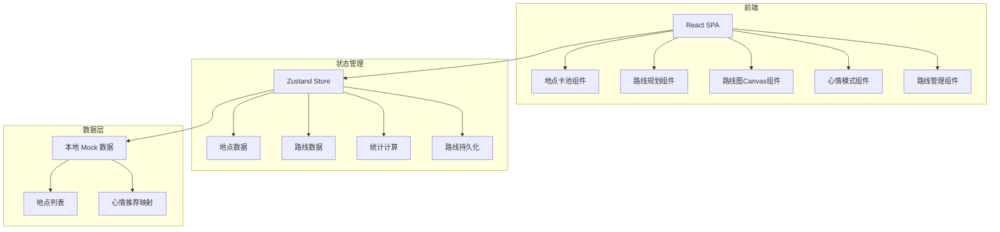
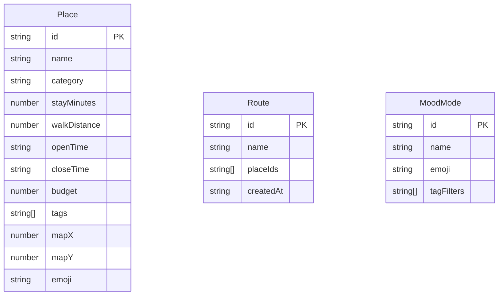

## 1. 架构设计



## 2. 技术说明
- 前端：React@18 + Tailwind CSS@3 + Vite + TypeScript
- 初始化工具：vite-init
- 后端：无（纯前端）
- 数据库：无（使用 localStorage 持久化 + Mock 数据）

## 3. 路由定义
| 路由 | 用途 |
|------|------|
| / | 主页面，包含所有功能模块 |

## 4. API 定义
无后端 API，所有数据存储在 localStorage

## 5. 服务器架构图
不适用

## 6. 数据模型

### 6.1 数据模型定义



### 6.2 数据定义

核心类型定义：

```typescript
interface Place {
  id: string;
  name: string;
  category: 'coffee' | 'park' | 'bookstore' | 'exhibition' | 'riverside' | 'nightmarket' | 'bakery' | 'gallery';
  stayMinutes: number;
  walkDistance: number;
  openTime: string;
  closeTime: string;
  budget: number;
  tags: string[];
  mapX: number;
  mapY: number;
  emoji: string;
}

interface Route {
  id: string;
  name: string;
  placeIds: string[];
  createdAt: string;
}

interface MoodMode {
  id: string;
  name: string;
  emoji: string;
  tagFilters: string[];
}

interface RouteStats {
  totalMinutes: number;
  totalDistance: number;
  totalBudget: number;
  warnings: string[];
}
```
