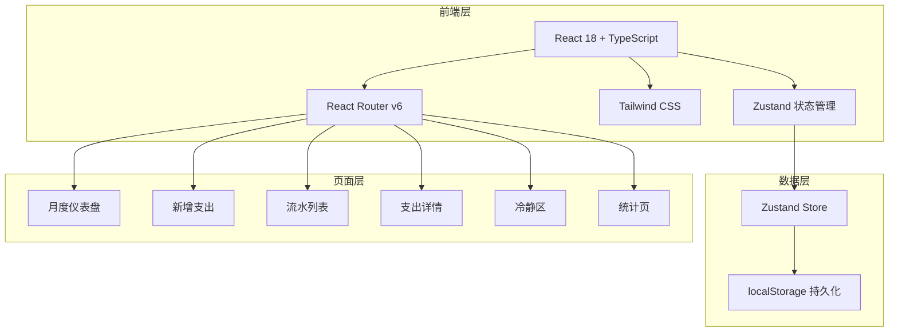
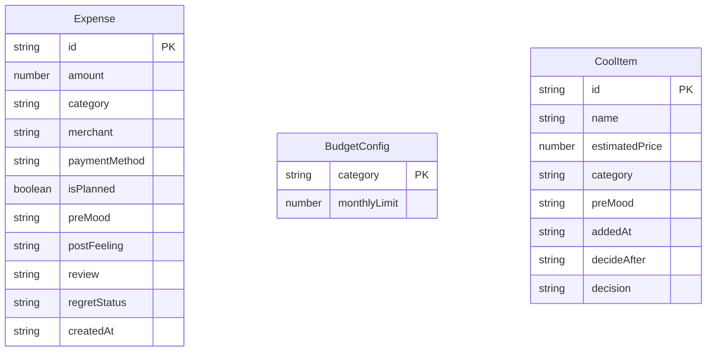

## 1. 架构设计



## 2. 技术说明

- **前端框架**：React 18 + TypeScript
- **构建工具**：Vite
- **样式方案**：Tailwind CSS 3
- **状态管理**：Zustand（含 persist 中间件，数据持久化到 localStorage）
- **路由**：React Router DOM v6
- **图标库**：lucide-react
- **后端**：无（纯前端，数据存储于 localStorage）
- **数据库**：localStorage（通过 Zustand persist 中间件）

## 3. 路由定义

| 路由 | 用途 |
|------|------|
| `/` | 月度仪表盘首页，预算总览和快捷操作 |
| `/new` | 新增支出录入页 |
| `/transactions` | 流水列表页，按心情筛选 |
| `/transaction/:id` | 支出详情页，复盘功能 |
| `/cool-zone` | 冲动消费冷静区 |
| `/stats` | 统计分析页 |

## 4. 数据模型

### 4.1 数据模型定义



### 4.2 类型定义

```typescript
type Category = '生活' | '吃饭' | '交通' | '娱乐' | '学习'

type PreMood = '焦虑' | '开心' | '平静' | '冲动' | '压力' | '无聊' | '难过'

type PostFeeling = '满足' | '后悔' | '无所谓' | '意外惊喜'

type RegretStatus = '后悔' | '不后悔' | '可替代'

type PaymentMethod = '微信' | '支付宝' | '现金' | '信用卡' | '借记卡' | '其他'

interface Expense {
  id: string
  amount: number
  category: Category
  merchant: string
  paymentMethod: PaymentMethod
  isPlanned: boolean
  preMood: PreMood
  postFeeling: PostFeeling
  review: string
  regretStatus: RegretStatus | ''
  createdAt: string
}

interface BudgetConfig {
  category: Category
  monthlyLimit: number
}

interface CoolItem {
  id: string
  name: string
  estimatedPrice: number
  category: Category
  preMood: PreMood
  addedAt: string
  decideAfter: string
  decision: '买' | '不买' | ''
}
```
