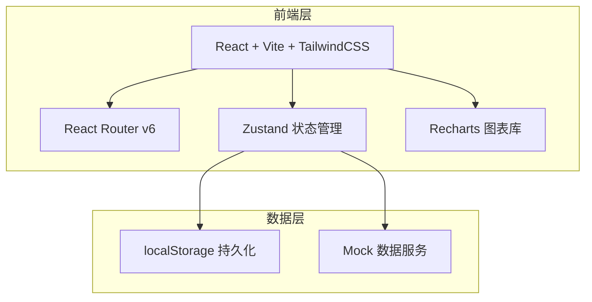
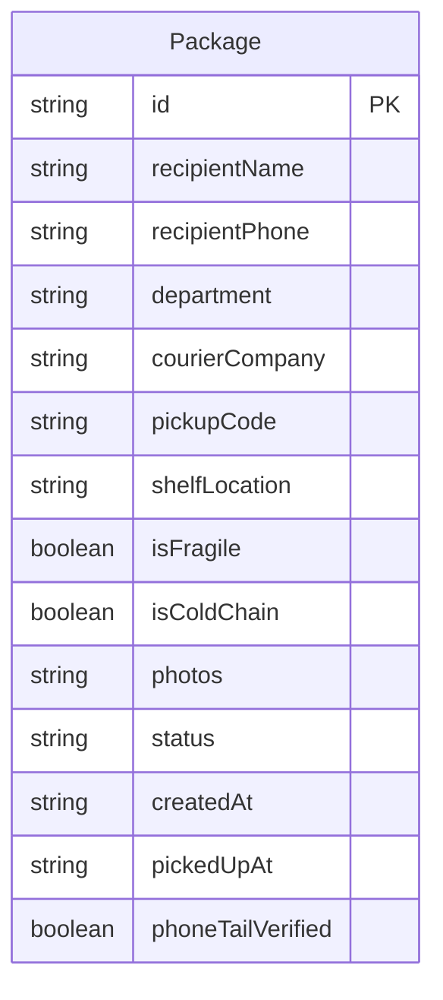

## 1. 架构设计



## 2. 技术说明

- 前端：React@18 + TailwindCSS@3 + Vite
- 初始化工具：Vite
- 后端：无（纯前端，使用 localStorage 持久化）
- 数据库：无（localStorage + 内存状态管理）
- 状态管理：Zustand
- 图表：Recharts
- 路由：React Router v6
- 图标：Lucide React

## 3. 路由定义

| 路由 | 用途 |
|------|------|
| / | 包裹首页，四组状态卡片列表 |
| /register | 包裹录入页 |
| /pickup/:id | 取件签收页，核验手机号尾号并签收 |
| /stats | 统计页，到件量/部门排行/超时统计 |

## 4. API 定义

无后端 API，所有数据操作通过 Zustand Store + localStorage 完成。

### 4.1 数据操作接口

```typescript
interface PackageStore {
  packages: Package[];
  addPackage: (pkg: Omit<Package, 'id' | 'createdAt' | 'status'>) => void;
  pickupPackage: (id: string, phoneTail: string) => boolean;
  searchPackages: (query: string, filters: PackageFilters) => Package[];
  getOverduePackages: () => Package[];
  getStats: () => StatsData;
}
```

### 4.2 核心类型定义

```typescript
type PackageStatus = 'new' | 'pending' | 'picked_up' | 'abnormal';

interface Package {
  id: string;
  recipientName: string;
  recipientPhone: string;
  department: string;
  courierCompany: string;
  pickupCode: string;
  shelfLocation: string;
  isFragile: boolean;
  isColdChain: boolean;
  photos: string[];
  status: PackageStatus;
  createdAt: string;
  pickedUpAt?: string;
  phoneTailVerified: boolean;
}

interface PackageFilters {
  status?: PackageStatus;
  department?: string;
  courierCompany?: string;
  isFragile?: boolean;
  isColdChain?: boolean;
  isOverdue?: boolean;
}

interface StatsData {
  dailyArrivals: { date: string; count: number }[];
  departmentRanking: { department: string; count: number }[];
  overdueCount: number;
  avgPickupTime: number;
  coldChainOverdueRatio: number;
}
```

## 5. 服务端架构图

不适用（纯前端项目）

## 6. 数据模型

### 6.1 数据模型定义



### 6.2 数据定义

使用 localStorage 键 `parcel-management-packages` 存储序列化后的 Package 数组。初始预置 Mock 数据用于演示。

### 6.3 超时规则

- 普通包裹：创建时间超过 48 小时未取 → 标记为超时，状态变更为 abnormal
- 冷藏包裹：创建时间超过 4 小时未取 → 标记为超时，状态变更为 abnormal
- 首页定时器每分钟检查一次超时状态
