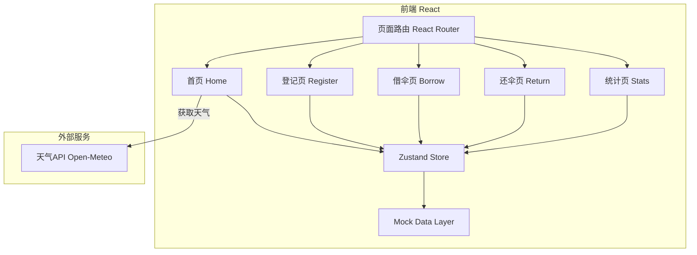
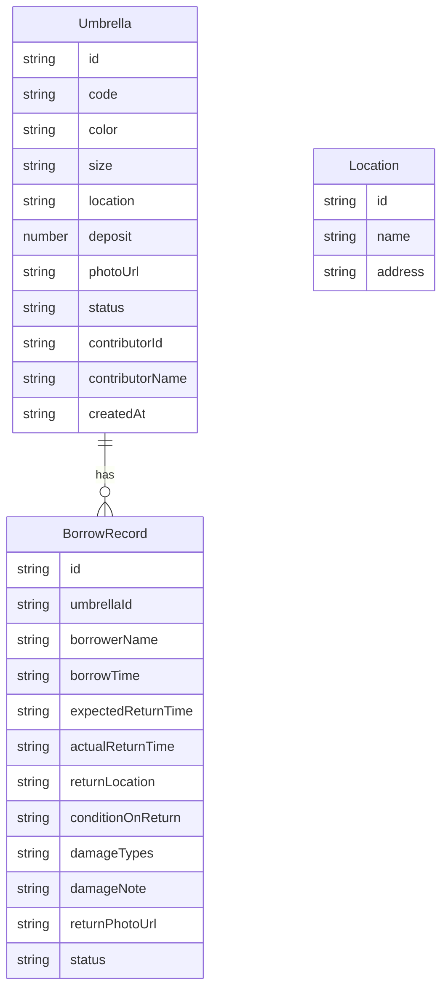

## 1. 架构设计



## 2. 技术说明

- 前端：React@18 + TypeScript + Tailwind CSS@3 + Vite
- 初始化工具：vite-init（react-ts 模板）
- 状态管理：Zustand
- 路由：react-router-dom
- 后端：无（纯前端，Mock数据）
- 数据库：无（Zustand + localStorage 持久化）
- 图标：lucide-react
- 天气API：Open-Meteo（免费，无需API Key）
- 动画：CSS + framer-motion

## 3. 路由定义

| 路由 | 用途 |
|------|------|
| / | 首页：雨伞状态分类展示 + 天气提醒 |
| /register | 登记共享雨伞 |
| /borrow/:id | 借用指定雨伞 |
| /return/:id | 归还指定雨伞 |
| /stats | 统计页面 |

## 4. API定义

无需后端API，使用Open-Meteo天气API：

```
GET https://api.open-meteo.com/v1/forecast?latitude=31.23&longitude=121.47&daily=precipitation_probability_max&timezone=Asia/Shanghai
```

响应：
```typescript
interface WeatherResponse {
  daily: {
    precipitation_probability_max: number[]
  }
}
```

## 5. 服务器架构图

不适用（纯前端项目）

## 6. 数据模型

### 6.1 数据模型定义



### 6.2 数据定义语言

使用Zustand + localStorage，TypeScript类型定义如下：

```typescript
type UmbrellaStatus = 'available' | 'borrowed' | 'damaged' | 'lost'
type UmbrellaSize = 'S' | 'M' | 'L'
type DamageType = 'rib_broken' | 'canopy_torn' | 'button_malfunction' | 'other'
type BorrowStatus = 'active' | 'returned' | 'overdue'

interface Umbrella {
  id: string
  code: string
  color: string
  size: UmbrellaSize
  location: string
  deposit: number
  photoUrl: string
  status: UmbrellaStatus
  contributorId: string
  contributorName: string
  createdAt: string
}

interface BorrowRecord {
  id: string
  umbrellaId: string
  borrowerName: string
  borrowTime: string
  expectedReturnTime: string
  actualReturnTime: string | null
  returnLocation: string
  conditionOnReturn: 'good' | 'damaged' | 'lost'
  damageTypes: DamageType[]
  damageNote: string
  returnPhotoUrl: string | null
  status: BorrowStatus
}

interface Location {
  id: string
  name: string
}
```
