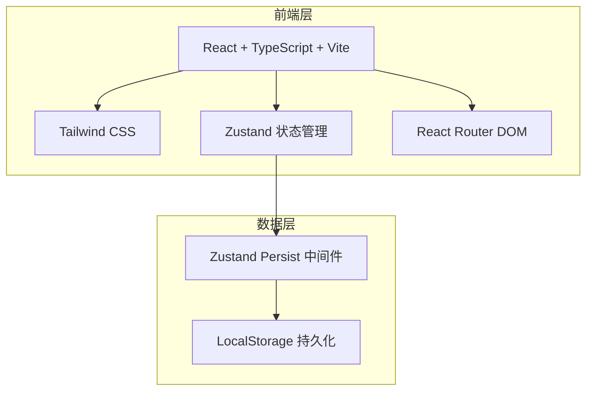
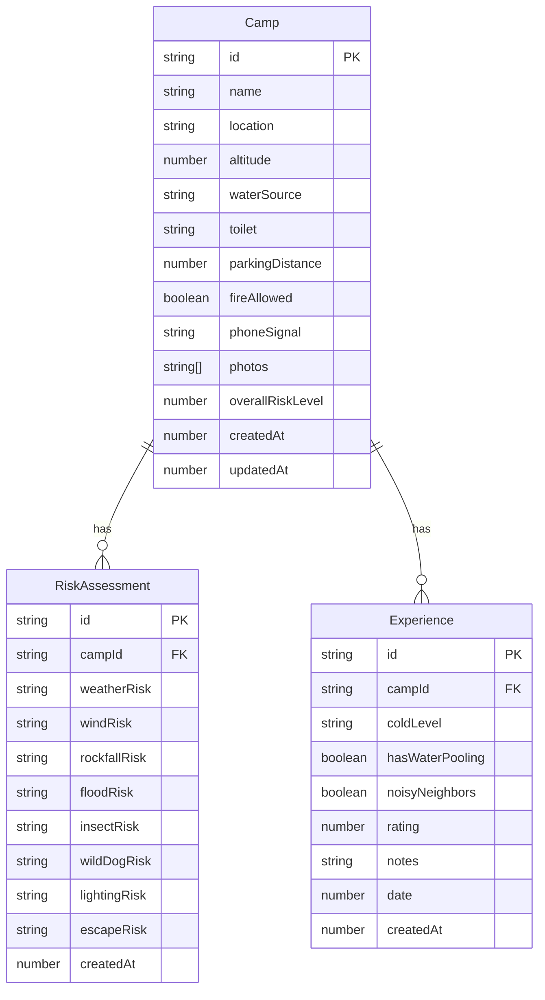

## 1. 架构设计



纯前端应用，使用 LocalStorage 进行数据持久化，无需后端服务。

## 2. 技术说明

- **前端框架**：React@18 + TypeScript + Vite
- **样式方案**：Tailwind CSS@3
- **状态管理**：Zustand（含 persist 中间件）
- **路由**：React Router DOM@6
- **图表**：自实现Canvas雷达图和柱状图
- **数据持久化**：LocalStorage（通过 Zustand persist）
- **图标**：lucide-react

## 3. 路由定义

| 路由 | 用途 |
|------|------|
| `/` | 首页 - 营地列表，按风险等级排序 |
| `/camp/add` | 添加营地页 |
| `/camp/:id` | 营地详情页 - 风险检查清单、准备清单、体验记录 |
| `/camp/:id/edit` | 编辑营地页 |
| `/camp/:id/experience` | 记录露营体验页 |
| `/stats` | 统计页 - 营地稳定性、风险频率 |

## 4. 数据模型

### 4.1 数据模型定义



### 4.2 TypeScript 类型定义

```typescript
type RiskLevel = 'low' | 'medium' | 'high';

type WaterSource = 'none' | 'stream' | 'lake' | 'tap';

type ToiletType = 'none' | 'simple' | 'standard';

type PhoneSignal = 'none' | 'weak' | 'medium' | 'strong';

interface Camp {
  id: string;
  name: string;
  location: string;
  altitude: number;
  waterSource: WaterSource;
  toilet: ToiletType;
  parkingDistance: number;
  fireAllowed: boolean;
  phoneSignal: PhoneSignal;
  photos: string[];
  overallRiskLevel: number;
  createdAt: number;
  updatedAt: number;
}

interface RiskAssessment {
  id: string;
  campId: string;
  weatherRisk: RiskLevel;
  windRisk: RiskLevel;
  rockfallRisk: RiskLevel;
  floodRisk: RiskLevel;
  insectRisk: RiskLevel;
  wildDogRisk: RiskLevel;
  lightingRisk: RiskLevel;
  escapeRisk: RiskLevel;
  createdAt: number;
}

interface Experience {
  id: string;
  campId: string;
  coldLevel: 'none' | 'mild' | 'severe';
  hasWaterPooling: boolean;
  noisyNeighbors: boolean;
  rating: number;
  notes: string;
  date: number;
  createdAt: number;
}
```

## 5. 风险计算逻辑

综合风险等级 = 各风险项加权得分之和 / 风险项数量

- 低风险 = 1分，中风险 = 2分，高风险 = 3分
- 综合得分 < 1.5 → 低风险（绿色）
- 1.5 ≤ 综合得分 < 2.5 → 中风险（橙色）
- 综合得分 ≥ 2.5 → 高风险（红色）

## 6. 准备清单自动生成规则

| 风险条件 | 准备建议 |
|----------|----------|
| windRisk = high | 带地钉加固帐篷、准备防风绳 |
| windRisk = medium | 备用地钉、检查帐篷防风性能 |
| toilet = none | 带便携厕所袋、手部消毒液 |
| waterSource = none | 带足饮用水、储水袋 |
| phoneSignal = none | 带对讲机、离线地图、告知他人行程 |
| phoneSignal = weak | 下载离线地图、充满电宝 |
| insectRisk = high | 带驱蚊喷雾、蚊香、长袖长裤 |
| insectRisk = medium | 带驱蚊液、蚊香 |
| floodRisk = high | 远离河道扎营、带防水袋、关注天气预报 |
| rockfallRisk = high | 远离崖壁和陡坡、戴头盔 |
| wildDogRisk = high | 带防狗喷雾、不单独行动、收好食物 |
| lightingRisk = high | 带头灯、营地灯、备用电池 |
| escapeRisk = high | 提前规划撤离路线、标记紧急出口 |
| weatherRisk = high | 带雨衣雨布、防水帐篷、关注天气预警 |
| fireAllowed = false | 带气炉代替、不携带明火设备 |
| altitude > 3000 | 防高反药物、注意保暖、避免剧烈运动 |
| parkingDistance > 500 | 带手推车、减少重物搬运 |
