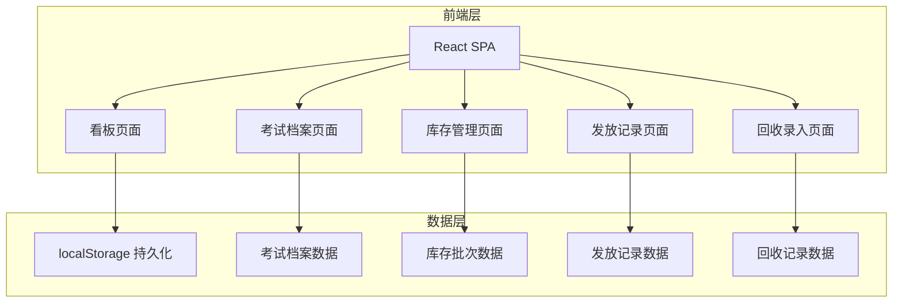
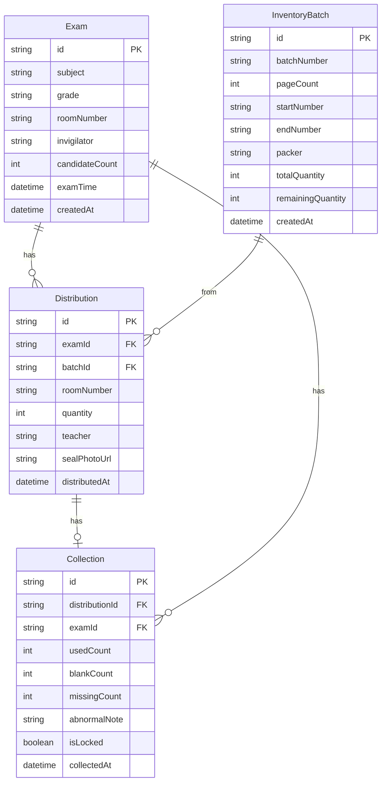

## 1. 架构设计



## 2. 技术说明

- 前端：React@18 + TypeScript + Tailwind CSS@3 + Vite
- 初始化工具：Vite (react-ts 模板)
- 后端：无（纯前端，数据使用 localStorage 持久化）
- 数据库：无（使用 localStorage + 内存状态管理）
- 图表库：Recharts
- 路由：React Router v6
- 状态管理：Zustand

## 3. 路由定义

| 路由 | 用途 |
|------|------|
| / | 看板页面，展示全局状态总览 |
| /exams | 考试档案列表与管理 |
| /inventory | 草稿纸库存批次管理 |
| /distribution | 草稿纸发放记录管理 |
| /collection | 草稿纸回收录入与管理 |

## 4. 数据模型

### 4.1 数据模型定义



### 4.2 数据定义

```typescript
interface Exam {
  id: string;
  subject: string;
  grade: string;
  roomNumber: string;
  invigilator: string;
  candidateCount: number;
  examTime: string;
  createdAt: string;
}

interface InventoryBatch {
  id: string;
  batchNumber: string;
  pageCount: number;
  startNumber: string;
  endNumber: string;
  packer: string;
  totalQuantity: number;
  remainingQuantity: number;
  createdAt: string;
}

interface Distribution {
  id: string;
  examId: string;
  batchId: string;
  roomNumber: string;
  quantity: number;
  teacher: string;
  sealPhotoUrl: string;
  distributedAt: string;
}

interface Collection {
  id: string;
  distributionId: string;
  examId: string;
  usedCount: number;
  blankCount: number;
  missingCount: number;
  abnormalNote: string;
  isLocked: boolean;
  collectedAt: string;
}
```

## 5. 核心业务逻辑

### 5.1 缺失自动标红锁定

- 回收录入时，若 `missingCount > 0`，自动设置 `isLocked = true`
- 锁定后该考场记录不可编辑/删除，仅管理员可解锁
- 看板异常列表实时反映锁定状态

### 5.2 库存扣减

- 发放时根据 `batchId` 扣减对应批次的 `remainingQuantity`
- 回收不影响库存（草稿纸不重复使用）

### 5.3 看板数据计算

- 待发放 = 有考试档案但无发放记录的考场
- 待回收 = 有发放记录但无回收记录的考场
- 数量异常 = 回收总数（已用+空白+缺失）≠ 发放数量的考场
- 各考场用量 = 每个考场的发放数量与回收数量对比
- 剩余库存 = 各批次 remainingQuantity 汇总
