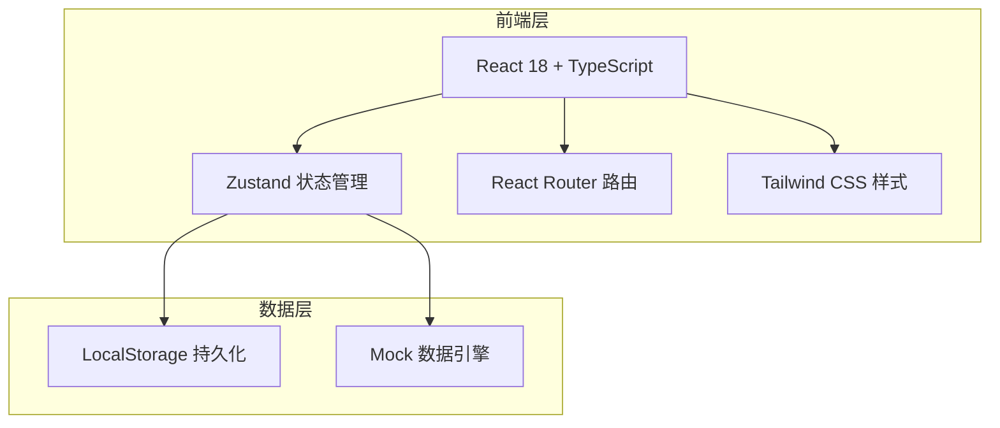
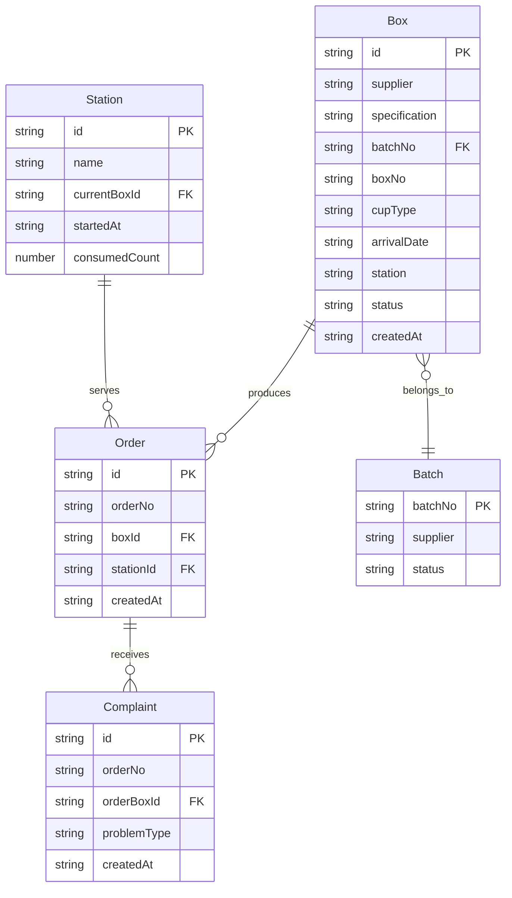

## 1. 架构设计



纯前端架构，使用 Zustand + LocalStorage 实现数据持久化，无需后端服务。

## 2. 技术说明

- 前端：React@18 + TypeScript + Tailwind CSS@3 + Vite
- 初始化工具：vite-init (react-ts 模板)
- 状态管理：Zustand（含 persist 中间件，数据持久化到 LocalStorage）
- 后端：无（纯前端，Mock 数据）
- 数据库：无（LocalStorage 持久化）

## 3. 路由定义

| 路由 | 用途 |
|------|------|
| / | 重定向到 /receiving |
| /receiving | 开箱入库页：录入杯盖箱信息+入库记录列表 |
| /stations | 吧台管理页：吧台状态卡片+切换批次 |
| /complaints | 客诉追踪页：登记客诉+反查同批次订单 |
| /inventory | 库存总览页：统计看板+客诉率+供应商排行+异常暂停 |

## 4. API定义

无后端API，所有数据操作通过 Zustand Store 完成。

### Store 接口定义

```typescript
interface Box {
  id: string
  supplier: string
  specification: string
  batchNo: string
  boxNo: string
  cupType: string
  arrivalDate: string
  station: string
  status: 'in_stock' | 'in_use' | 'used_up' | 'suspended'
  createdAt: string
}

interface Station {
  id: string
  name: string
  currentBoxId: string | null
  startedAt: string | null
  consumedCount: number
}

interface Order {
  id: string
  orderNo: string
  boxId: string
  stationId: string
  createdAt: string
}

interface Complaint {
  id: string
  orderNo: string
  orderBoxId: string
  problemType: 'leak' | 'burst' | 'loose'
  createdAt: string
}

interface Batch {
  batchNo: string
  supplier: string
  status: 'normal' | 'suspended'
}
```

## 5. 服务端架构图

不适用（纯前端项目）

## 6. 数据模型

### 6.1 数据模型定义



### 6.2 数据定义语言

使用 Zustand + LocalStorage，无 SQL DDL。初始化时注入 Mock 数据：

- 3 个吧台（吧台A/B/C）
- 6 个杯盖箱（分属 3 个批次、2 个供应商）
- 20 个模拟订单
- 5 条客诉记录
