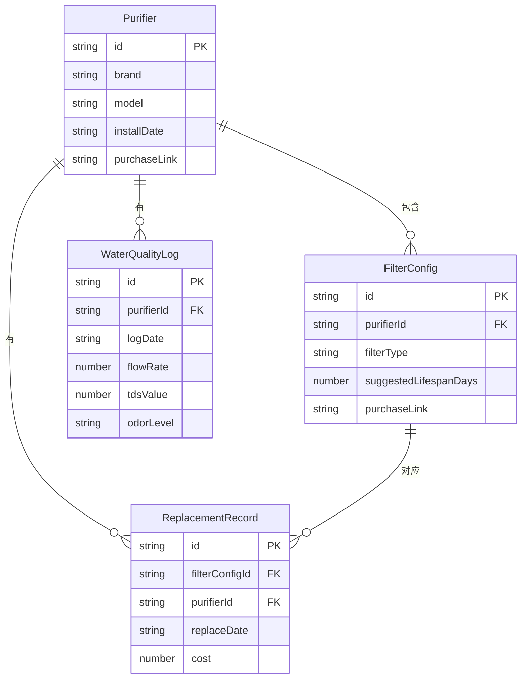

## 1. 架构设计

```mermaid
graph TB
    "前端 React 应用" --> "Zustand 状态管理"
    "Zustand 状态管理" --> "localStorage 持久化"
    "前端 React 应用" --> "页面组件"
    "页面组件" --> "首页仪表盘"
    "页面组件" --> "净水器管理"
    "页面组件" --> "换芯记录"
    "页面组件" --> "水质日志"
    "页面组件" --> "统计中心"
```

纯前端应用，数据通过 localStorage 持久化存储，无需后端服务。

## 2. 技术说明

- **前端**：React 18 + TypeScript + Tailwind CSS + Vite
- **初始化工具**：vite-init (react-ts 模板)
- **后端**：无（纯前端应用）
- **数据库**：localStorage（结构化 JSON 存储）
- **状态管理**：Zustand（含 persist 中间件自动同步 localStorage）
- **图表**：recharts（轻量级 React 图表库）
- **图标**：lucide-react
- **路由**：react-router-dom v6
- **日期处理**：date-fns

## 3. 路由定义

| 路由 | 用途 |
|------|------|
| / | 首页仪表盘，滤芯状态总览和快捷操作 |
| /purifiers | 净水器管理，添加/编辑/删除净水器和滤芯 |
| /replacements | 换芯记录，查看和添加换芯记录 |
| /water-quality | 水质日志，录入水质数据和趋势图 |
| /statistics | 统计中心，花费、频率、合并购买建议 |

## 4. API 定义

不适用（纯前端应用，无后端 API）

## 5. 服务端架构图

不适用

## 6. 数据模型

### 6.1 数据模型定义



### 6.2 数据定义

**Purifier（净水器）**

| 字段 | 类型 | 说明 |
|------|------|------|
| id | string | UUID |
| brand | string | 品牌名称 |
| model | string | 型号 |
| installDate | string | 安装日期 (ISO 格式) |
| purchaseLink | string | 购买链接 |

**FilterConfig（滤芯配置）**

| 字段 | 类型 | 说明 |
|------|------|------|
| id | string | UUID |
| purifierId | string | 所属净水器 ID |
| filterType | string | 滤芯类型：PP棉/活性炭/RO膜/超滤膜/后置炭/其他 |
| suggestedLifespanDays | number | 建议寿命天数 |
| purchaseLink | string | 购买链接 |

**ReplacementRecord（换芯记录）**

| 字段 | 类型 | 说明 |
|------|------|------|
| id | string | UUID |
| filterConfigId | string | 对应滤芯配置 ID |
| purifierId | string | 所属净水器 ID |
| replaceDate | string | 更换日期 (ISO 格式) |
| cost | number | 花费金额（元） |

**WaterQualityLog（水质日志）**

| 字段 | 类型 | 说明 |
|------|------|------|
| id | string | UUID |
| purifierId | string | 所属净水器 ID |
| logDate | string | 记录日期 (ISO 格式) |
| flowRate | number | 出水速度 (ml/min) |
| tdsValue | number | TDS 数值 (ppm) |
| odorLevel | string | 异味等级：none/mild/obvious |

**业务计算逻辑**：

- 滤芯剩余寿命 = 建议寿命天数 - (今天 - 最近一次换芯日期) 天数
- 若无换芯记录，则从净水器安装日期开始计算
- 滤芯状态判断：剩余 > 15 天 = 正常(绿)，剩余 1-15 天 = 即将到期(橙)，剩余 ≤ 0 天 = 已超期(红)
- 水质异常检测：最近 3 次记录中出水速度连续下降 或 TDS 连续上升，触发预警
