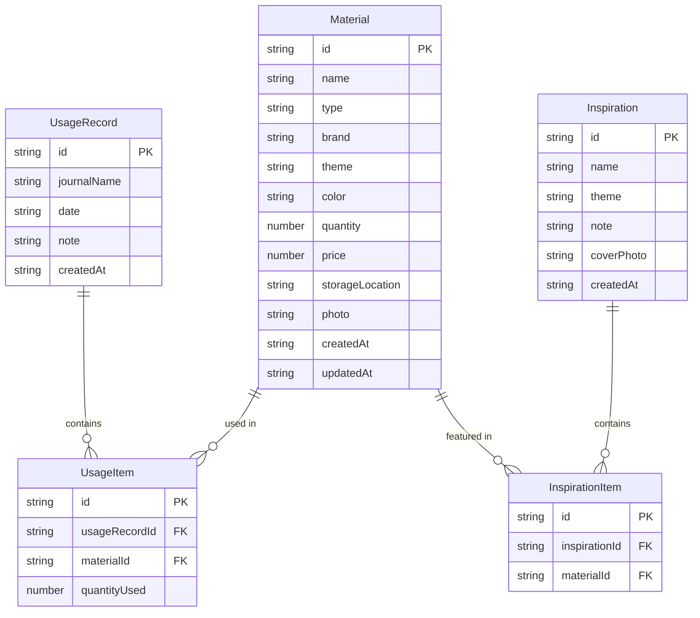

## 1. 架构设计

```mermaid
graph TB
    "前端 React" --> "Zustand 状态管理"
    "Zustand 状态管理" --> "localStorage 持久化"
    "前端 React" --> "React Router 路由"
```

纯前端架构，使用 localStorage 进行数据持久化，无需后端服务。

## 2. 技术说明
- 前端: React@18 + TypeScript + Tailwind CSS@3 + Vite
- 初始化工具: vite-init
- 后端: 无
- 数据库: localStorage（浏览器本地存储）
- 状态管理: Zustand（含 persist 中间件）
- 路由: React Router DOM v6
- 图标: lucide-react

## 3. 路由定义
| 路由 | 用途 |
|------|------|
| / | 首页 - 素材分组展示、库存预警、最近使用 |
| /materials | 素材管理页 - 素材列表、筛选、添加/编辑 |
| /materials/add | 添加素材 |
| /materials/:id | 素材详情 |
| /usage | 使用记录页 - 记录列表 |
| /usage/add | 新建使用记录 |
| /inspirations | 搭配灵感页 - 灵感列表 |
| /inspirations/add | 创建搭配 |
| /inspirations/:id | 搭配详情 |
| /stats | 统计页 - 用量统计、购买分析、闲置提醒 |

## 4. API定义
无后端API，所有数据通过 Zustand store 在前端管理。

## 5. 服务器架构图
不适用

## 6. 数据模型

### 6.1 数据模型定义



### 6.2 数据定义语言

```typescript
type MaterialType = "sticker" | "tape" | "memo" | "stamp";

interface Material {
  id: string;
  name: string;
  type: MaterialType;
  brand: string;
  theme: string;
  color: string;
  quantity: number;
  price: number;
  storageLocation: string;
  photo: string;
  createdAt: string;
  updatedAt: string;
}

interface UsageRecord {
  id: string;
  journalName: string;
  date: string;
  note: string;
  createdAt: string;
}

interface UsageItem {
  id: string;
  usageRecordId: string;
  materialId: string;
  quantityUsed: number;
}

interface Inspiration {
  id: string;
  name: string;
  theme: string;
  note: string;
  coverPhoto: string;
  createdAt: string;
}

interface InspirationItem {
  id: string;
  inspirationId: string;
  materialId: string;
}

interface JournalStore {
  materials: Material[];
  usageRecords: UsageRecord[];
  usageItems: UsageItem[];
  inspirations: Inspiration[];
  inspirationItems: InspirationItem[];
  addMaterial: (material: Omit<Material, "id" | "createdAt" | "updatedAt">) => void;
  updateMaterial: (id: string, data: Partial<Material>) => void;
  deleteMaterial: (id: string) => void;
  addUsageRecord: (record: Omit<UsageRecord, "id" | "createdAt">, items: Omit<UsageItem, "id">[]) => void;
  addInspiration: (inspiration: Omit<Inspiration, "id" | "createdAt">, items: Omit<InspirationItem, "id">[]) => void;
  deleteInspiration: (id: string) => void;
}
```
