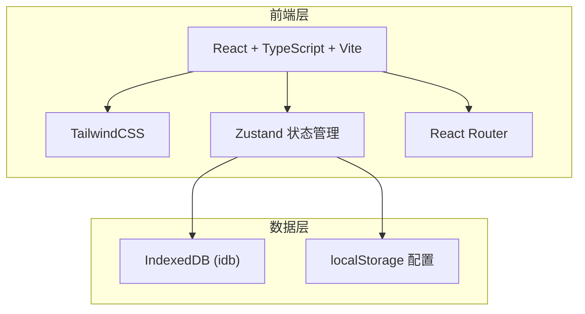
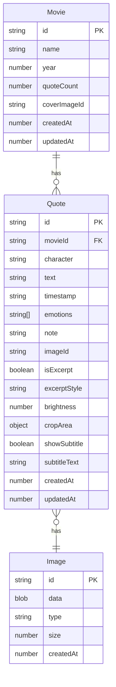

## 1. 架构设计



纯前端架构，无后端服务。所有数据（包括图片）存储在浏览器 IndexedDB 中，应用配置存储在 localStorage。

## 2. 技术说明

- **前端框架**：React@18 + TypeScript + Vite
- **初始化工具**：vite-init (react-ts 模板)
- **样式方案**：TailwindCSS@3
- **状态管理**：Zustand
- **路由**：React Router DOM@6
- **本地存储**：idb（IndexedDB 封装库），存储台词数据和图片 Blob
- **图片编辑**：react-image-crop（裁剪）、Canvas API（亮度调节、字幕框叠加、分享卡片合成）
- **图表**：recharts（统计页数据可视化）
- **图标**：lucide-react
- **后端**：无
- **数据库**：IndexedDB（浏览器本地）

## 3. 路由定义

| 路由 | 用途 |
|------|------|
| `/` | 胶片墙首页，按电影分组展示所有台词 |
| `/movie/:movieId` | 电影详情页，展示某部电影下所有台词卡 |
| `/quote/:quoteId` | 台词详情页，图片编辑与分享 |
| `/add` | 添加台词页（上传截图模式） |
| `/excerpt` | 摘录模式页（纯文字生成台词卡） |
| `/stats` | 统计页面 |

## 4. API 定义
无后端 API，所有操作通过 Zustand Store 直接读写 IndexedDB。

## 5. 服务器架构图
无服务器。

## 6. 数据模型

### 6.1 数据模型定义



### 6.2 数据定义

**IndexedDB 数据库名**: `CineQuoteDB`，版本 `1`

**Object Stores**:

1. **movies** - 存储电影信息
   - `id`: string (主键，UUID)
   - `name`: string (电影名)
   - `year`: number (年份)
   - `quoteCount`: number (台词数量，冗余字段加速查询)
   - `coverImageId`: string (封面图片ID，取最新台词的图片)
   - `createdAt`: number (创建时间戳)
   - `updatedAt`: number (更新时间戳)

2. **quotes** - 存储台词数据
   - `id`: string (主键，UUID)
   - `movieId`: string (索引，关联电影)
   - `character`: string (角色名)
   - `text`: string (台词文字)
   - `timestamp`: string (时间点，格式 "01:23:45")
   - `emotions`: string[] (情绪标签数组)
   - `note`: string (个人感想)
   - `imageId`: string (索引，关联图片)
   - `isExcerpt`: boolean (是否为摘录模式生成)
   - `excerptStyle`: string (摘录卡片风格模板)
   - `brightness`: number (亮度值 0-200，默认100)
   - `cropArea`: object | null (裁剪区域 {x, y, width, height})
   - `showSubtitle`: boolean (是否显示字幕框)
   - `subtitleText`: string (字幕框文字)
   - `createdAt`: number (索引，创建时间戳)
   - `updatedAt`: number (更新时间戳)

3. **images** - 存储图片 Blob
   - `id`: string (主键)
   - `data`: Blob (图片二进制数据)
   - `type`: string (MIME 类型)
   - `size`: number (文件大小)
   - `createdAt`: number (创建时间戳)

**索引**:
- quotes: `movieId` 索引，`createdAt` 索引
- images: 无额外索引

### 6.3 Zustand Store 设计

```typescript
interface CineQuoteStore {
  movies: Movie[]
  quotes: Quote[]
  
  // Movie 操作
  addMovie: (movie: Omit<Movie, 'id' | 'quoteCount' | 'createdAt' | 'updatedAt'>) => Promise<Movie>
  updateMovie: (id: string, data: Partial<Movie>) => Promise<void>
  deleteMovie: (id: string) => Promise<void>
  
  // Quote 操作
  addQuote: (quote: Omit<Quote, 'id' | 'createdAt' | 'updatedAt'>) => Promise<Quote>
  updateQuote: (id: string, data: Partial<Quote>) => Promise<void>
  deleteQuote: (id: string) => Promise<void>
  getQuotesByMovie: (movieId: string) => Quote[]
  
  // Image 操作
  saveImage: (blob: Blob) => Promise<string>
  getImage: (id: string) => Promise<Blob | undefined>
  deleteImage: (id: string) => Promise<void>
  
  // 筛选
  filterQuotes: (filter: QuoteFilter) => Quote[]
  
  // 初始化
  init: () => Promise<void>
}
```
