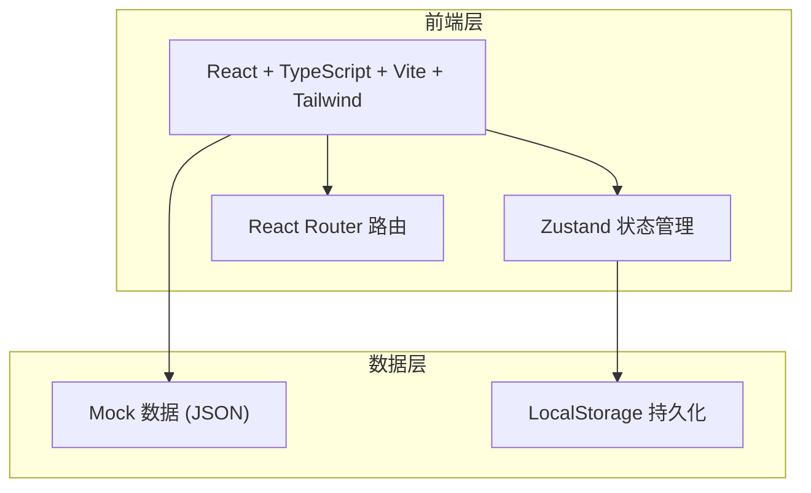
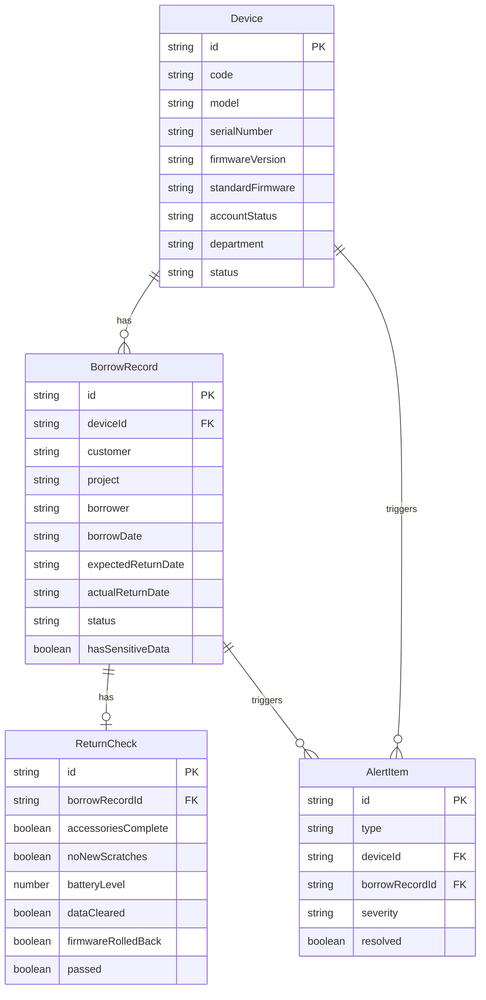

## 1. 架构设计



纯前端方案，使用 Mock 数据 + LocalStorage 持久化，无需后端服务。

## 2. 技术说明

- 前端：React@18 + TypeScript + Tailwind CSS@3 + Vite
- 初始化工具：vite-init
- 后端：无（纯前端 Mock）
- 数据库：无（LocalStorage 持久化 + 内存状态管理）
- 状态管理：Zustand
- 路由：React Router DOM v6
- 图标：Lucide React
- 日期处理：date-fns

## 3. 路由定义

| 路由 | 用途 |
|------|------|
| `/` | 重定向至样机列表 |
| `/devices` | 样机列表页 |
| `/devices/new` | 新增样机页 |
| `/devices/:id` | 样机详情页 |
| `/devices/:id/edit` | 编辑样机页 |
| `/borrow` | 外借登记页 |
| `/borrow/return/:id` | 归还检查页 |
| `/records` | 外借记录列表页 |
| `/alerts` | 异常预警页 |

## 4. API 定义

无后端 API，使用 Zustand Store + LocalStorage 直接操作数据。

### 核心数据类型定义

```typescript
interface Device {
  id: string
  code: string
  model: string
  serialNumber: string
  firmwareVersion: string
  standardFirmware: string
  accessories: string[]
  accountStatus: "active" | "expired" | "none"
  department: string
  photos: string[]
  status: "idle" | "borrowed" | "overdue"
  createdAt: string
  updatedAt: string
}

interface BorrowRecord {
  id: string
  deviceId: string
  customer: string
  project: string
  borrower: string
  borrowerDepartment: string
  borrowDate: string
  expectedReturnDate: string
  actualReturnDate: string | null
  demoScenario: string
  hasSensitiveData: boolean
  status: "borrowed" | "returned" | "overdue"
  returnCheck?: ReturnCheck
}

interface ReturnCheck {
  accessoriesComplete: boolean
  accessoriesNote: string
  noNewScratches: boolean
  scratchesNote: string
  batteryLevel: number
  dataCleared: boolean
  dataClearNote: string
  firmwareRolledBack: boolean
  firmwareNote: string
  checkedAt: string
  checkedBy: string
  passed: boolean
}

interface AlertItem {
  id: string
  type: "overdue" | "sensitive_data" | "non_standard_firmware"
  deviceId: string
  borrowRecordId: string
  message: string
  severity: "high" | "medium" | "low"
  createdAt: string
  resolved: boolean
}
```

## 5. 服务器架构图

不适用（纯前端项目）

## 6. 数据模型

### 6.1 数据模型定义



### 6.2 数据定义语言

使用 LocalStorage 存储 JSON 数据，初始化时写入 Mock 数据。
