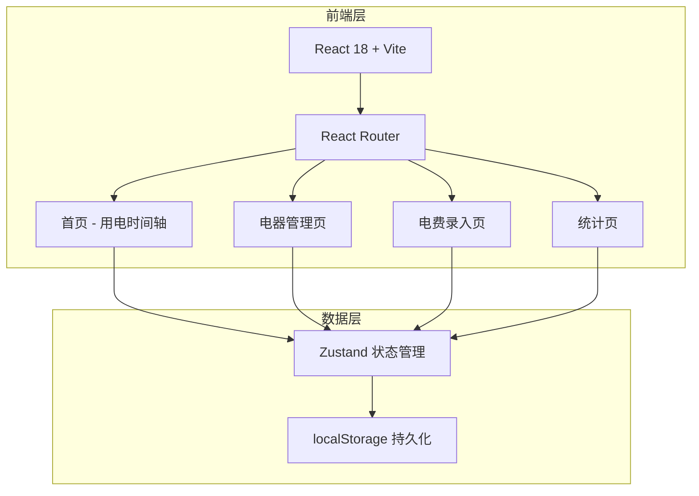
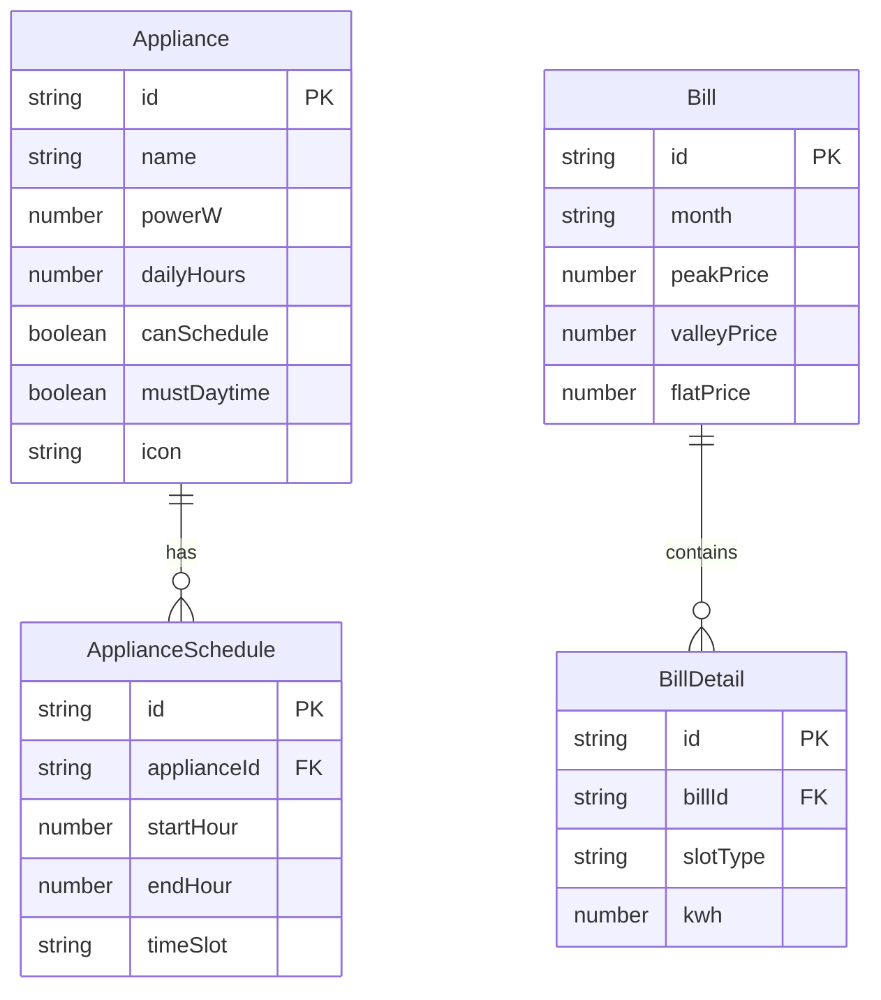

## 1. 架构设计



## 2. 技术说明
- **前端框架**: React@18 + TypeScript + Vite
- **样式方案**: Tailwind CSS@3 + 自定义 CSS 变量
- **状态管理**: Zustand（轻量、支持持久化中间件）
- **拖拽交互**: @dnd-kit/core + @dnd-kit/sortable
- **图表库**: Recharts
- **图标**: Lucide React
- **动画**: framer-motion
- **路由**: React Router@6
- **数据持久化**: localStorage（通过 Zustand persist 中间件）
- **初始化工具**: Vite

## 3. 路由定义
| 路由 | 用途 |
|------|------|
| / | 首页 - 用电时间轴，拖拽电器安排时段 |
| /appliances | 电器管理页，增删改电器 |
| /bills | 电费录入页，管理月度电费单 |
| /stats | 统计页，峰谷占比、耗电排行、优化清单 |

## 4. API 定义
无后端 API，所有数据通过 Zustand + localStorage 在前端本地管理。

## 5. 数据模型

### 5.1 数据模型定义



### 5.2 TypeScript 类型定义

```typescript
type TimeSlotType = "peak" | "valley" | "flat"

interface Appliance {
  id: string
  name: string
  powerW: number
  dailyHours: number
  canSchedule: boolean
  mustDaytime: boolean
  icon: string
}

interface ApplianceSchedule {
  id: string
  applianceId: string
  startHour: number
  endHour: number
  timeSlot: TimeSlotType
}

interface Bill {
  id: string
  month: string
  peakPrice: number
  valleyPrice: number
  flatPrice: number
  peakKwh: number
  valleyKwh: number
  flatKwh: number
}
```

### 5.3 峰谷时段定义（默认）
- **峰电**: 08:00 - 11:00, 18:00 - 21:00
- **平电**: 07:00 - 08:00, 11:00 - 18:00, 21:00 - 23:00
- **谷电**: 23:00 - 07:00

### 5.4 费用计算逻辑
```
电器日耗电(kWh) = 功率(W) × 日使用时长(h) / 1000
电器日费用 = 日耗电 × 所在时段单价
节省金额 = 当前时段费用 - 最优时段费用（谷电优先）
```
