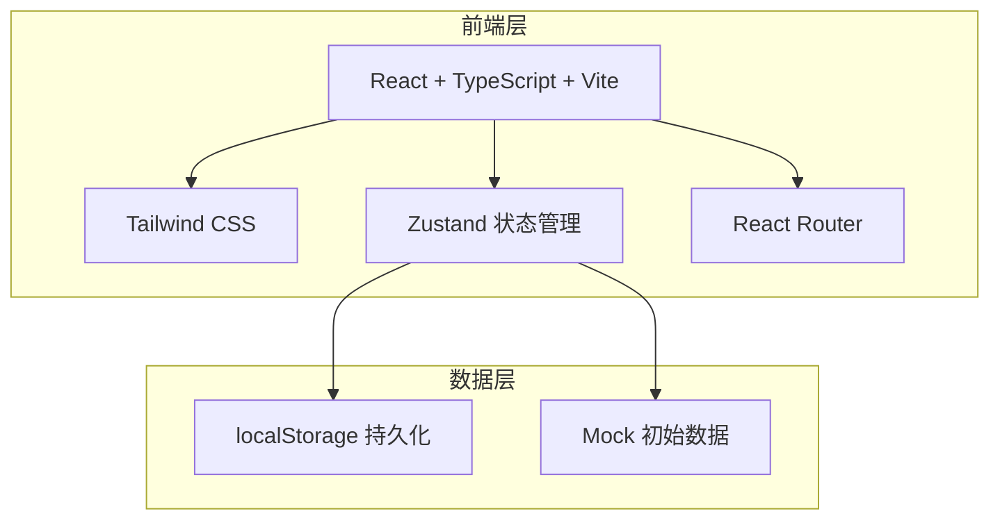
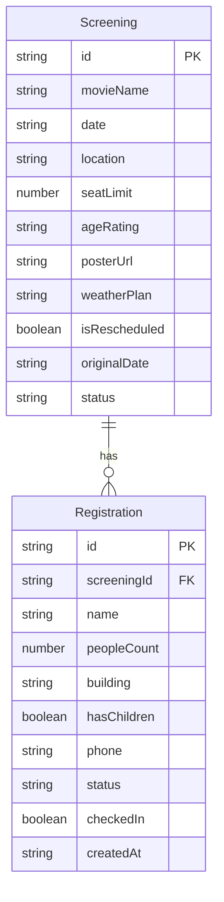

## 1. 架构设计



## 2. 技术说明

- 前端：React@18 + TypeScript + Tailwind CSS@3 + Vite
- 初始化工具：vite-init
- 后端：无（纯前端，使用 localStorage 持久化）
- 数据库：无（使用 Zustand + localStorage 模拟数据持久化）
- 状态管理：Zustand
- 路由：React Router DOM v6
- 图表：recharts
- 图标：lucide-react

## 3. 路由定义

| 路由 | 用途 |
|------|------|
| / | 放映场次列表页（首页） |
| /screening/:id | 场次详情页 |
| /dashboard | 管理看板页面 |

## 4. API定义

无后端API，所有数据通过 Zustand store 管理。

### 数据类型定义

```typescript
interface Screening {
  id: string;
  movieName: string;
  date: string;
  location: string;
  seatLimit: number;
  ageRating: string;
  posterUrl: string;
  weatherPlan: string;
  isRescheduled: boolean;
  originalDate?: string;
  status: 'upcoming' | 'ongoing' | 'completed' | 'rained_out';
}

interface Registration {
  id: string;
  screeningId: string;
  name: string;
  peopleCount: number;
  building: string;
  hasChildren: boolean;
  phone: string;
  status: 'confirmed' | 'waitlisted' | 'cancelled';
  checkedIn: boolean;
  createdAt: string;
}

interface DashboardStats {
  totalRegistered: number;
  totalWaitlisted: number;
  childrenSeatsNeeded: number;
  attendanceRate: number;
}
```

## 5. 服务器架构图

不适用（纯前端项目）

## 6. 数据模型

### 6.1 数据模型定义



### 6.2 数据定义语言

使用 localStorage 键值存储：
- `open-air-cinema_screenings`: 存储放映场次数组
- `open-air-cinema_registrations`: 存储报名记录数组

初始化数据包含3场预设放映场次和若干示例报名记录。
