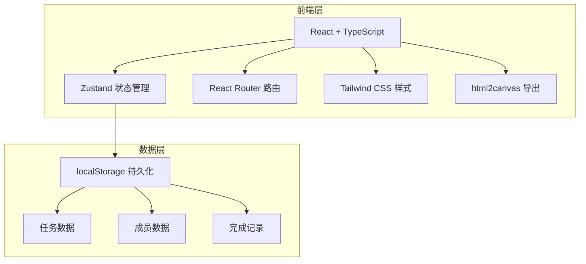
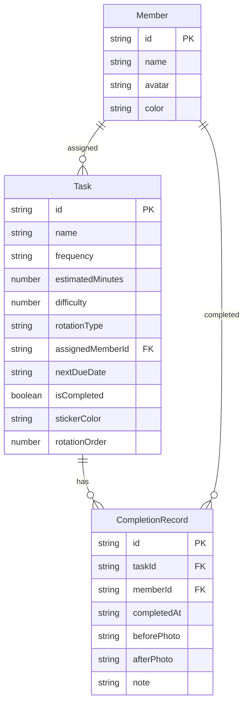

## 1. 架构设计



纯前端应用，无后端服务。所有数据存储在浏览器 localStorage 中，页面刷新后数据不丢失。

## 2. 技术说明

- **前端**：React@18 + TypeScript + Tailwind CSS@3 + Vite
- **初始化工具**：vite-init（react-ts 模板）
- **状态管理**：Zustand（带 localStorage persist 中间件）
- **路由**：react-router-dom@6
- **图标**：lucide-react
- **导出图片**：html2canvas
- **后端**：无
- **数据库**：无，使用 localStorage + Zustand persist

## 3. 路由定义

| 路由 | 用途 |
|------|------|
| `/` | 任务墙首页 - 冰箱门风格贴纸墙 |
| `/stats` | 统计页 - 个人排行、拖延榜、清洁状态 |
| `/export` | 导出页 - 预览并导出本周排班图 |

## 4. API 定义

无后端 API，全部使用前端 Zustand store 管理。

## 5. 服务器架构图

不适用，纯前端应用。

## 6. 数据模型

### 6.1 数据模型定义



### 6.2 数据定义语言

**Member（家庭成员）**

```typescript
interface Member {
  id: string
  name: string
  avatar: string
  color: string
}
```

**Task（清洁任务）**

```typescript
interface Task {
  id: string
  name: string
  frequency: 'daily' | 'weekly' | 'biweekly' | 'monthly'
  estimatedMinutes: number
  difficulty: 1 | 2 | 3 | 4 | 5
  rotationType: 'rotate' | 'fixed' | 'auto-assign'
  assignedMemberId: string
  nextDueDate: string
  isCompleted: boolean
  stickerColor: string
  rotationOrder: string[]
  createdAt: string
}
```

**CompletionRecord（完成记录）**

```typescript
interface CompletionRecord {
  id: string
  taskId: string
  memberId: string
  completedAt: string
  beforePhoto: string
  afterPhoto: string
  note: string
}
```

**Store 结构**

```typescript
interface KitchenStore {
  members: Member[]
  tasks: Task[]
  completionRecords: CompletionRecord[]
  addMember: (member: Member) => void
  removeMember: (id: string) => void
  addTask: (task: Task) => void
  updateTask: (id: string, updates: Partial<Task>) => void
  deleteTask: (id: string) => void
  completeTask: (record: CompletionRecord) => void
  getOverdueTasks: () => Task[]
  getTasksByPeriod: (period: 'today' | 'week' | 'month') => Task[]
  getMemberStats: () => Record<string, number>
  getDelayedTasks: () => Task[]
  getKitchenHealthScore: () => number
}
```
