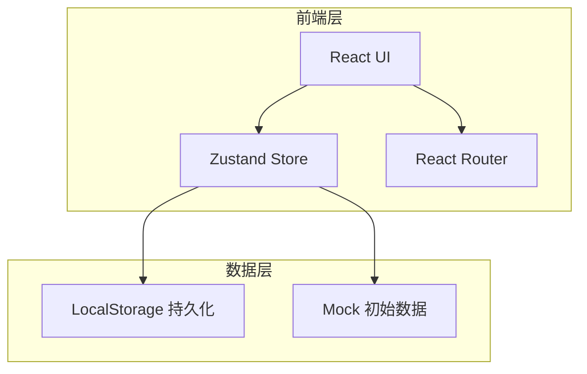
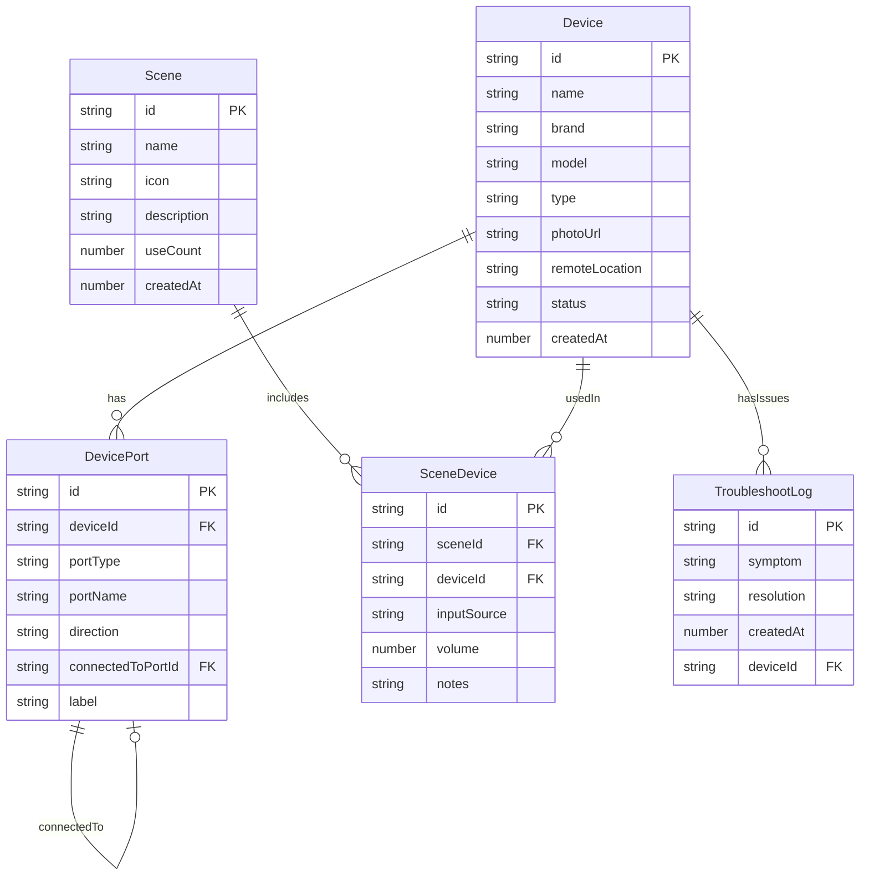

## 1. 架构设计



纯前端应用，数据持久化至 LocalStorage，无需后端服务。

## 2. 技术说明

- **前端**：React@18 + TypeScript + Tailwind CSS@3 + Vite
- **初始化工具**：vite-init
- **状态管理**：Zustand（含 persist 中间件自动持久化到 LocalStorage）
- **路由**：react-router-dom v6
- **图标**：lucide-react
- **后端**：无
- **数据库**：LocalStorage（前端持久化）

## 3. 路由定义

| 路由 | 用途 |
|------|------|
| `/` | 首页 — 客厅设备拓扑图 + 快捷场景栏 |
| `/devices` | 设备管理页 — 设备列表 |
| `/devices/new` | 新增设备表单 |
| `/devices/:id` | 设备详情/编辑 |
| `/scenes` | 场景管理页 — 场景列表 |
| `/scenes/new` | 创建新场景 |
| `/scenes/:id` | 场景详情/编辑 |
| `/troubleshoot` | 故障排查页 |
| `/stats` | 统计页 |

## 4. 数据模型

### 4.1 数据模型定义



### 4.2 数据类型定义

```typescript
interface Device {
  id: string;
  name: string;
  brand: string;
  model: string;
  type: 'tv' | 'projector' | 'amplifier' | 'speaker' | 'game_console' | 'streaming_box' | 'blu_ray' | 'other';
  photoUrl: string;
  remoteLocation: string;
  status: 'online' | 'offline' | 'fault';
  createdAt: number;
}

interface DevicePort {
  id: string;
  deviceId: string;
  portType: 'hdmi' | 'optical' | 'arc' | 'rca' | 'aux' | 'bluetooth' | 'usb' | 'ethernet';
  portName: string;
  direction: 'input' | 'output';
  connectedToPortId: string | null;
  label: string;
}

interface Scene {
  id: string;
  name: string;
  icon: string;
  description: string;
  useCount: number;
  createdAt: number;
}

interface SceneDevice {
  id: string;
  sceneId: string;
  deviceId: string;
  inputSource: string;
  volume: number;
  notes: string;
}

interface TroubleshootLog {
  id: string;
  symptom: string;
  resolution: string;
  createdAt: number;
  deviceId: string;
}

interface TopologyPosition {
  deviceId: string;
  x: number;
  y: number;
}
```

## 5. 故障排查知识库设计

预设常见故障症状及诊断步骤：

| 症状 | 诊断步骤 |
|------|----------|
| 有画面没声音 | 1.检查功放是否开机 2.检查功放输入源是否正确 3.检查光纤/HDMI线是否松动 4.检查音响线缆连接 5.检查设备音量是否静音 |
| 遥控器找不到 | 1.回想遥控器存放位置 2.查看设备登记的遥控器位置备注 3.建议使用手机红外/蓝牙遥控替代 |
| HDMI口占用 | 1.查看拓扑图确认端口连接 2.查看哪个设备占用了该端口 3.建议使用HDMI切换器或更换端口 |
| 画面闪烁 | 1.检查HDMI线是否插紧 2.检查线缆是否支持当前分辨率 3.尝试更换HDMI线 4.检查设备输出分辨率设置 |
| 无信号 | 1.确认源设备已开机 2.确认输入源选择正确 3.检查HDMI线两端是否连接 4.尝试重新插拔线缆 |
