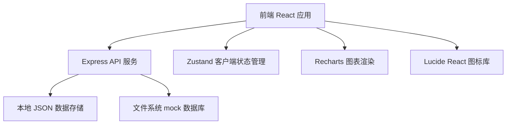
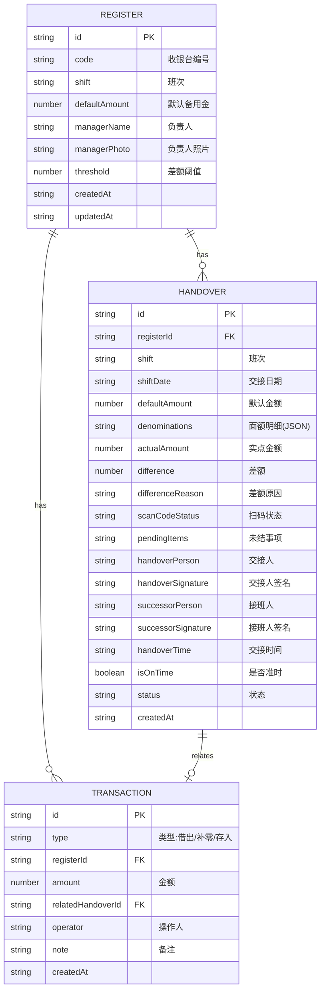

## 1. 架构设计



## 2. 技术描述

- **前端**：React@18 + TypeScript + Vite + TailwindCSS@3 + React Router DOM@6 + Zustand + Recharts
- **初始化工具**：vite-init
- **后端**：Express@4 + TypeScript
- **数据库**：本地 JSON 文件存储（mock 数据，无需真实数据库）
- **状态管理**：Zustand 管理前端全局状态
- **图表库**：Recharts 实现数据可视化
- **图标库**：Lucide React

## 3. 路由定义

| 路由 | 页面组件 | 用途 |
|-------|---------|------|
| `/` | Dashboard | 首页仪表盘，数据概览和快捷入口 |
| `/registers` | RegisterList | 收银台档案列表 |
| `/registers/new` | RegisterForm | 新建收银台档案 |
| `/registers/:id/edit` | RegisterForm | 编辑收银台档案 |
| `/handovers` | HandoverList | 交接记录列表 |
| `/handovers/new` | HandoverCreate | 新建交接记录（多步骤表单） |
| `/handovers/:id` | HandoverDetail | 交接记录详情 |
| `/transactions` | TransactionList | 资金异动记录列表 |
| `/transactions/new` | TransactionForm | 新建资金异动记录 |
| `/statistics` | Statistics | 统计分析报表 |

## 4. API 定义

### 4.1 收银台档案 API

```typescript
interface Register {
  id: string;
  code: string;              // 收银台编号
  shift: 'morning' | 'evening' | 'all';  // 班次
  defaultAmount: number;     // 默认备用金额
  managerName: string;       // 负责人姓名
  managerPhoto: string;      // 负责人照片 (base64)
  threshold: number;         // 差额阈值（超过标红）
  createdAt: string;
  updatedAt: string;
}

// GET    /api/registers       获取列表
// GET    /api/registers/:id   获取单条
// POST   /api/registers       创建
// PUT    /api/registers/:id   更新
// DELETE /api/registers/:id   删除
```

### 4.2 交接记录 API

```typescript
interface DenominationItem {
  denomination: number;  // 面额: 100, 50, 20, 10, 5, 1, 0.5, 0.1
  count: number;         // 张数
}

interface Handover {
  id: string;
  registerId: string;
  registerCode: string;
  shift: 'morning' | 'evening';
  shiftDate: string;           // 交接日期 YYYY-MM-DD
  defaultAmount: number;       // 默认备用金额
  denominations: DenominationItem[];  // 现金面额明细
  actualAmount: number;        // 实点金额
  difference: number;          // 差额（实际-默认）
  differenceReason?: string;   // 差额原因
  scanCodeStatus: 'normal' | 'damaged' | 'missing';  // 扫码备用码状态
  scanCodeNote?: string;       // 扫码备注
  pendingItems: string;        // 上一班未结事项
  handoverPerson: string;      // 交接人
  handoverSignature: string;   // 交接人签名 (base64)
  successorPerson: string;     // 接班人
  successorSignature: string;  // 接班人签名 (base64)
  handoverTime: string;        // 实际交接时间
  scheduledTime: string;       // 规定交接时间
  isOnTime: boolean;           // 是否准时
  status: 'normal' | 'warning' | 'danger';  // 状态
  createdAt: string;
}

// GET    /api/handovers              获取列表（支持筛选）
// GET    /api/handovers/:id          获取单条详情
// POST   /api/handovers              创建交接记录
// GET    /api/handovers/recent       获取最近记录
```

### 4.3 资金异动 API

```typescript
interface Transaction {
  id: string;
  type: 'loan' | 'replenish' | 'deposit';  // 临时借出 / 补零 / 银行存入
  registerId: string;
  amount: number;
  relatedHandoverId?: string;      // 关联的交接记录
  operator: string;                // 操作人
  note?: string;                   // 备注
  createdAt: string;
}

// GET    /api/transactions       获取列表（支持按类型筛选）
// POST   /api/transactions       创建异动记录
```

### 4.4 统计 API

```typescript
interface StatsResponse {
  // 按班次差额统计
  shiftDifferences: {
    shift: 'morning' | 'evening';
    count: number;
    totalAmount: number;
  }[];
  // 常缺面额统计
  denominationStats: {
    denomination: number;
    shortageCount: number;
    surplusCount: number;
  }[];
  // 未处理差额
  pendingDifferences: {
    handoverId: string;
    registerCode: string;
    amount: number;
    date: string;
  }[];
  // 本月交接准时率
  punctualityRate: {
    date: string;           // YYYY-MM-DD
    rate: number;           // 0-100
    total: number;
    onTime: number;
  }[];
  // 仪表盘概览
  overview: {
    todayHandovers: number;
    pendingDifferences: number;
    weeklyPunctuality: number;
    totalRegisters: number;
  };
}

// GET /api/statistics        获取统计数据
// GET /api/statistics/overview  获取仪表盘概览
```

## 5. 数据模型



