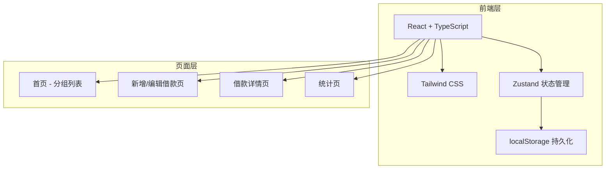
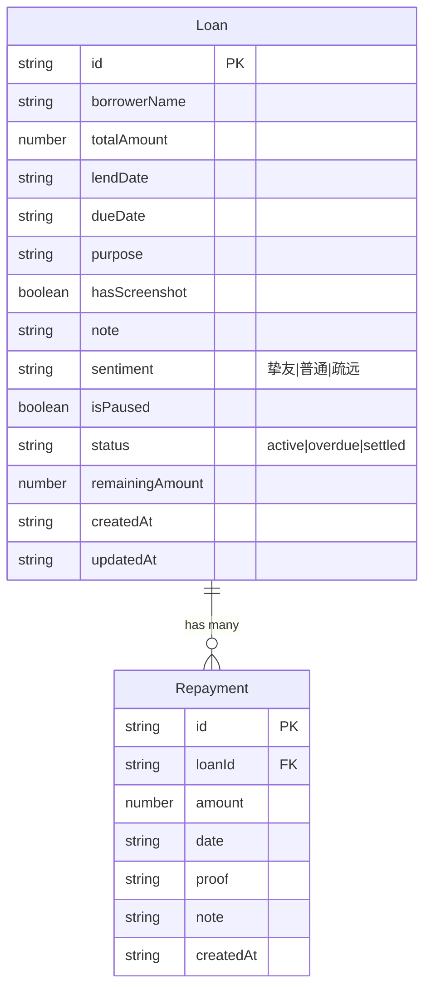

## 1. 架构设计



纯前端应用，数据存储在 localStorage，无需后端服务。

## 2. 技术说明
- 前端：React@18 + TypeScript + Tailwind CSS@3 + Vite
- 初始化工具：vite-init
- 后端：无（纯前端应用，数据存 localStorage）
- 数据库：无（localStorage + Zustand persist 中间件）

## 3. 路由定义
| 路由 | 用途 |
|------|------|
| / | 首页，展示分组借款列表 |
| /loan/new | 新增借款表单 |
| /loan/:id | 借款详情页（含还款记录、提醒操作） |
| /loan/:id/edit | 编辑借款信息 |
| /stats | 统计页，展示借出/收回/逾期数据 |

## 4. 数据模型

### 4.1 数据模型定义



### 4.2 数据类型定义

```typescript
interface Loan {
  id: string
  borrowerName: string
  totalAmount: number
  lendDate: string
  dueDate: string
  purpose: string
  hasScreenshot: boolean
  note: string
  sentiment: 'close' | 'normal' | 'distant'
  isPaused: boolean
  status: 'active' | 'overdue' | 'settled'
  remainingAmount: number
  createdAt: string
  updatedAt: string
}

interface Repayment {
  id: string
  loanId: string
  amount: number
  date: string
  proof: string
  note: string
  createdAt: string
}

interface LoanStore {
  loans: Loan[]
  repayments: Repayment[]
  addLoan: (loan: Omit<Loan, 'id' | 'status' | 'remainingAmount' | 'createdAt' | 'updatedAt'>) => void
  updateLoan: (id: string, data: Partial<Loan>) => void
  deleteLoan: (id: string) => void
  addRepayment: (repayment: Omit<Repayment, 'id' | 'createdAt'>) => void
  deleteRepayment: (id: string) => void
  getRepaymentsByLoanId: (loanId: string) => Repayment[]
  getLoansByGroup: () => { expiringSoon: Loan[], overdue: Loan[], installment: Loan[], settled: Loan[] }
  getStats: () => { totalLent: number, totalOverdue: number, totalRecovered: number, maxOverdueDays: number }
}
```
