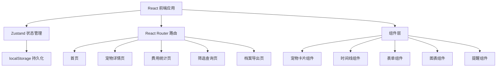
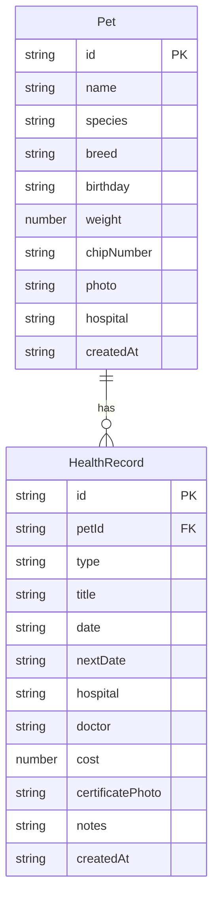

## 1. 架构设计

纯前端应用，数据存储在浏览器 localStorage，支持离线使用。



## 2. 技术说明

- **前端框架**：React@18 + TypeScript + Vite
- **样式方案**：Tailwind CSS@3
- **状态管理**：Zustand（含 persist 中间件实现 localStorage 持久化）
- **路由**：react-router-dom@6
- **图表**：recharts（轻量级 React 图表库）
- **图标**：lucide-react
- **图片处理**：本地 File API 转 Base64 存储
- **导出**：html2canvas 或原生 window.print() 实现打印/导出
- **后端**：无，纯前端应用
- **数据库**：localStorage（浏览器本地存储）

## 3. 路由定义

| 路由 | 用途 |
|------|------|
| `/` | 首页 - 宠物卡片列表 + 到期提醒 |
| `/pet/:id` | 宠物详情页 - 基本信息卡 + 健康时间线 |
| `/pet/:id/add-record` | 添加健康记录页 |
| `/pet/:id/edit` | 编辑宠物信息页 |
| `/add-pet` | 添加宠物页 |
| `/stats` | 费用统计页 |
| `/search` | 筛选查询页 |
| `/export/:id` | 档案导出预览页 |

## 4. 数据模型

### 4.1 数据模型定义



### 4.2 数据类型定义

```typescript
interface Pet {
  id: string
  name: string
  species: 'cat' | 'dog'
  breed: string
  birthday: string
  weight: number
  chipNumber: string
  photo: string
  hospital: string
  createdAt: string
}

type HealthRecordType = 'vaccine' | 'deworming' | 'checkup' | 'allergy' | 'surgery'

interface HealthRecord {
  id: string
  petId: string
  type: HealthRecordType
  title: string
  date: string
  nextDate: string
  hospital: string
  doctor: string
  cost: number
  certificatePhoto: string
  notes: string
  createdAt: string
}

interface PetStore {
  pets: Pet[]
  records: HealthRecord[]
  addPet: (pet: Omit<Pet, 'id' | 'createdAt'>) => void
  updatePet: (id: string, data: Partial<Pet>) => void
  deletePet: (id: string) => void
  addRecord: (record: Omit<HealthRecord, 'id' | 'createdAt'>) => void
  updateRecord: (id: string, data: Partial<HealthRecord>) => void
  deleteRecord: (id: string) => void
  getPetRecords: (petId: string) => HealthRecord[]
  getUpcomingReminders: () => ReminderItem[]
  getCostStats: (year: number) => CostStats
}
```

## 5. 关键算法

### 5.1 到期提醒计算

- 获取所有有 `nextDate` 的健康记录
- 计算当前日期与 `nextDate` 的天数差
- 7天内到期 → 红色紧急提醒
- 30天内到期 → 橙色预警提醒
- 按紧急程度排序展示

### 5.2 费用统计

- 按年份筛选健康记录
- 按类型汇总费用（疫苗/驱虫/体检/手术/其他）
- 按月份聚合展示趋势
- 多宠物时按宠物维度拆分

### 5.3 健康时间线

- 获取指定宠物的所有健康记录
- 按日期倒序排列
- 根据类型分配不同图标和颜色
  - 疫苗：绿色 + 注射器图标
  - 驱虫：蓝色 + 虫子图标
  - 体检：紫色 + 听诊器图标
  - 过敏：橙色 + 警告图标
  - 手术：红色 + 手术刀图标
