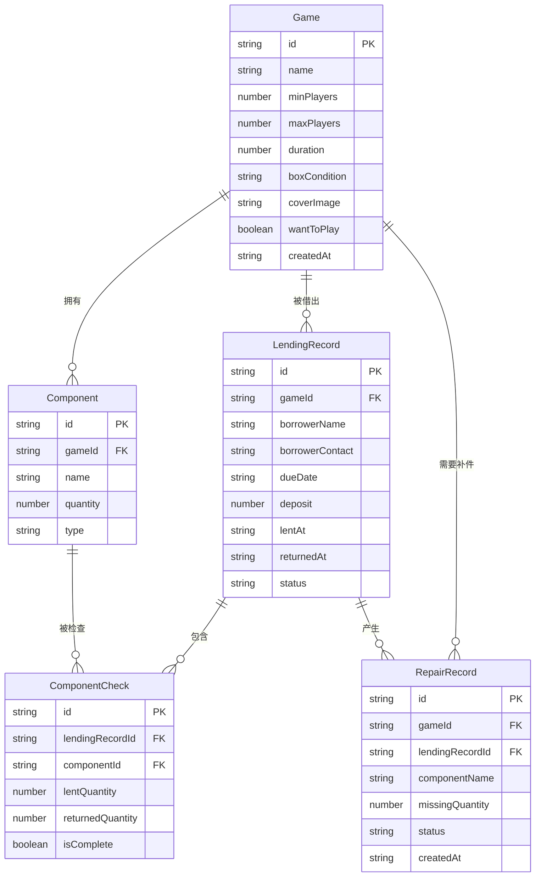

## 1. 架构设计

```mermaid
flowchart TD
    "前端 React SPA" --> "LocalStorage 持久化"
    "前端 React SPA" --> "状态管理 Zustand"
    "状态管理 Zustand" --> "LocalStorage 持久化"
```

纯前端单页应用，使用 LocalStorage 做数据持久化，Zustand 管理全局状态。

## 2. 技术说明

- 前端：React@18 + TypeScript + TailwindCSS@3 + Vite
- 初始化工具：Vite (react-ts 模板)
- 后端：无（纯前端，LocalStorage 持久化）
- 数据库：LocalStorage（模拟数据存储）

## 3. 路由定义

| 路由 | 用途 |
|------|------|
| / | 首页仪表盘，展示逾期未还、配件不全、最近想玩、借阅统计 |
| /games | 游戏档案列表页 |
| /games/new | 新建游戏档案 |
| /games/:id | 游戏档案详情页 |
| /games/:id/edit | 编辑游戏档案 |
| /lend | 借出登记页 |
| /return/:id | 归还检查页（id 为借出记录 ID） |
| /repairs | 补件记录列表页 |

## 4. API 定义

无后端 API，使用 Zustand store + LocalStorage 直接操作数据。

## 5. 数据模型

### 5.1 数据模型定义



### 5.2 数据定义语言（TypeScript 类型）

```typescript
type BoxCondition = "全新" | "轻微使用" | "正常使用" | "明显磨损" | "损坏";
type LendingStatus = "借出中" | "已归还" | "逾期";
type ComponentType = "卡牌" | "骰子" | "说明书" | "计分板" | "棋子" | "标记物" | "其他";
type RepairStatus = "待采购" | "已采购" | "已补齐";

interface Game {
  id: string;
  name: string;
  minPlayers: number;
  maxPlayers: number;
  duration: number;
  boxCondition: BoxCondition;
  coverImage: string;
  wantToPlay: boolean;
  createdAt: string;
}

interface Component {
  id: string;
  gameId: string;
  name: string;
  quantity: number;
  type: ComponentType;
}

interface LendingRecord {
  id: string;
  gameId: string;
  borrowerName: string;
  borrowerContact: string;
  dueDate: string;
  deposit: number;
  lentAt: string;
  returnedAt: string | null;
  status: LendingStatus;
}

interface ComponentCheck {
  id: string;
  lendingRecordId: string;
  componentId: string;
  lentQuantity: number;
  returnedQuantity: number;
  isComplete: boolean;
}

interface RepairRecord {
  id: string;
  gameId: string;
  lendingRecordId: string;
  componentName: string;
  missingQuantity: number;
  status: RepairStatus;
  createdAt: string;
}
```
