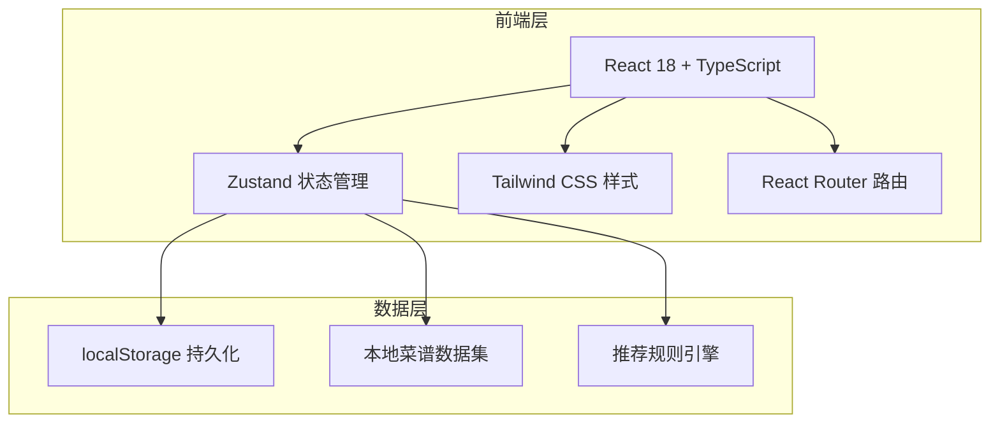
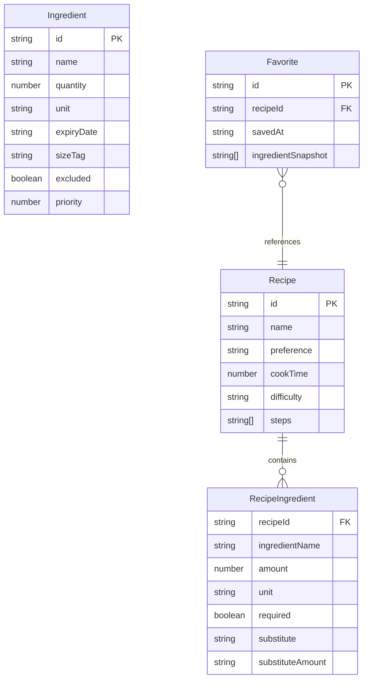

## 1. 架构设计



纯前端应用，无后端服务。所有数据存储在 localStorage，菜谱数据和推荐规则内置于前端。

## 2. 技术说明

- 前端：React@18 + TypeScript + Tailwind CSS@3 + Vite
- 初始化工具：vite-init
- 后端：无
- 数据库：无，使用 localStorage + 内置 JSON 数据集
- 状态管理：Zustand
- 路由：React Router DOM v6

## 3. 路由定义

| 路由 | 用途 |
|------|------|
| `/` | 食材录入页 - 主页，添加和管理冰箱食材 |
| `/recommend` | 偏好选择与推荐页 - 选偏好、看推荐菜谱 |
| `/recipe/:id` | 菜谱详情页 - 步骤、消耗量、剩余量、收藏 |
| `/favorites` | 我的收藏页 - 收藏的菜谱与智能推荐 |

## 4. API 定义
无后端 API，所有逻辑在前端本地完成。

## 5. 服务器架构图
不适用

## 6. 数据模型

### 6.1 数据模型定义



### 6.2 数据定义语言

```typescript
interface Ingredient {
  id: string
  name: string
  quantity: number
  unit: string
  expiryDate: string
  sizeTag: 'small' | 'medium' | 'large'
  excluded: boolean
}

interface Recipe {
  id: string
  name: string
  emoji: string
  preference: ('light' | 'heavy' | 'quick' | 'budget' | 'protein')[]
  cookTime: number
  difficulty: 'easy' | 'medium' | 'hard'
  steps: { description: string; time: number }[]
  ingredients: RecipeIngredient[]
}

interface RecipeIngredient {
  ingredientName: string
  amount: number
  unit: string
  required: boolean
  substitute?: string
  substituteAmount?: number
  substituteUnit?: string
}

interface Favorite {
  id: string
  recipeId: string
  savedAt: string
  ingredientSnapshot: string[]
}
```

## 7. 推荐规则引擎设计

### 7.1 食材优先级算法
```
优先级分 = 过期紧迫分(0-40) + 数量稀少分(0-30) + 体积占位分(0-30)

过期紧迫分：
  1天内过期 = 40, 2天 = 35, 3天 = 25, 5天 = 15, 7天+ = 5

数量稀少分：
  数量 < 0.3标准量 = 30, < 0.5 = 20, < 0.8 = 10, >= 0.8 = 0

体积占位分：
  large = 30, medium = 15, small = 5
```

### 7.2 菜谱匹配算法
```
匹配度 = (匹配食材数 / 菜谱所需食材数) * 60 + 偏好加成(20) + 收藏加成(20)

偏好加成：菜谱标签包含所选偏好 = 20，否则 = 0
收藏加成：菜谱已收藏且食材相似度 > 70% = 20，否则 = 0

排序规则：匹配度降序 → 缺料数升序 → 用时升序
```
