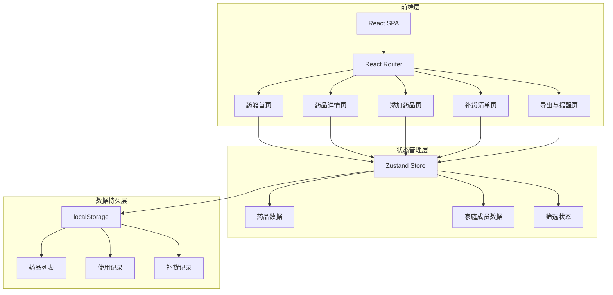
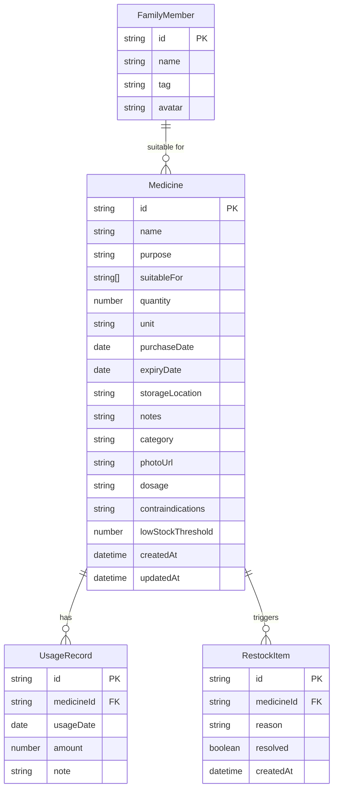

## 1. 架构设计



## 2. 技术说明

- **前端框架**：React@18 + TypeScript
- **样式方案**：Tailwind CSS@3
- **构建工具**：Vite
- **路由**：React Router@6
- **状态管理**：Zustand（轻量、简洁）
- **数据持久化**：localStorage（纯前端，无需后端）
- **图标**：Lucide React（温暖风格线性图标）
- **动画**：Framer Motion
- **日期处理**：date-fns
- **后端**：无（纯前端应用，数据存储在浏览器 localStorage）

## 3. 路由定义

| 路由 | 用途 |
|------|------|
| `/` | 药箱首页 - 分区展示、预警横幅、成员筛选 |
| `/medicine/:id` | 药品详情页 - 基本信息、服用说明、使用记录 |
| `/add` | 添加药品页 - 表单录入、照片上传 |
| `/edit/:id` | 编辑药品页 - 修改已有药品信息 |
| `/restock` | 补货清单页 - 自动/手动补货列表 |
| `/export` | 导出与提醒页 - 导出清单、过期提醒 |

## 4. 数据模型

### 4.1 数据模型定义



### 4.2 TypeScript 类型定义

```typescript
type MedicineCategory = 'regular' | 'children' | 'topical' | 'chronic' | 'emergency'

interface Medicine {
  id: string
  name: string
  purpose: string
  suitableFor: string[]
  quantity: number
  unit: string
  purchaseDate: string
  expiryDate: string
  storageLocation: string
  notes: string
  category: MedicineCategory
  photoUrl: string
  dosage: string
  contraindications: string
  lowStockThreshold: number
  createdAt: string
  updatedAt: string
}

interface UsageRecord {
  id: string
  medicineId: string
  usageDate: string
  amount: number
  note: string
}

interface FamilyMember {
  id: string
  name: string
  tag: string
  avatar: string
}

interface RestockItem {
  id: string
  medicineId: string
  reason: 'low_stock' | 'expiring_soon'
  resolved: boolean
  createdAt: string
}
```

## 5. 效期计算规则

| 状态 | 计算规则 | UI 表现 |
|------|----------|---------|
| 正常 | 有效期 > 30天 | 正常展示 |
| 即将过期 | 有效期 ≤ 30天 且 > 0天 | 黄色警告标签 + 呼吸动画 |
| 已过期 | 有效期 ≤ 0天 | 红色标签 + 移入待处理区 |
| 低库存 | 数量 ≤ lowStockThreshold | 蓝色提示标签 + 自动进入补货清单 |

## 6. 项目目录结构

```
src/
├── components/
│   ├── Layout.tsx
│   ├── MedicineCard.tsx
│   ├── CategorySection.tsx
│   ├── ExpiryBanner.tsx
│   ├── MemberFilter.tsx
│   ├── UsageTimeline.tsx
│   └── RestockItem.tsx
├── pages/
│   ├── Home.tsx
│   ├── MedicineDetail.tsx
│   ├── AddMedicine.tsx
│   ├── EditMedicine.tsx
│   ├── RestockList.tsx
│   └── ExportPage.tsx
├── store/
│   ├── medicineStore.ts
│   └── memberStore.ts
├── types/
│   └── index.ts
├── data/
│   └── mock.ts
├── utils/
│   ├── expiry.ts
│   └── export.ts
├── App.tsx
└── main.tsx
```
